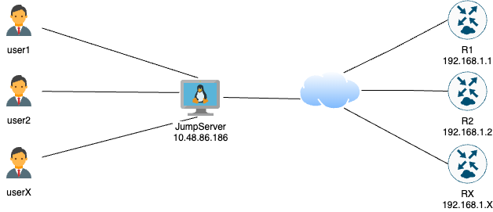

# CX LABS

## Lab Topology



<br></br>

### Jumpserver

| IP Address  | Username | Password | Connection Type|
| ---------- | -------- | -------- | -------- |
| 10.48.86.186 | user1 | cisco1 | SSH |
| 10.48.86.186 | user2 | cisco2 | SSH |
| 10.48.86.186 | userX | ciscoX | SSH |


`Note` where X is user number (example: user1, user2, user3 etc)

<br></br>

### C8000v

| JumpServer User | Lab Router Hostname  | Lab Router IP | Lab Router Username | Lab Router Password | Connection Type|
| ---------- | -------- | -------- | -------- | -------- | -------- |
| user1 | R1 | 192.168.1.1 | user1 | cisco1 | SSH |
| user2 | R2 | 192.168.1.2 | user2 | cisco2 | SSH |
| userX | RX | 192.168.1.X | userX | ciscoX | SSH |


<br></br>

---


## LAB INSTRUCTIONS

If you are using CX LABS not sandbox from developer.cisco.com, there are small differences in commands/instructions:

<br>

### JumpServer text editor

On jumpserver there is nano text editor installed. To edit files execute `nano`: 

```
[user1@localhost ~]$ nano <file name>
```

To exit hit CTRL + X

<br>


### LAB 1 - Guest Shell, Python scripting on Box

Login to Jumpserver using your username and password.

Example:

`ssh user1@0.tcp.eu.ngrok.io -p 16856`


```
kmazurki@KMAZURKI-M-L9FT ~ % ssh user1@0.tcp.eu.ngrok.io -p 16856
user1@10.48.86.186's password: 
Last login: Sun Apr 16 11:20:33 2023 from 10.61.76.44
-bash: warning: setlocale: LC_CTYPE: cannot change locale (UTF-8): No such file or directory
[user1@localhost ~]$ 
```

Login to your router:

`ssh user1@192.168.1.1`

```
[user1@localhost ~]$ ssh user1@192.168.1.1
Password: 

R1#
```

<br>

### LAB 3 - Building an IOx Application with Docker

Login to Jumpserver using your username and password.

Example:

`ssh user1@0.tcp.eu.ngrok.io -p 16856`

```
kmazurki@KMAZURKI-M-L9FT ~ % ssh user1@10.48.86.186
user1@10.48.86.186's password: 
Last login: Sun Apr 16 11:20:33 2023 from 10.61.76.44
-bash: warning: setlocale: LC_CTYPE: cannot change locale (UTF-8): No such file or directory
[user1@localhost ~]$ 
```

Navigate to lab3 folder

`cd labs/lab3/app`

```
[user1@localhost ~]$ cd labs/lab3/app
[user1@localhost lab3]$ 
```

Build your docker image with tag: `user1/ioxapp`

Note. You need to use sudo in front of docker command:

`sudo docker build -t user1/ioxapp .`

```
[user1@localhost app]$ sudo docker build -t user1/ioxapp .
```

Jumpserver is shared resource, so you can see other users images:

```
[user1@localhost app]$ sudo docker images
REPOSITORY     TAG       IMAGE ID       CREATED          SIZE
user1/ioxapp   latest    7a415c27a3b1   32 minutes ago   85.5MB
user2/ioxapp   latest    7a415c27a3b2   32 minutes ago   85.5MB
user3/ioxapp   latest    7a415c27a3b3   32 minutes ago   85.5MB
user4/ioxapp   latest    7a415c27a3b4   32 minutes ago   85.5MB
```

To package application ioxclient you need to use following command:

`sudo /usr/local/bin/ioxclient docker package user1/iox:latest .`

sudo needs to be added and instead of ioxclient you need to use /usr/local/bin/ioxclient

Since JS has no GUI, you won't be able to verify application using web browser and IOX Local Manager.

You can verify that your application is running succesfully by running curl command on jump server:

`curl http://192.168.1.201:5000`

```
[user1@localhost lab3]$ curl http://192.168.1.201:5000
Hello World![user0@localhost lab3]$ 
```


<br>

### LAB 4 - Troubleshoot Cisco IOX

Login to Jumpserver using your username and password.

Example:

`ssh user1@10.48.86.186`

```
kmazurki@KMAZURKI-M-L9FT ~ % ssh user1@10.48.86.186
user1@10.48.86.186's password: 
Last login: Sun Apr 16 11:20:33 2023 from 10.61.76.44
-bash: warning: setlocale: LC_CTYPE: cannot change locale (UTF-8): No such file or directory
[user1@localhost ~]$ 
```

Navigate to lab4 folder

`cd labs/lab4/broken_app`

```
[user1@localhost ~]$ cd labs/lab4/broken_app
[user1@localhost broken_app]$
```

Build your docker image with tag: `user1/ioxbrokenapp`

Note. You need to use sudo in front of docker command:

`sudo docker build -t user1/ioxbrokenapp .`

```
[user1@localhost broken_app]$ sudo docker build -t user1/ioxbrokenapp .
```

Jumpserver is shared resource, so you can see other users images:

```
[user1@localhost broken_app]$ sudo docker images
REPOSITORY           TAG       IMAGE ID       CREATED          SIZE
user1/ioxbrokenapp   latest    7a415c27a3b1   32 minutes ago   85.5MB
user2/ioxbrokenapp   latest    7a415c27a3b2   32 minutes ago   85.5MB
user3/ioxbrokenapp   latest    7a415c27a3b3   32 minutes ago   85.5MB
user4/ioxbrokenapp   latest    7a415c27a3b4   32 minutes ago   85.5MB
```

Try to run user1/ioxbrokenapp image using command:


`sudo docker run -p 5000:5000 user1/ioxbrokenapp .`

To package application ioxclient you need to use following command:

`sudo /usr/local/bin/ioxclient docker package user1/ioxbrokenapp:latest .`

