# Introduction to Infrastructure as Code using Terrraform

## Prerequisites

If you want to execute those labs on your workstation you need to have following prerequisites:

- Access to the internet

- `Docker` installed on your local machine: You will need to install Docker on your local machine. Docker provides installation instructions for various operating systems on their website. [Get Docker](https://docs.docker.com/get-docker/)

- `Code editor`: You will need a code editor to write and edit Dockerfiles and other code. You can choose any code editor of your preference like Visual Studio Code, Sublime Text, Atom or Notepad++, etc. [Visual Studio Code Download](https://code.visualstudio.com/)

- `terraform` version 1.5.X installed on your local machine [Terraform](https://developer.hashicorp.com/terraform/downloads)

- Basic command-line skills: Terraform is primarily a command-line tool, so you should be familiar with basic command-line skills to navigate and work with your system's terminal or command prompt.

Labs can also be done without installing anything on local machine using https://dcloud.cisco.com and `Cisco Catalyst 9000 IOS XE Programmability & Automation Lab v1`.

  

## LABS

- [LAB 1 - Introduction to Terraform](labs/lab1/README.md)

- [LAB 2 - BGP EVPN on IOS-XE Cat9k using Terraform](labs/lab2/README.md)

- [LAB 3 - Build CICD pipeline with Terraform](labs/lab3/README.md)

  

## Terraform Cheat Sheet

[Terraform Cheat Sheet](./TerraformCheatSheet.md)

  

## Reserve an DCLOUD session:

To reserve an `Cisco Catalyst 9000 IOS XE Programmability & Automation Lab v1`, follow below steps:

1. Login to Cisco DCLOUD website

In the browser, please navigate to DevNet: https://dcloud.cisco.com/ and click `Log In` button:

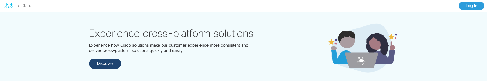

Login with your cisco.com account. If you don't have cisco.com account click `Sing up`

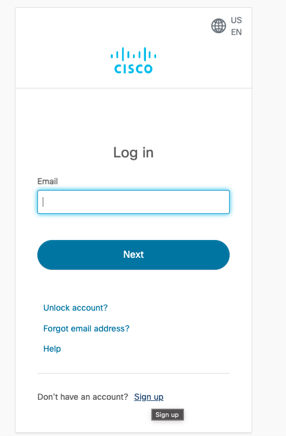

Create new account and click `Register`

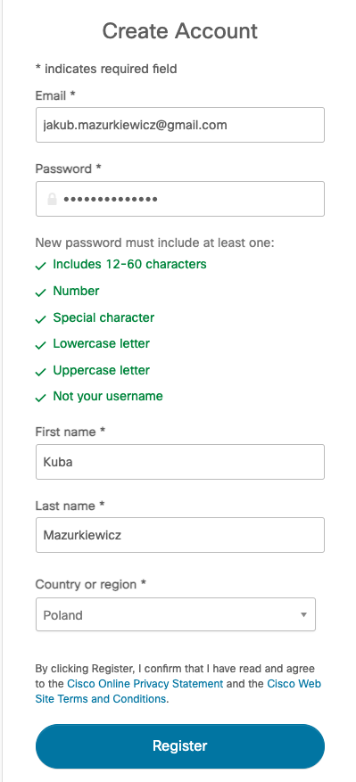

2. Find and schedule Cisco Catalyst 9000 IOS XE Programmability & Automation Lab v1 session

Paste `Cisco Catalyst 9000 IOS XE Programmability & Automation Lab v1` in Search field and click magnifying glass icon:

You should see 1 result:

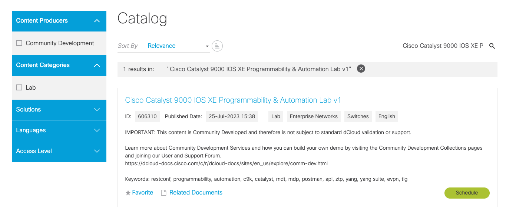

Click `Schedule` button and choose Schedule a Single Session and choose start and end date and click `Next`:

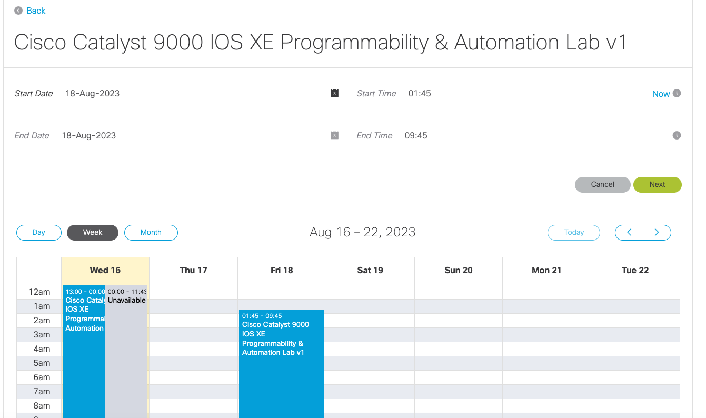

Choose Primary Use to help dcloud prioritize future enhancements and click Schedule:

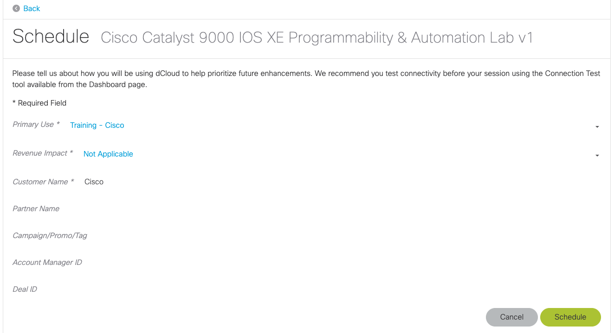

Once you schedule your session you should receive following mail:

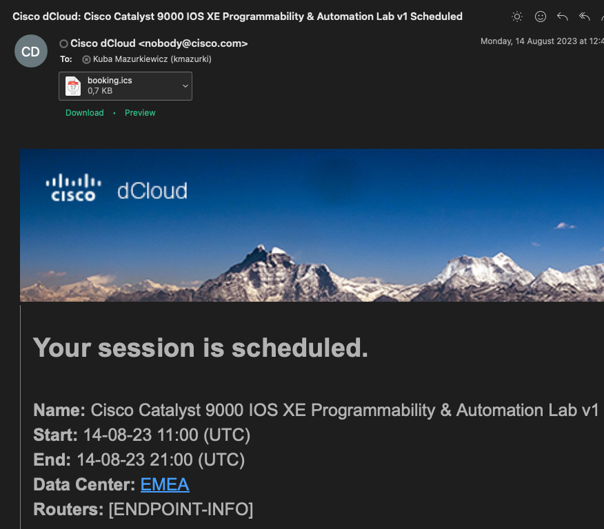

3. Access Cisco Catalyst 9000 IOS XE Programmability & Automation Lab v1 session

Navigate to main page of https://dcloud.cisco.com and click `My Hub` on the top right:

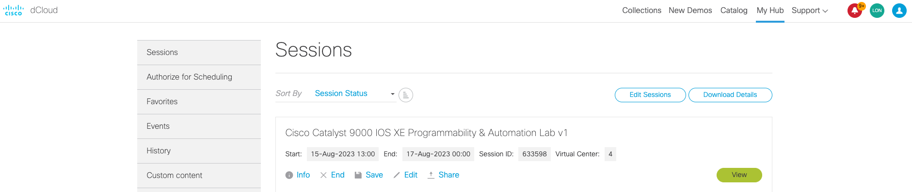

You should see your scheduled session under Sessions. Click `View` button to enter your session:

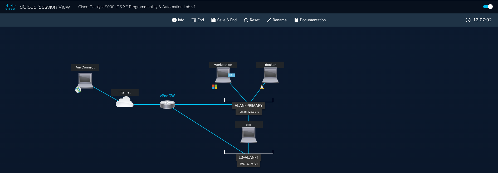

### Network Topology:

There is a workstation and a CML instance that host the tooling and virtual machines for the use cases. The Windows Workstation can be accessed with RDP. There is an Ubuntu WSL VM within the Windows VM that hosts services including TFTP.

The CML topology has several Cisco Catalyst 9000 Virtual Switches, Ubuntu Linux and Alpine Linux clients:

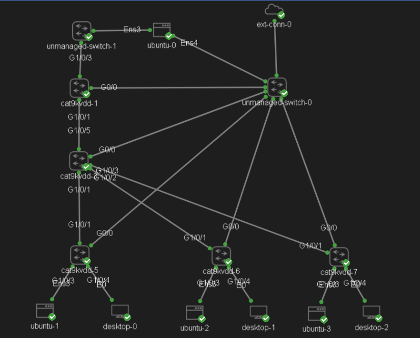

To access Windows Workstation Click on workstation icon, expand Remote Access and click `Web RDP` button:

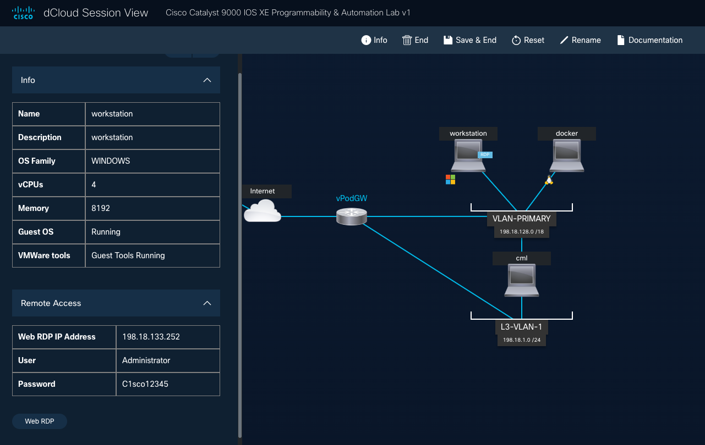

A new tab will open, and you should see Windows desktop

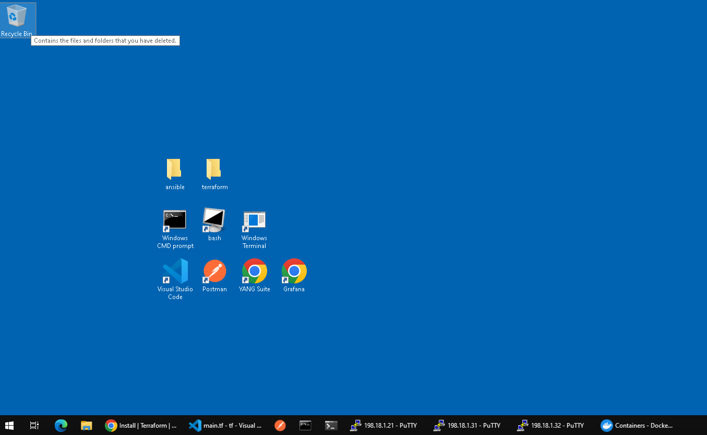
