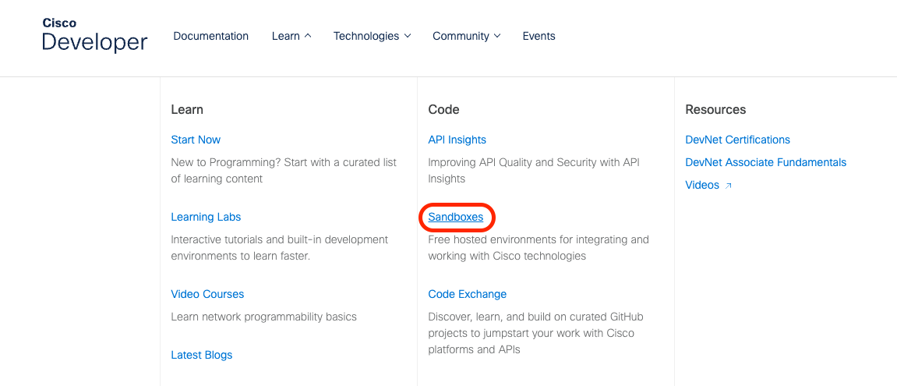
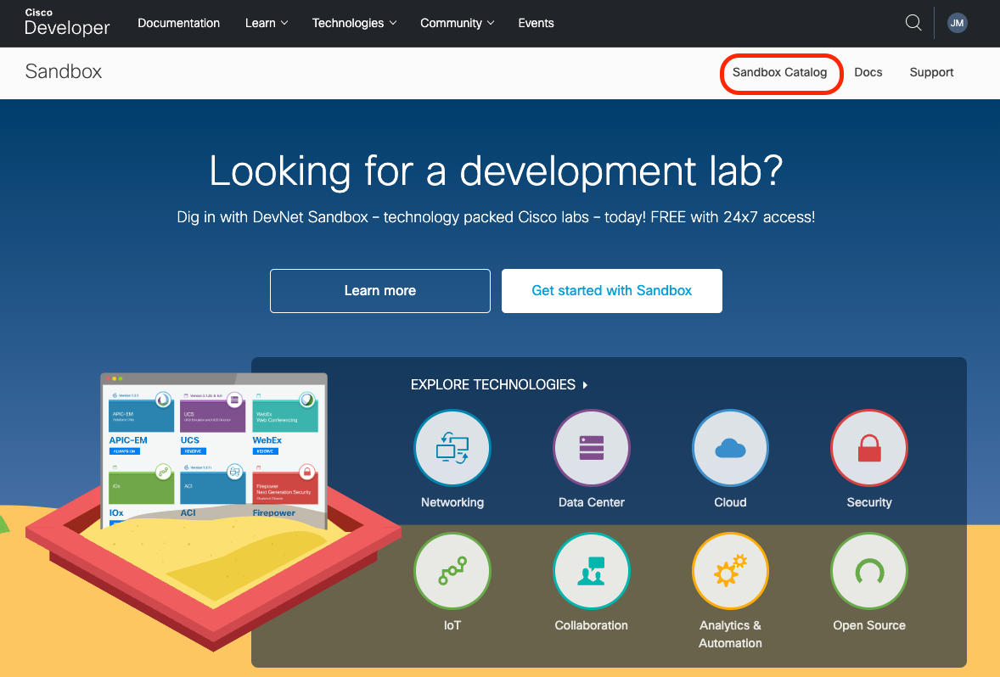
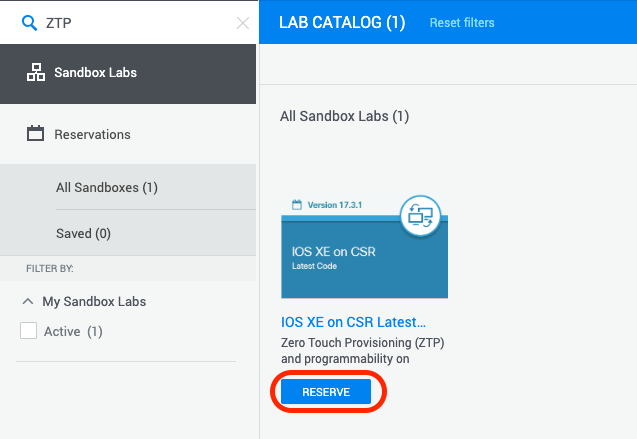
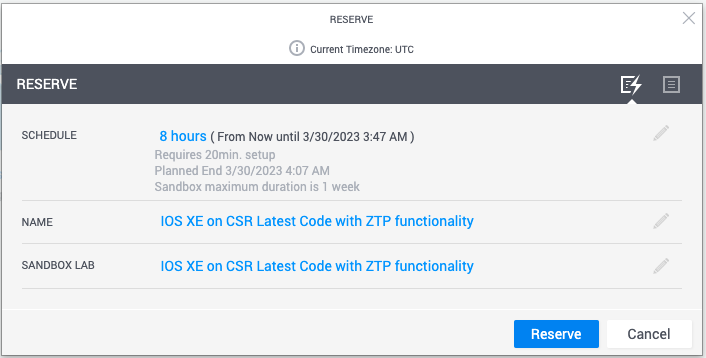
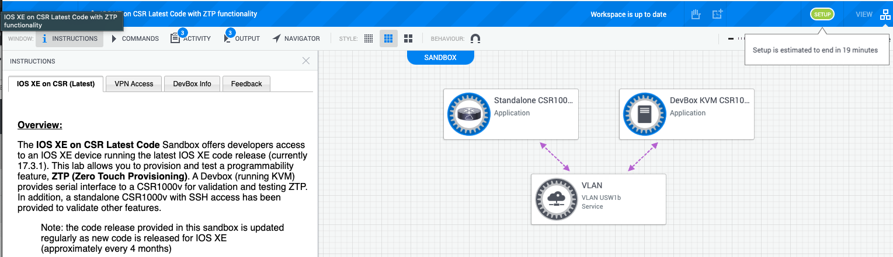

# Application Hosting on Cisco Devices Lab Guides

## Prerequisites

If you want to execute those labs on your workstation you need to have following prerequisites:

- Access to the internet: Docker requires internet access to download container images and Docker components, so you will need a reliable internet connection.

- `Docker` installed on your local machine: You will need to install Docker on your local machine. Docker provides installation instructions for various operating systems on their website. [Get Docker](https://docs.docker.com/get-docker/)

- `Code editor`: You will need a code editor to write and edit Dockerfiles and other code. You can choose any code editor of your preference like Visual Studio Code, Sublime Text, Atom or Notepad++, etc. [Visual Studio Code Download](https://code.visualstudio.com/)

- `ioxclient` downloaded: You will need to download [ioxclient](https://developer.cisco.com/docs/iox/#!iox-resource-downloads/downloads). "ioxclient" is a command line tool provided as part of Cisco IOx SDK. This utility is primarily meant for assisting application development for Cisco's IOx platforms.

- Basic command-line skills: Docker is primarily a command-line tool, so you should be familiar with basic command-line skills to navigate and work with your system's terminal or command prompt.

Labs can also be done without installing anything on local machine using https://developer.cisco.com sandboxes and other online resources.


<br></br>

## LABS

- [Lab 1 - Guest Shell, Python scripting on Box](labs/lab1/README.md)

- [Lab 2 - Introduction to Docker](labs/lab2/README.md)

- [Lab 3 - Building an IOX Application with Docker](labs/lab3/README.md)

- [Lab 4 - Troubleshoot Cisco IOX](labs/lab4/README.md)

<br></br>

## Reserve an IOx v1.15 Sandbox

To initially reserve an IOx v1.15 CAF instance, follow the next steps.

1. Login to DevNet Sandbox Page

In the browser, please navigate to DevNet: https://developer.cisco.com/

- Login with one of the available social logins.
- If you have not yet created a DevNet login, click "SIGN UP FREE" and follow the instructions.

Once logged in, click on Learn -> Sandboxes



Then click on Sandbox Catalog



Take a look at the catalog and the different usability options available. For easy access use features like:

- Search by keyword.
- Filter by the availability.
- Browse by Category.
- Check your reservations.

Find IOS XE on CSR Latest Code with ZTP functionality and click RESERVE:



Next click on the "Reserve" button to reserve a lab:

- Let's leave the default values in place and click Reserve button, you can change default schedule to more than 8 hours, maximum duration is 1 week.



- 2 emails will be sent to you with reservation confirmation and lab access details. You can watch for status updates.



In both mails you will find information how to install Cisco Anyconnect VPN Client Software which is required to access devices in reserved sandbox:

- [Download the Cisco AnyConnect VPN Client Software](https://developer.cisco.com/site/devnet/sandbox/anyconnect/)
- [Installation Guide for the Cisco AnyConnect VPN Client Software](https://devnetsandbox.cisco.com/Docs/VPN_Access/AnyConnect_Installation_Guide.pdf)

In the second mail you will also find VPN connection information which you have to use to establish VPN connection using Cisco AnyConnect VPN Client:

Example:

```
Lab Network Address: devnetsandbox-usw1-reservation.cisco.com:20230
Username: kuba.mazu
Password: JJUPMYPQ
```

Once you connect to VPN you should be able to reach Lab devices from your workstation using ssh client and web browser.