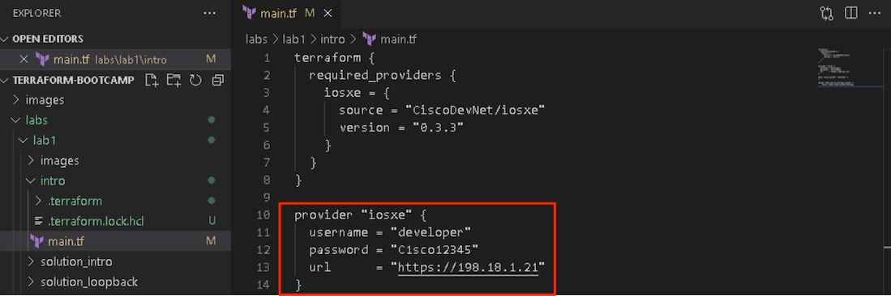
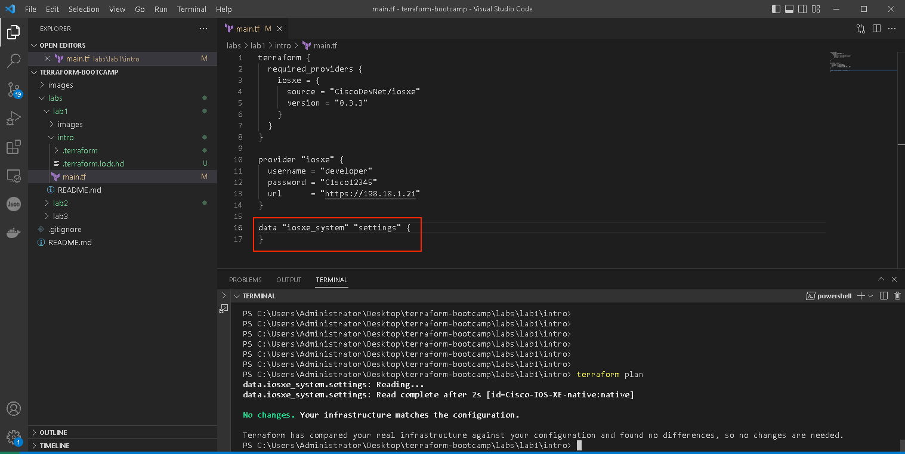
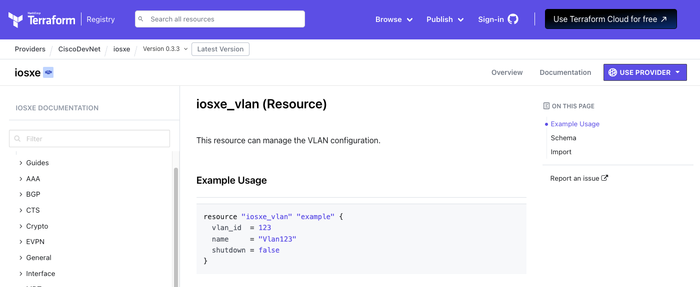
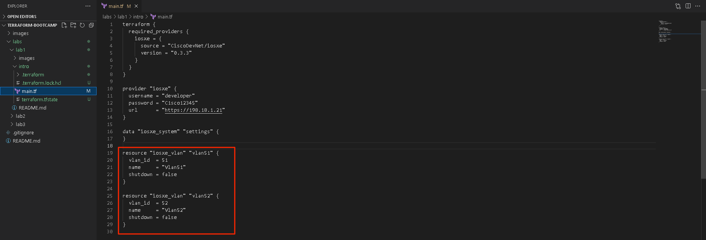

# LAB 1 - Introduction to Terraform

## Lab Overview

Welcome to the Introduction to Terraform Lab! In this lab, you will gain hands-on experience with Terraform, an Infrastructure as Code (IaC) tool used for creating, managing, and updating infrastructure resources in a declarative manner. Terraform allows you to define your infrastructure configuration as code, making it versionable, reproducible, and automated.

## Lab Objectives

Understand the fundamentals of Terraform and its core concepts.
Learn how to define, plan, apply, and destroy infrastructure using Terraform.
Explore Terraform CLI commands for formatting, validation, managing state, and more.
Import existing infrastructure into Terraform's management.

## Lab Sections:

<b>1. Installing Terraform:</b> 
- Learn how to set up your local development environment to start using Terraform effectively, including installing / updating terraform to latest version and install cisco IOSXE provider.

<b>2. Terraform Core Concepts:</b>
- Learn about Terraform Providers and how they manage resources from Cisco IOSXE provider.
- Understand Resources and Data Sources, and their role in defining and retrieving infrastructure components.
- Explore Terraform State and how it tracks the real state of infrastructure.
- Work with Input Variables and Output Values to parameterize and share values across configurations.

<b>3. Terraform Lifecycle:</b>
- Run terraform init to initialize a new or existing Terraform configuration.
- Use terraform plan to create an execution plan that shows what Terraform will do when you apply changes.
- Apply changes to your infrastructure using terraform apply.
- Safely destroy resources using terraform destroy.

<b>4. Import Existing Infrastructure:</b>
- Learn how to import existing infrastructure into Terraform using terraform import.

<b>5. Terraform CLI commands:</b>
- Use terraform fmt to format your configuration files for consistency.
- Validate your configuration with terraform validate to catch syntax and semantic errors.
- List resources managed by Terraform using terraform state list.

<br>

By the end of this lab, you will have the skills and confidence to leverage Terraform to orchestrate infrastructure in a scalable, efficient, and reproducible way. Let's embark on this exciting journey to transform your understanding of infrastructure provisioning!

<br>

## Pre-requisites

- Use an IDE of your choice. This tutorial will assume Visual Studio Code

- Git installed

- Access to Catalyst 9000 series switches

- Access to the internet


## Time Estimates

60 minutes

<br></br>
---

## 1. Upgrade/Install Terraform to latest version

To access Windows Workstation Click on workstation icon, expand Remote Access and click `Web RDP` button:


A new tab will open, and you should see Windows desktop


On Windows Workstation terraform is already installed. If you need to install fresh installation of Terraform you can follow Instruction from hashicorp.com website: [Install Terraform](https://developer.hashicorp.com/terraform/tutorials/aws-get-started/install-cli)

To upgrade Terraform to latest version (v1.5.5) open Windows Command prompt and run following command: `choco install terraform --version=1.5.6 --force`


You will be asked to continue (type "Y") and to run the script (type "Y)
```sh
C:\Users\Administrator>choco install terraform --version=1.5.5 --force
Chocolatey v1.1.0
Chocolatey detected you are not running from an elevated command shell
 (cmd/powershell).

 You may experience errors - many functions/packages
 require admin rights. Only advanced users should run choco w/out an
 elevated shell. When you open the command shell, you should ensure
 that you do so with "Run as Administrator" selected. If you are
 attempting to use Chocolatey in a non-administrator setting, you
 must select a different location other than the default install
 location. See
 https://docs.chocolatey.org/en-us/choco/setup#non-administrative-install
 for details.


 Do you want to continue?([Y]es/[N]o): Y

Installing the following packages:
terraform
By installing, you accept licenses for the packages.
terraform v1.5.5 already installed. Forcing reinstall of version '1.5.5'.
 Please use upgrade if you meant to upgrade to a new version.

terraform v1.5.5 (forced) [Approved]
terraform package files install completed. Performing other installation steps.
The package terraform wants to run 'chocolateyInstall.ps1'.
Note: If you don't run this script, the installation will fail.
Note: To confirm automatically next time, use '-y' or consider:
choco feature enable -n allowGlobalConfirmation
Do you want to run the script?([Y]es/[A]ll - yes to all/[N]o/[P]rint): A

Removing old terraform plugins
Downloading terraform 64 bit
  from 'https://releases.hashicorp.com/terraform/1.5.5/terraform_1.5.5_windows_amd64.zip'
Progress: 100% - Completed download of C:\Users\Administrator\AppData\Local\Temp\chocolatey\terraform\1.5.5\terraform_1.5.5_windows_amd64.zip (19.99 MB).
Download of terraform_1.5.5_windows_amd64.zip (19.99 MB) completed.
Hashes match.
Extracting C:\Users\Administrator\AppData\Local\Temp\chocolatey\terraform\1.5.5\terraform_1.5.5_windows_amd64.zip to C:\ProgramData\chocoportable\lib\terraform\tools...
C:\ProgramData\chocoportable\lib\terraform\tools
 ShimGen has successfully created a shim for terraform.exe
 The install of terraform was successful.
  Software installed to 'C:\ProgramData\chocoportable\lib\terraform\tools'

Chocolatey installed 1/1 packages.
 See the log for details (C:\ProgramData\chocoportable\logs\chocolatey.log).
```

Verify if terraform was updated successfully by running `terraform version` command:

```sh
C:\Users\Administrator>terraform version
Terraform v1.5.5
on windows_amd64
```

<br>

## 2. Clone terraform-bootcamp repository to workstation

Click on `Windows CMD prompt` icon on Workstation Desktop


Clone terraform-bootcamp-evpn repository to Desktop by running following command:

`git clone https://github.com/kuba-mazurkiewicz/terraform-bootcamp.git`


You will be asked to Sign in to GitHub. Use `access token` provided during labs


After cloning the repository, open the repository folder on your desktop. Right-click on the `terraform-bootcamp` folder and select `Open with Code`


Open Terminal in Visual Studio Code Editor by selecting `Terminal -> New Terminal`


Navigate to labs/lab1/intro folder in terminal by executing command: `cd labs/lab1/intro`


and expand same intro folder on right hand side of Visual Studio Code to create / edit files in Editor:


<br>

## 3. Install IOS-XE Terraform Provider

To install this provider, copy and paste this code into `main.tf` file.

```sh
terraform {
  required_providers {
    iosxe = {
      source = "CiscoDevNet/iosxe"
      version = "0.3.3"
    }
  }
}

provider "iosxe" {
  # Configuration options
}
```


Then, run `terraform init` command:


When you run the terraform init command, it initializes a working directory for your Terraform configuration. As part of this initialization process, Terraform creates two important artifacts: the .terraform directory and the .terraform.lock.hcl file. These artifacts play a role in managing the dependencies and configurations of your Terraform project.

### 1. .terraform Directory:

The `.terraform` directory is a subdirectory that Terraform creates within your working directory during the `terraform init` process. This directory contains a few essential components:

  -  <b>Plugin Binaries:</b> The main purpose of the `.terraform` directory is to store plugin binaries (providers). Providers are responsible for interacting with various infrastructure platforms, such as Cisco, AWS, Azure, GCP, etc. When you define providers in your configuration files, Terraform downloads and stores the corresponding provider plugin binaries in this directory.

  - <b>Module Content:</b> If your configuration references external modules (reusable configurations), the `.terraform` directory may also contain the downloaded module content. This helps keep track of the modules you're using and ensures they are available when you apply your configuration.

  - <b>Provider Metadata:</b> Alongside the plugin binaries, Terraform stores metadata about the providers in the `.terraform` directory. This metadata includes version information, configurations, and more.

### 2. .terraform.lock.hcl File:

The `.terraform.lock.hcl` file is a lock file that Terraform creates during the `terraform init` process. This file is used to record and manage the specific versions of providers that were selected for your project. It's designed to ensure consistency in provider versions across different environments and team members.

The lock file includes details such as the provider name and version constraint. It prevents automatic updates to provider versions that could potentially cause unexpected changes or issues when applying your Terraform configuration.

## 3. How to use IOS-XE Terraform Provider

To learn how to configure and interact with Terraform provider, you can use provider documentation on the Terraform Registry.

To check documentation for Cisco IOS-XE Terraform Provider open following link in your webbrowser:

`https://registry.terraform.io/providers/CiscoDevNet/iosxe/latest/docs`


Terraform Provider Documentation includes:

- <b>Introduction:</b> An overview of what the provider, data source, module, or topic is, including its purpose, use cases, and benefits.

- <b>Installation and Configuration:</b> Instructions on how to install and configure the provider or module. This might involve setting up authentication credentials, specifying provider settings, or importing modules into your Terraform projects.

- <b>Provider Configuration:</b> Detailed information about the configuration options and settings specific to the provider. This could include authentication mechanisms, API endpoints, region settings, and more.

- <b>Resource Types:</b> A list of the resource types that the provider supports. Each resource type is described in detail, including its purpose, arguments, attributes, and usage examples.

- <b>Data Sources:</b> Information about available data sources and how to use them. Data sources allow you to query external information and incorporate it into your Terraform configurations.

- <b>Module Documentation:</b> For modules, you'll find documentation on how to use the module, its inputs and outputs, usage examples, and any specific considerations or recommendations.

- <b>Usage Examples:</b> Practical examples that showcase how to use the provider or module. These examples help you understand how to define resources, configure settings, and integrate them into your configurations.

- <b>Argument Reference:</b> Detailed information about the arguments that can be used with resources or modules. This includes descriptions of each argument, data types, and possible values.

- <b>Attribute Reference:</b> Information about the attributes that are available for resources once they are created. These attributes represent the current state of the resource.

- <b>Importing Resources:</b> Guidance on how to import existing resources into your Terraform management. This is particularly important when you're adopting Terraform for existing infrastructure.

- <b>Version Compatibility:</b> Information about which versions of Terraform are compatible with the provider, module, or topic. This helps you ensure that you're using the appropriate versions.

- <b>Contributing and Community:</b> Information about how to contribute to the provider's development through GitHub repositories `Report an issue`

<br>

## 4. Use IOS-XE Terraform Provider to read data from C9000v switch

To read data from switch you need to provide credentials for device to Terrraform. This can be done either by updating the provider configuration in `main.tf` file:

```sh
provider "iosxe" {
  username = "developer"
  password = "C1sco12345"
  url      = "https://198.18.1.21"
}
```

Or by adding environment variables:

<b>(Windows)</b>
```sh
$env:IOSXE_USERNAME="developer"
$env:IOSXE_PASSWORD="C1sco12345"
```

<b>(Linux/Mac)</b>
```sh
export IOSXE_USERNAME=developer
export IOSXE_PASSWORD=C1sco12345
```


We will be updating `main.tf` file to provide credentials for C9k-spine device in CML topology:



To read data from C9k-spine device, we will use `Data Source` - `iosxe_system` to read the System configuration.

In Terraform, a data source is a special type of configuration that allows you to retrieve information or data from an external resource, such as a cloud provider, a database, or an API, and use that data within your Terraform configuration. Data sources provide a way to reference and consume existing information without actually creating or managing the resource itself. This is particularly useful when you want to gather information from an external source to inform your infrastructure configuration.

Data sources are defined using the data block in your Terraform configuration. Here's a structure of how a data source to read System configuration from C9k devices is defined:

```sh
data "iosxe_system" "settings" {
}
```

where:

- `iosxe`: is the name of the provider that supplies the data source

- `system`: The type of the data source, specifying the kind of information you want to retrieve. This is typically associated with a specific resource type provided by the provider

- `settings:` A name you give to the data source block. This is used to refer to the data source within your configuration.

Let's paste this config to main.tf file and run `terarform plan` command:




```ps
PS C:\Users\Administrator\Desktop\terraform-bootcamp\labs\lab1\intro> terraform plan
data.iosxe_system.settings: Reading...
data.iosxe_system.settings: Read complete after 2s [id=Cisco-IOS-XE-native:native]

No changes. Your infrastructure matches the configuration.

Terraform has compared your real infrastructure against your configuration and found no differences, so no changes are needed.
PS C:\Users\Administrator\Desktop\terraform-bootcamp\labs\lab1\intro>
```

You can see that configuration was read:

```
data.iosxe_system.settings: Reading...
data.iosxe_system.settings: Read complete after 2s [id=Cisco-IOS-XE-native:native]
```

Since data source is not creating or managing the resource, executing terraform plan will read data source but it won't result in any changes to the existing infrastructure. 


To display data from data source you can use `output` block in Terraform. The `output` block allows you to define values that you want to expose and make available for easy access after you apply your configuration.

Here's how you can use the output block to print and display `iosxe_system` data source:

```sh
output "data_source_settings_output" {
    value = data.iosxe_system.settings
}
```

where "data_source_settings_output" can be replaced with any custom name you choose for the output.


Once we paste output block to `main.tf` file, let's run `terraform plan` command again:

```ps
PS C:\Users\Administrator\Desktop\terraform-bootcamp\labs\lab1\intro> terraform plan
data.iosxe_system.settings: Reading...
data.iosxe_system.settings: Read complete after 2s [id=Cisco-IOS-XE-native:native]

Changes to Outputs:
  + data_source_settings_output = {
      + device                        = null
      + hostname                      = "c9k-spine"
      + id                            = "Cisco-IOS-XE-native:native"
      + ip_domain_lookup              = false
      + ip_domain_name                = "cisco.com"
      + ip_routing                    = false
      + ip_source_route               = false
      + ipv6_unicast_routing          = false
      + login_delay                   = null
      + login_on_failure              = false
      + login_on_failure_log          = false
      + login_on_success              = true
      + login_on_success_log          = true
      + mtu                           = null
      + multicast_routing             = false
      + multicast_routing_distributed = false
      + multicast_routing_switch      = false
      + multicast_routing_vrfs        = null
    }

You can apply this plan to save these new output values to the Terraform state, without changing any real infrastructure.

─────────────────────────────────────────────────────────────────────────────────────────────────────────────────────────────────────── 

Note: You didn't use the -out option to save this plan, so Terraform can't guarantee to take exactly these actions if you run
"terraform apply" now.
```

We can run `terraform apply` to save these new output values to the Terraform state, without changing any real infrastructure.

```ps
PS C:\Users\Administrator\Desktop\terraform-bootcamp\labs\lab1\intro> terraform apply
data.iosxe_system.settings: Reading...
data.iosxe_system.settings: Read complete after 2s [id=Cisco-IOS-XE-native:native]

Changes to Outputs:
  + data_source_settings_output = {
      + device                        = null
      + hostname                      = "c9k-spine"
      + id                            = "Cisco-IOS-XE-native:native"
      + ip_domain_lookup              = false
      + ip_domain_name                = "cisco.com"
      + ip_routing                    = false
      + ip_source_route               = false
      + ipv6_unicast_routing          = false
      + login_delay                   = null
      + login_on_failure              = false
      + login_on_failure_log          = false
      + login_on_success              = true
      + login_on_success_log          = true
      + mtu                           = null
      + multicast_routing             = false
      + multicast_routing_distributed = false
      + multicast_routing_switch      = false
      + multicast_routing_vrfs        = null
    }

You can apply this plan to save these new output values to the Terraform state, without changing any real infrastructure.

Do you want to perform these actions?
  Terraform will perform the actions described above.
  Only 'yes' will be accepted to approve.

  Enter a value: yes


Apply complete! Resources: 0 added, 0 changed, 0 destroyed.

Outputs:

data_source_settings_output = {
  "device" = tostring(null)
  "hostname" = "c9k-spine"
  "id" = "Cisco-IOS-XE-native:native"
  "ip_domain_lookup" = false
  "ip_domain_name" = "cisco.com"
  "ip_routing" = false
  "ip_source_route" = false
  "ipv6_unicast_routing" = false
  "login_delay" = tonumber(null)
  "login_on_failure" = false
  "login_on_failure_log" = false
  "login_on_success" = true
  "login_on_success_log" = true
  "mtu" = tonumber(null)
  "multicast_routing" = false
  "multicast_routing_distributed" = false
  "multicast_routing_switch" = false
  "multicast_routing_vrfs" = tolist(null) /* of object */
}
```

After you execute `terraform apply` new terraform state file: `terraform.tfstate` will be created to store information about resources and data objects.

You can inspect content of `terraform.tfstate` file in Visual Studio Code:


Since data source object was added to `terrafrom.tfstate` after applying configuration, you can use `terraform output` command to display `data_source_settings_output` output:

```ps
PS C:\Users\Administrator\Desktop\terraform-bootcamp\labs\lab1\intro> terraform output data_source_settings_output
{
  "device" = tostring(null)
  "hostname" = "c9k-spine"
  "id" = "Cisco-IOS-XE-native:native"
  "ip_domain_lookup" = false
  "ip_domain_name" = "cisco.com"
  "ip_routing" = false
  "ip_source_route" = false
  "ipv6_unicast_routing" = false
  "login_delay" = tonumber(null)
  "login_on_failure" = false
  "login_on_failure_log" = false
  "login_on_success" = true
  "login_on_success_log" = true
  "mtu" = tonumber(null)
  "multicast_routing" = false
  "multicast_routing_distributed" = false
  "multicast_routing_switch" = false
  "multicast_routing_vrfs" = tolist(null) /* of object */
}
PS C:\Users\Administrator\Desktop\terraform-bootcamp\labs\lab1\intro>
```

<br>

## 5. Create new VLANs on C9000v switch

Prior to moving forward, it's important to be aware that if you encounter any challenges or wish to review the ultimate solution after completing this section, you can click [here](./solution_intro/main.tf) to examine the expected appearance of the "main.tf" file.

Let's now interact with c9k-spine switch and configure 2 new vlans: 51 and 52.

Before we start let's remove output configuration from previous step.

The resource to manage VLAN configuration in iosxe terraform provider is: `iosxe_vlan`. In documentation website we can find this resource and check example usage:



We need to modify this example usage configuration to create vlan 51 and 52:

```sh
resource "iosxe_vlan" "vlan51" {
  vlan_id  = 51
  name     = "Vlan51"
  shutdown = false
}

resource "iosxe_vlan" "vlan52" {
  vlan_id  = 52
  name     = "Vlan52"
  shutdown = false
}
```

paste this config into `main.tf` configuration file:



and run `terraform plan` command to create an execution plan that shows what Terraform will do when you apply changes:

```ps
PS C:\Users\Administrator\Desktop\terraform-bootcamp\labs\lab1\intro> terraform plan
data.iosxe_system.settings: Reading...
data.iosxe_system.settings: Read complete after 2s [id=Cisco-IOS-XE-native:native]

Terraform used the selected providers to generate the following execution plan. Resource actions are indicated with the following
symbols:
  + create

Terraform will perform the following actions:

  # iosxe_vlan.vlan51 will be created
  + resource "iosxe_vlan" "vlan51" {
      + id       = (known after apply)
      + name     = "Vlan51"
      + shutdown = false
      + vlan_id  = 51
    }

  # iosxe_vlan.vlan52 will be created
  + resource "iosxe_vlan" "vlan52" {
      + id       = (known after apply)
      + name     = "Vlan52"
      + shutdown = false
      + vlan_id  = 52
    }

Plan: 2 to add, 0 to change, 0 to destroy.

─────────────────────────────────────────────────────────────────────────────────────────────────────────────────────────────────────── 

Note: You didn't use the -out option to save this plan, so Terraform can't guarantee to take exactly these actions if you run
"terraform apply" now.
PS C:\Users\Administrator\Desktop\terraform-bootcamp\labs\lab1\intro>  
```

To sum it up, terraform will flag the changes which will be executed to existing infrastructure with `terraform apply` command. 

You can see that 2 new resources "iosxe_vlan" "vlan51" and "iosxe_vlan" "vlan52" on C9k device will be created.

Let's run `terraform apply` command now. Terraform will ask to confirm changes, you can do this by typing `yes`:

```ps
PS C:\Users\Administrator\Desktop\terraform-bootcamp\labs\lab1\intro> terraform apply
data.iosxe_system.settings: Reading...
data.iosxe_system.settings: Read complete after 2s [id=Cisco-IOS-XE-native:native]

Terraform used the selected providers to generate the following execution plan. Resource actions are indicated with the following
symbols:
  + create

Terraform will perform the following actions:

  # iosxe_vlan.vlan51 will be created
  + resource "iosxe_vlan" "vlan51" {
      + id       = (known after apply)
      + name     = "Vlan51"
      + shutdown = false
      + vlan_id  = 51
    }

  # iosxe_vlan.vlan52 will be created
  + resource "iosxe_vlan" "vlan52" {
      + id       = (known after apply)
      + name     = "Vlan52"
      + shutdown = false
      + vlan_id  = 52
    }

Plan: 2 to add, 0 to change, 0 to destroy.

Do you want to perform these actions?
  Terraform will perform the actions described above.
  Only 'yes' will be accepted to approve.

  Enter a value: yes

iosxe_vlan.vlan51: Creating...
iosxe_vlan.vlan52: Creating...
iosxe_vlan.vlan52: Creation complete after 1s [id=Cisco-IOS-XE-native:native/vlan/Cisco-IOS-XE-vlan:vlan-list=52]
iosxe_vlan.vlan51: Creation complete after 1s [id=Cisco-IOS-XE-native:native/vlan/Cisco-IOS-XE-vlan:vlan-list=51]

Apply complete! Resources: 2 added, 0 changed, 0 destroyed.

PS C:\Users\Administrator\Desktop\terraform-bootcamp\labs\lab1\intro>
```

Configuration was applied succesfully, let's inspect `terraform.tfstate` file to see 2 new managed resources for vlan51 and vlan52:


You can also verify that 2 new vlans were created on C9k-spine device by using Putty to login to that box.

Use the following details to log in:

| Device Name | Device IP | username / password | 
| --- | --- | --- |
| C9k-spine | 198.18.1.21 | developer/C1sco12345 | 

and execute `show vlan` command:


Let's destroy vlans created by Terraform by running `terraform destroy` command:

```ps
PS C:\Users\Administrator\Desktop\terraform-bootcamp\labs\lab1\intro> terraform destroy
iosxe_vlan.vlan51: Refreshing state... [id=Cisco-IOS-XE-native:native/vlan/Cisco-IOS-XE-vlan:vlan-list=51]
data.iosxe_system.settings: Reading...
iosxe_vlan.vlan52: Refreshing state... [id=Cisco-IOS-XE-native:native/vlan/Cisco-IOS-XE-vlan:vlan-list=52]
data.iosxe_system.settings: Read complete after 2s [id=Cisco-IOS-XE-native:native]

Terraform used the selected providers to generate the following execution plan. Resource actions are indicated with the following       
symbols:
  - destroy

Terraform will perform the following actions:

  # iosxe_vlan.vlan51 will be destroyed
  - resource "iosxe_vlan" "vlan51" {
      - id       = "Cisco-IOS-XE-native:native/vlan/Cisco-IOS-XE-vlan:vlan-list=51" -> null
      - name     = "Vlan51" -> null
      - shutdown = false -> null
      - vlan_id  = 51 -> null
    }

  # iosxe_vlan.vlan52 will be destroyed
  - resource "iosxe_vlan" "vlan52" {
      - id       = "Cisco-IOS-XE-native:native/vlan/Cisco-IOS-XE-vlan:vlan-list=52" -> null
      - name     = "Vlan52" -> null
      - shutdown = false -> null
      - vlan_id  = 52 -> null
    }

Plan: 0 to add, 0 to change, 2 to destroy.

Do you really want to destroy all resources?
  Terraform will destroy all your managed infrastructure, as shown above.
  There is no undo. Only 'yes' will be accepted to confirm.

  Enter a value: yes

iosxe_vlan.vlan51: Destroying... [id=Cisco-IOS-XE-native:native/vlan/Cisco-IOS-XE-vlan:vlan-list=51]
iosxe_vlan.vlan52: Destroying... [id=Cisco-IOS-XE-native:native/vlan/Cisco-IOS-XE-vlan:vlan-list=52]
iosxe_vlan.vlan52: Destruction complete after 1s
iosxe_vlan.vlan51: Destruction complete after 1s

Destroy complete! Resources: 2 destroyed.
PS C:\Users\Administrator\Desktop\terraform-bootcamp\labs\lab1\intro>
```

As resources are destroyed, Terraform updates the terraform.tfstate file to reflect the new state of the infrastructure. Resources that have been deleted are marked as such in the state file. You can check that vlan 51 and vlan 52 resources are not present in `terraform.tfstate` file anymore:


<br>

## 6. Best practises for Terraform configurations structure

Putting all code in `main.tf` is a good idea when you are getting started or writing an example code. In all other cases you will be better having several files split logically like this:

- `main.tf` - call modules, locals, and data sources to create all resources
- `variables.tf` - contains declarations of variables used in main.tf
- `outputs.tf` - contains outputs from the resources created in main.tf
- `versions.tf` - contains version requirements for Terraform and providers
- `terraform.tfvars` - contains variable values that are declared in variables.tf file

Let's create Loopback interfaces on 2 leaf switches using file stucture mentined above and following details:

| Device Name | Device IP | username / password | Loopback Interface Number | Loopback IP address |
| --- | --- | --- | --- | --- |
| LEAF-1 | 198.18.1.31 | developer/C1sco12345 | 101 | 192.168.1.101/32 |
| LEAF-2 | 198.18.1.32 | developer/C1sco12345 | 101 | 192.168.2.101/32 |

where Loopback Interface Number is matching 4th octet of Loopback IP Address and 3rd octet of Loopback IP Address is matching last character (number) in Device Name.

<br>

### 1. Prepare your working directory:

Create a new directory for your Terraform project and navigate into it.

```ps
PS C:\Users\Administrator\Desktop\terraform-bootcamp\labs\lab1\intro> cd ..
PS C:\Users\Administrator\Desktop\terraform-bootcamp\labs\lab1> mkdir iosxe-loopback-interface


    Directory: C:\Users\Administrator\Desktop\terraform-bootcamp\labs\lab1


Mode                 LastWriteTime         Length Name
----                 -------------         ------ ----
d-----         8/21/2023  10:16 AM                iosxe-loopback-interface


PS C:\Users\Administrator\Desktop\terraform-bootcamp\labs\lab1> cd .\iosxe-loopback-interface\
PS C:\Users\Administrator\Desktop\terraform-bootcamp\labs\lab1\iosxe-loopback-interface> 
```

### 2. Initialize your configuration:

Create the following files in your ``` iosxe-loopback-interface ``` directory:

- main.tf
- variables.tf
- outputs.tf
- versions.tf
- terraform.tfvars

In order to create files, right click on ``` iosxe-loopback-interface ``` in Visual Studio code and select ``` New File ``` as visible on screenshow below:

  

Prior to moving forward, it's important to be aware that if you encounter any challenges or wish to review the ultimate solution after completing this section, you can click [here](./solution_loopback/) to examine how the above mentioned files' content is expected to look like.
<br>

Once files are created, you should see them the following way:


### 3. Configure versions.tf:

In the versions.tf file, specify the required Terraform and provider version:

```ps
terraform {
  required_version = ">= 1.5.0"

  required_providers {
    iosxe = {
      source = "CiscoDevNet/iosxe"
      version = "0.3.3"
    }
  }
}
```

### 4. Define variables.tf:

In the variables.tf file, declare the variables you'll use in your configuration.

```ps
variable "devices" {
  description = "List of device details"
  type        = list(object({
    name = string
    url  = string
  }))
}

variable "credentials" {
  description = "Credentials"
  type        = object({
    username = string
    password = string
  })
}

variable "loopback_interface_number" {
  description = "Loopback interface number"
  type        = number
}
```

Variable `credentials` is object variable, which is a type of variable that can hold a complex data structure with multiple attributes or fields.

Variable `devices` is list of objects variable. This is a data structure that allows you to define a list of maps, where each map represents an object with a set of key-value pairs. This data structure is often used to represent a collection of similar resources or configurations that need to be created in a single block of code


### 5. Configure terraform.tfvars:

In the terraform.tfvars file, provide values for the variables.

```ps
credentials = {
  username = "developer"
  password = "C1sco12345"
}

devices = [
  {
    name = "LEAF-1"
    url = "https://198.18.1.31"
  },
  {
    name = "LEAF-2"
    url = "https://198.18.1.32"
  }
]

loopback_interface_number = 101
```

### 6. Define main.tf:

In the main.tf file, define the resources to create the loopback interface on both switches.

```ps
provider "iosxe" {
  username = var.credentials.username
  password = var.credentials.password
  devices  = var.devices
}

resource "iosxe_interface_loopback" "loopback_interface" {
  for_each = { for device in var.devices : device.name => split("-",device.name)[1] }

  name              = var.loopback_interface_number
  description       = "Created by Terraform"
  device            = each.key
  ipv4_address      = "192.168.${each.value}.${var.loopback_interface_number}"
  ipv4_address_mask = "255.255.255.255"
}
```

To create loopback interface we are using resource `iosxe_interface_loopback` from iosxe provider: https://registry.terraform.io/providers/CiscoDevNet/iosxe/latest/docs/resources/interface_loopback

Here's a breakdown of each part of the code:

1. `resource "iosxe_interface_loopback" "loopback_interface"`: This defines a iosxe_interface_loopback resource named loopback_interface

2. `for_each = { for device in var.devices : device.name => split("-", device.name)[1] }`: This for_each argument iterates through the var.devices list of devices and creates a loopback interface for each device. The loop iterates over each device and creates a map where the key is device.name and value is derived from splitting the device.name using the hyphen ("-") as a separator and taking the second part (index [1]) of the resulting list. This value is used in ipv4_address attribute.

3. `name = var.loopback_interface_number`: This assigns the value of the var.loopback_interface_number variable to the name attribute of loopback interface.

4. `description = "Created by Terraform"`: Sets a static description for the loopback interface. Each created interface will have this description.

5. `device`: This assigns device name using each.key which refers to key (device_name).

6. `ipv4_address = "192.168.${each.value}.${var.loopback_interface_number}"`: This sets the IPv4 address for each loopback interface. The `${each.value}` represents the value associated with the current iteration in the for_each loop (in this case, the value derived from the split operation). `${var.loopback_interface_number}` refers to the specified loopback interface number.

### 7. Define outputs.tf:

In the outputs.tf file, define any outputs you want to see after applying the configuration.

```ps
output "created_loopback_interfaces" {
  description = "List of created loopback interface resource ids"
  value       = [for intf in iosxe_interface_loopback.loopback_interface : intf.id]
}
```

In above code `created_loopback_interfaces` output will contain list of id's for created loopback interface resources.

In Terraform, the id of a resource is a unique identifier that represents that resource within its provider. The id is a special attribute that's automatically generated by the provider when the resource is created and assigned a unique value that allows Terraform to manage and track the resource.

### 8. Initiate the Terraform initialization process using 'terraform init':

Running ``` terraform init ``` is necessary to ensure that your Terraform configuration and provider versions are consistent and properly managed.

It nsures that your working directory is consistent with your configuration, preventing version conflicts or inconsistencies during future ``` terraform apply ``` or ``` terraform plan ``` operations.

Run ``` terraform init ```:


### 9. Plan and Apply the Configuration:

Run `terraform plan` command:

```ps
PS C:\Users\Administrator\Desktop\terraform-bootcamp\labs\lab1\iosxe-loopback-interface> terraform plan   

Terraform used the selected providers to generate the following execution plan. Resource actions are indicated with the following       
symbols:
  + create

Terraform will perform the following actions:

  # iosxe_interface_loopback.loopback_interface["LEAF-1"] will be created
  + resource "iosxe_interface_loopback" "loopback_interface" {
      + description       = "Created by Terraform"
      + device            = "LEAF-1"
      + id                = (known after apply)
      + ipv4_address      = "192.168.1.101"
      + ipv4_address_mask = "255.255.255.255"
      + name              = 101
    }

  # iosxe_interface_loopback.loopback_interface["LEAF-2"] will be created
  + resource "iosxe_interface_loopback" "loopback_interface" {
      + description       = "Created by Terraform"
      + device            = "LEAF-2"
      + id                = (known after apply)
      + ipv4_address      = "192.168.2.101"
      + ipv4_address_mask = "255.255.255.255"
      + name              = 101
    }

Plan: 2 to add, 0 to change, 0 to destroy.

Changes to Outputs:
  + created_loopback_interfaces = [
      + (known after apply),
      + (known after apply),
    ]

─────────────────────────────────────────────────────────────────────────────────────────────────────────────────────────────────────── 

Note: You didn't use the -out option to save this plan, so Terraform can't guarantee to take exactly these actions if you run
"terraform apply" now.
PS C:\Users\Administrator\Desktop\terraform-bootcamp\labs\lab1\iosxe-loopback-interface> 
```

Check if output is matching desired configuration. You should see 2 loopback interface resources (Loopback101 with ip 192.168.1.101 and mask 255.255.255.255 on LEAF-1 and Loopback101 with ip 192.168.2.101 and mask 255.255.255.255 on LEAF-2). 

Notice `(known after apply)` status in Changes to Output of created_loopback_interfaces. The actual values of the created loopback interface resource IDs will be known only after you apply your Terraform configuration. 

Run `terrafrom apply`:

```ps
PS C:\Users\Administrator\Desktop\terraform-bootcamp\labs\lab1\iosxe-loopback-interface> terraform apply

Terraform used the selected providers to generate the following execution plan. Resource actions are indicated with the following       
symbols:
  + create

Terraform will perform the following actions:

  # iosxe_interface_loopback.loopback_interface["LEAF-1"] will be created
  + resource "iosxe_interface_loopback" "loopback_interface" {
      + description       = "Created by Terraform"
      + device            = "LEAF-1"
      + id                = (known after apply)
      + ipv4_address      = "192.168.1.101"
      + ipv4_address_mask = "255.255.255.255"
      + name              = 101
    }

  # iosxe_interface_loopback.loopback_interface["LEAF-2"] will be created
  + resource "iosxe_interface_loopback" "loopback_interface" {
      + description       = "Created by Terraform"
      + device            = "LEAF-2"
      + id                = (known after apply)
      + ipv4_address      = "192.168.2.101"
      + ipv4_address_mask = "255.255.255.255"
      + name              = 101
    }

Plan: 2 to add, 0 to change, 0 to destroy.

Changes to Outputs:
  + created_loopback_interfaces = [
      + (known after apply),
      + (known after apply),
    ]

Do you want to perform these actions?
  Terraform will perform the actions described above.
  Only 'yes' will be accepted to approve.

  Enter a value: yes

iosxe_interface_loopback.loopback_interface["LEAF-1"]: Creating...
iosxe_interface_loopback.loopback_interface["LEAF-2"]: Creating...
iosxe_interface_loopback.loopback_interface["LEAF-1"]: Creation complete after 0s [id=Cisco-IOS-XE-native:native/interface/Loopback=101]iosxe_interface_loopback.loopback_interface["LEAF-2"]: Creation complete after 0s [id=Cisco-IOS-XE-native:native/interface/Loopback=101]
Apply complete! Resources: 2 added, 0 changed, 0 destroyed.

Outputs:

created_loopback_interfaces = [
  "Cisco-IOS-XE-native:native/interface/Loopback=101",
  "Cisco-IOS-XE-native:native/interface/Loopback=101",
]
PS C:\Users\Administrator\Desktop\terraform-bootcamp\labs\lab1\iosxe-loopback-interface> 
```

### 10. Verify Loopback Interfaces:

After the terraform apply command completes, login to both switches (c9k-leaf1 and c9k-leaf2) using Putty and the following details:

| Device Name | Device IP | username / password | 
| --- | --- | --- |
| LEAF-1 | 198.18.1.31 | developer/C1sco12345 | 
| LEAF-2 | 198.18.1.32 | developer/C1sco12345 | 

Verify that Loopback101 interfaces were created on both devices:


### 11. Clean Up:
When you're done, run terraform destroy to remove the created loopback interfaces.

```ps
PS C:\Users\Administrator\Desktop\terraform-bootcamp\labs\lab1\iosxe-loopback-interface> terraform destroy
iosxe_interface_loopback.loopback_interface["LEAF-2"]: Refreshing state... [id=Cisco-IOS-XE-native:native/interface/Loopback=101]
iosxe_interface_loopback.loopback_interface["LEAF-1"]: Refreshing state... [id=Cisco-IOS-XE-native:native/interface/Loopback=101]

Terraform used the selected providers to generate the following execution plan. Resource actions are indicated with the following       
symbols:
  - destroy

Terraform will perform the following actions:

  # iosxe_interface_loopback.loopback_interface["LEAF-1"] will be destroyed
  - resource "iosxe_interface_loopback" "loopback_interface" {
      - description       = "Created by Terraform" -> null
      - device            = "LEAF-1" -> null
      - id                = "Cisco-IOS-XE-native:native/interface/Loopback=101" -> null
      - ipv4_address      = "192.168.1.101" -> null
      - ipv4_address_mask = "255.255.255.255" -> null
      - name              = 101 -> null
    }

  # iosxe_interface_loopback.loopback_interface["LEAF-2"] will be destroyed
  - resource "iosxe_interface_loopback" "loopback_interface" {
      - description       = "Created by Terraform" -> null
      - device            = "LEAF-2" -> null
      - id                = "Cisco-IOS-XE-native:native/interface/Loopback=101" -> null
      - ipv4_address      = "192.168.2.101" -> null
      - ipv4_address_mask = "255.255.255.255" -> null
      - name              = 101 -> null
    }

Plan: 0 to add, 0 to change, 2 to destroy.

Changes to Outputs:
  - created_loopback_interfaces = [
      - "Cisco-IOS-XE-native:native/interface/Loopback=101",
      - "Cisco-IOS-XE-native:native/interface/Loopback=101",
    ] -> null

Do you really want to destroy all resources?
  Terraform will destroy all your managed infrastructure, as shown above.
  There is no undo. Only 'yes' will be accepted to confirm.

  Enter a value: yes

iosxe_interface_loopback.loopback_interface["LEAF-2"]: Destroying... [id=Cisco-IOS-XE-native:native/interface/Loopback=101]
iosxe_interface_loopback.loopback_interface["LEAF-1"]: Destroying... [id=Cisco-IOS-XE-native:native/interface/Loopback=101]
iosxe_interface_loopback.loopback_interface["LEAF-1"]: Destruction complete after 1s
iosxe_interface_loopback.loopback_interface["LEAF-2"]: Destruction complete after 1s

Destroy complete! Resources: 2 destroyed.
PS C:\Users\Administrator\Desktop\terraform-bootcamp\labs\lab1\iosxe-loopback-interface> 
```

<br>

## 7. Import Existing Infrastructure

 While creating resources from scratch using Terraform is a common practice, the real world often presents scenarios where existing resources need to be integrated into your IAC workflow. This is where the `terrafrom config-driven import` comes into play. Terraform config-driven import was introduced in Terraform version 1.5.
 
 Config-driven import is a new declarative workflow to add existing resources into Terraform state and solves the limitations of the existing import command. 

Terraform import is also useful in situation where you loose `terraform.tfstate` file. If the state file gets lost, Terraform will think it never created those resources in the first place and will try to duplicate everything. This can lead to potential issues and complications.


Let's recreate loopback interfaces we destroyed in last step:

```ps
PS C:\Users\Administrator\Desktop\terraform-bootcamp\labs\lab1\iosxe-loopback-interface> terraform apply

Terraform used the selected providers to generate the following execution plan. Resource actions are indicated with the following       
symbols:
  + create

Terraform will perform the following actions:

  # iosxe_interface_loopback.loopback_interface["LEAF-1"] will be created
  + resource "iosxe_interface_loopback" "loopback_interface" {
      + description       = "Created by Terraform"
      + device            = "LEAF-1"
      + id                = (known after apply)
      + ipv4_address      = "192.168.1.101"
      + ipv4_address_mask = "255.255.255.255"
      + name              = 101
    }

  # iosxe_interface_loopback.loopback_interface["LEAF-2"] will be created
  + resource "iosxe_interface_loopback" "loopback_interface" {
      + description       = "Created by Terraform"
      + device            = "LEAF-2"
      + id                = (known after apply)
      + ipv4_address      = "192.168.2.101"
      + ipv4_address_mask = "255.255.255.255"
      + name              = 101
    }

Plan: 2 to add, 0 to change, 0 to destroy.

Changes to Outputs:
  + created_loopback_interfaces = [
      + (known after apply),
      + (known after apply),
    ]

Do you want to perform these actions?
  Terraform will perform the actions described above.
  Only 'yes' will be accepted to approve.

  Enter a value: yes

iosxe_interface_loopback.loopback_interface["LEAF-1"]: Creating...
iosxe_interface_loopback.loopback_interface["LEAF-2"]: Creating...
iosxe_interface_loopback.loopback_interface["LEAF-2"]: Creation complete after 0s [id=Cisco-IOS-XE-native:native/interface/Loopback=101]iosxe_interface_loopback.loopback_interface["LEAF-1"]: Creation complete after 0s [id=Cisco-IOS-XE-native:native/interface/Loopback=101]
Apply complete! Resources: 2 added, 0 changed, 0 destroyed.

Outputs:

created_loopback_interfaces = [
  "Cisco-IOS-XE-native:native/interface/Loopback=101",
  "Cisco-IOS-XE-native:native/interface/Loopback=101",
]
PS C:\Users\Administrator\Desktop\terraform-bootcamp\labs\lab1\iosxe-loopback-interface> 
```

Next, let's create new loopback interface 102 on c9k-leaf1 manually via PUTTY:

```
conf t
interface Loopback102
ip address 192.168.1.102 255.255.255.255
```


We have now Loopback interface 102 on c9k-leaf1 device which is not managed by Terraform. To import this interface to your terrrafrom tfstate file use following commands:

1. Create new resource in `main.tf` file:

```ps
resource "iosxe_interface_loopback" "loopback_interface102" {
  name              = 102
  description       = "Created Manually"
  device            = "LEAF-1"
  ipv4_address      = "192.168.1.102"
  ipv4_address_mask = "255.255.255.255"
}
```

2. Run `terraform import` command:

```ps
PS C:\Users\Administrator\Desktop\terraform-bootcamp\labs\lab1\iosxe-loopback-interface> terraform import iosxe_interface_loopback.loopback_interface102 "Cisco-IOS-XE-native:native/interface/Loopback=102"
iosxe_interface_loopback.loopback_interface102: Importing from ID "Cisco-IOS-XE-native:native/interface/Loopback=102"...
iosxe_interface_loopback.loopback_interface102: Import prepared!
  Prepared iosxe_interface_loopback for import
iosxe_interface_loopback.loopback_interface102: Refreshing state... [id=Cisco-IOS-XE-native:native/interface/Loopback=102]

Import successful!

The resources that were imported are shown above. These resources are now in
your Terraform state and will henceforth be managed by Terraform.

PS C:\Users\Administrator\Desktop\terraform-bootcamp\labs\lab1\iosxe-loopback-interface> 
```

Import was succesfull now you can check if `resource loopback_interface102` was added to terraform state file. Run `terraform state list` command:

```ps
PS C:\Users\Administrator\Desktop\terraform-bootcamp\labs\lab1\iosxe-loopback-interface> terraform state list
iosxe_interface_loopback.loopback_interface["LEAF-1"]
iosxe_interface_loopback.loopback_interface["LEAF-2"]
iosxe_interface_loopback.loopback_interface102
```

To verify that Loopback102 on c9k-leaf1 was imported to Terraform you can run `terraform destroy` command:

```ps
PS C:\Users\Administrator\Desktop\terraform-bootcamp\labs\lab1\iosxe-loopback-interface> terraform destroy
iosxe_interface_loopback.loopback_interface102: Refreshing state... [id=Cisco-IOS-XE-native:native/interface/Loopback=102]
iosxe_interface_loopback.loopback_interface["LEAF-2"]: Refreshing state... [id=Cisco-IOS-XE-native:native/interface/Loopback=101]
iosxe_interface_loopback.loopback_interface["LEAF-1"]: Refreshing state... [id=Cisco-IOS-XE-native:native/interface/Loopback=101]       

Terraform used the selected providers to generate the following execution plan. Resource actions are indicated with the following       
symbols:
  - destroy

Terraform will perform the following actions:

  # iosxe_interface_loopback.loopback_interface["LEAF-1"] will be destroyed
  - resource "iosxe_interface_loopback" "loopback_interface" {
      - description       = "Created by Terraform" -> null
      - device            = "LEAF-1" -> null
      - id                = "Cisco-IOS-XE-native:native/interface/Loopback=101" -> null
      - ipv4_address      = "192.168.1.101" -> null
      - ipv4_address_mask = "255.255.255.255" -> null
      - name              = 101 -> null
    }

  # iosxe_interface_loopback.loopback_interface["LEAF-2"] will be destroyed
  - resource "iosxe_interface_loopback" "loopback_interface" {
      - description       = "Created by Terraform" -> null
      - device            = "LEAF-2" -> null
      - id                = "Cisco-IOS-XE-native:native/interface/Loopback=101" -> null
      - ipv4_address      = "192.168.2.101" -> null
      - ipv4_address_mask = "255.255.255.255" -> null
      - name              = 101 -> null
    }

  # iosxe_interface_loopback.loopback_interface102 will be destroyed
  - resource "iosxe_interface_loopback" "loopback_interface102" {
      - id = "Cisco-IOS-XE-native:native/interface/Loopback=102" -> null
    }

Plan: 0 to add, 0 to change, 3 to destroy.

Changes to Outputs:
  - created_loopback_interfaces = [
      - "Cisco-IOS-XE-native:native/interface/Loopback=101",
      - "Cisco-IOS-XE-native:native/interface/Loopback=101",
    ] -> null

Do you really want to destroy all resources?
  Terraform will destroy all your managed infrastructure, as shown above.
  There is no undo. Only 'yes' will be accepted to confirm.

  Enter a value: yes

iosxe_interface_loopback.loopback_interface["LEAF-1"]: Destroying... [id=Cisco-IOS-XE-native:native/interface/Loopback=101]
iosxe_interface_loopback.loopback_interface["LEAF-2"]: Destroying... [id=Cisco-IOS-XE-native:native/interface/Loopback=101]
iosxe_interface_loopback.loopback_interface102: Destroying... [id=Cisco-IOS-XE-native:native/interface/Loopback=102]
iosxe_interface_loopback.loopback_interface["LEAF-2"]: Destruction complete after 0s
iosxe_interface_loopback.loopback_interface["LEAF-1"]: Destruction complete after 0s
iosxe_interface_loopback.loopback_interface102: Destruction complete after 1s

Destroy complete! Resources: 3 destroyed.
PS C:\Users\Administrator\Desktop\terraform-bootcamp\labs\lab1\iosxe-loopback-interface>
```

Now let's run `show ip int brief` command via Putty on c9k-leaf1 device:


<br>
Terraform import allows to import resources manually. We imported only one loopback interface and we had to add full resource block configuration for this one loopback interface. 

<br>

## 8. Terraform CLI commands

### Format your code
When crafting Terraform code, maintaining clean and organized configurations is essential for readability, collaboration, and ensuring accurate provisioning of infrastructure. However, as your Terraform codebase grows and involves numerous resource attributes, variables, and complex data structures, managing consistent formatting becomes challenging. Differing indentation levels and formatting inconsistencies can lead to code that's difficult to read, understand, and maintain.

This is where Terraform's `terraform fmt` command comes to the rescue. The terraform fmt command is a powerful tool designed to automatically format your Terraform code according to a standardized style. By applying consistent indentation, line breaks, and spacing, terraform fmt ensures that your code remains coherent and adheres to best practices, regardless of its complexity.

Let's take code from main.tf and change formatting from:

```ps
provider "iosxe" {
  username = var.credentials.username
  password = var.credentials.password
  devices  = var.devices
}

resource "iosxe_interface_loopback" "loopback_interface" {
  for_each = { for device in var.devices : device.name => split("-", device.name)[1] }

  name              = var.loopback_interface_number
  description       = "Created by Terraform"
  device            = each.key
  ipv4_address      = "192.168.${each.value}.${var.loopback_interface_number}"
  ipv4_address_mask = "255.255.255.255"
}
```

to:

```ps
provider "iosxe" {
  username = var.credentials.username
  password = var.credentials.password
  devices  = var.devices
}

resource "iosxe_interface_loopback" "loopback_interface" {
  for_each = { for device in var.devices : device.name => split("-", device.name)[1] }

  name = var.loopback_interface_number
    description  = "Created by Terraform"
       device  = each.key
  ipv4_address      = "192.168.${each.value}.${var.loopback_interface_number}"
ipv4_address_mask = "255.255.255.255"
}
```

This code will work with Terraform and if you run `terrraform apply` it will apply configuration correctly, but as you can see this code is messy and not formatted correctly.

We can easily fix this by running `terraform fmt` command:

```ps

PS C:\Users\Administrator\Desktop\terraform-bootcamp\labs\lab1\iosxe-loopback-interface> terraform fmt
main.tf
PS C:\Users\Administrator\Desktop\terraform-bootcamp\labs\lab1\iosxe-loopback-interface>
```


After command is succesfully applied you can see that it returned name of file where formatted was done `main.tf` and content of file is formatted according to standard.

### Validate your configuration

The `terraform validate` command is a Terraform CLI command used to check the syntax and validity of your Terraform configuration files without actually creating or modifying any resources. It helps you identify issues, errors, and potential problems in your configuration before applying it, reducing the risk of errors during the deployment process.

Let's modify `main.tf` file again by making intentional syntax error. In line nr 4 put additional `=` sign:


And now run `terraform validate` command:

```ps
PS C:\Users\Administrator\Desktop\terraform-bootcamp\labs\lab1\iosxe-loopback-interface> terraform validate
╷
│ Error: Argument or block definition required
│
│   on main.tf line 4, in provider "iosxe":
│    4:   devices  == var.devices
│
│ An argument or block definition is required here. To set an argument, use the equals sign "=" to introduce the argument value.        
╵
PS C:\Users\Administrator\Desktop\terraform-bootcamp\labs\lab1\iosxe-loopback-interface>  
```


Running `terraform validate` is a quick way to catch simple syntax errors and potential issues in your Terraform code.

<br></br>

---

### Congratulations! You have successfully completed the Introduction to Terraform Lab. You now have a solid understanding of Terraform's core concepts, its lifecycle, and the essential CLI commands. You can now confidently use Terraform to define, manage, and automate your infrastructure as code. Remember to explore more advanced features and scenarios as you continue your Terraform journey. Happy Infrastructure as Code coding!
