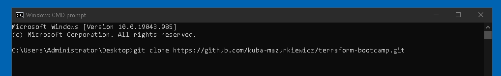

# LAB 1 - Introduction to Terraform

## Lab Overview

Welcome to the Introduction to Terraform Lab! In this lab, you will gain hands-on experience with Terraform, an Infrastructure as Code (IaC) tool used for creating, managing, and updating infrastructure resources in a declarative manner. Terraform allows you to define your infrastructure configuration as code, making it versionable, reproducible, and automated.

## Lab Objectives

Understand the fundamentals of Terraform and its core concepts.
Learn how to define, plan, apply, and destroy infrastructure using Terraform.
Explore Terraform CLI commands for formatting, validation, managing state, and more.
Import existing infrastructure into Terraform's management.

## Lab Sections:

<b>1. Installing Terraform:</b> 
- Learn how to set up your local development environment to start using Terraform effectively, including installing / updating terraform to latest version and install cisco IOSXE provider.

<b>2. Terraform Core Concepts:</b>
- Learn about Terraform Providers and how they manage resources from Cisco IOSXE provider.
- Understand Resources and Data Sources, and their role in defining and retrieving infrastructure components.
- Explore Terraform State and how it tracks the real state of infrastructure.
- Discover Modules, which allow you to encapsulate and reuse infrastructure configurations.
- Work with Input Variables and Output Values to parameterize and share values across configurations.
- Use Local Variables to store temporary values within your configuration.
- Explore Workspaces to manage different sets of infrastructure configurations.

<b>3. Terraform Lifecycle:</b>
- Run terraform init to initialize a new or existing Terraform configuration.
- Use terraform plan to create an execution plan that shows what Terraform will do when you apply changes.
- Apply changes to your infrastructure using terraform apply.
- Safely destroy resources using terraform destroy.

<b>4. Import Existing Infrastructure:</b>
- Learn how to import existing infrastructure into Terraform using terraform import.
- Understand the concept of config-driven import and how to map existing resources to Terraform configurations.

<b>5. Terraform CLI commands:</b>
- Use terraform fmt to format your configuration files for consistency.
- Validate your configuration with terraform validate to catch syntax and semantic errors.
- Mark a resource as tainted with terraform taint to force it to be recreated during the next apply.
- List resources managed by Terraform using terraform state list.
- Generate a visual representation of your infrastructure with terraform graph.
8. <b>Hands-on Exercises:</b> Put your knowledge into practice by working through a series of guided exercises, creating infrastructure step by step.

9. <b>Troubleshooting and Best Practices:</b> Learn strategies for troubleshooting common issues and gain insights into best practices for maintaining Terraform projects over time.

10. <b>Wrap-up and Next Steps:</b> Recap what you've learned, receive pointers for further exploration, and understand how to continue your Terraform journey.

By the end of this lab, you will have the skills and confidence to leverage Terraform to orchestrate infrastructure in a scalable, efficient, and reproducible way. Let's embark on this exciting journey to transform your understanding of infrastructure provisioning!

<br>

## Pre-requisites

- Use an IDE of your choice. This tutorial will assume Visual Studio Code

- Git installed

- Access to Catalyst 9000 series switches (2x Leafs, 1xSpine)

- Access to the internet


## Time Estimates

60 minutes

<br></br>
---

## 1. Upgrade/Install Terraform to latest version

On Windows Workstation terraform is already installed. If you need to install fresh installation of Terraform you can follow Instruction from hashicorp.com website: [Install Terraform](https://developer.hashicorp.com/terraform/tutorials/aws-get-started/install-cli)

To upgrade Terraform to latest version (v1.5.5) open Windows Command prompt and run following command: `choco install terraform --version=1.5.5 --force`

```sh
C:\Users\Administrator>choco install terraform --version=1.5.5 --force
Chocolatey v1.1.0
Chocolatey detected you are not running from an elevated command shell
 (cmd/powershell).

 You may experience errors - many functions/packages
 require admin rights. Only advanced users should run choco w/out an
 elevated shell. When you open the command shell, you should ensure
 that you do so with "Run as Administrator" selected. If you are
 attempting to use Chocolatey in a non-administrator setting, you
 must select a different location other than the default install
 location. See
 https://docs.chocolatey.org/en-us/choco/setup#non-administrative-install
 for details.


 Do you want to continue?([Y]es/[N]o): Y

Installing the following packages:
terraform
By installing, you accept licenses for the packages.
terraform v1.5.5 already installed. Forcing reinstall of version '1.5.5'.
 Please use upgrade if you meant to upgrade to a new version.

terraform v1.5.5 (forced) [Approved]
terraform package files install completed. Performing other installation steps.
The package terraform wants to run 'chocolateyInstall.ps1'.
Note: If you don't run this script, the installation will fail.
Note: To confirm automatically next time, use '-y' or consider:
choco feature enable -n allowGlobalConfirmation
Do you want to run the script?([Y]es/[A]ll - yes to all/[N]o/[P]rint): A

Removing old terraform plugins
Downloading terraform 64 bit
  from 'https://releases.hashicorp.com/terraform/1.5.5/terraform_1.5.5_windows_amd64.zip'
Progress: 100% - Completed download of C:\Users\Administrator\AppData\Local\Temp\chocolatey\terraform\1.5.5\terraform_1.5.5_windows_amd64.zip (19.99 MB).
Download of terraform_1.5.5_windows_amd64.zip (19.99 MB) completed.
Hashes match.
Extracting C:\Users\Administrator\AppData\Local\Temp\chocolatey\terraform\1.5.5\terraform_1.5.5_windows_amd64.zip to C:\ProgramData\chocoportable\lib\terraform\tools...
C:\ProgramData\chocoportable\lib\terraform\tools
 ShimGen has successfully created a shim for terraform.exe
 The install of terraform was successful.
  Software installed to 'C:\ProgramData\chocoportable\lib\terraform\tools'

Chocolatey installed 1/1 packages.
 See the log for details (C:\ProgramData\chocoportable\logs\chocolatey.log).
```

Verify if terraform was updated successfully by running `terraform version` command:

```sh
C:\Users\Administrator>terraform version
Terraform v1.5.5
on windows_amd64
```

<br>

## 2. Clone terraform-bootcamp repository to workstation

Click on `Windows CMD prompt` icon on Workstation Desktop


Clone terraform-bootcamp-evpn repository to Desktop by running following command:

`git clone https://github.com/kuba-mazurkiewicz/terraform-bootcamp.git`



You will be asked to Sign in to GitHub. Use `access token` provided during labs


After cloning the repository, open the repository folder on your desktop. Right-click on the `terraform-bootcamp` folder and select `Open with Code`


Open Terminal in Visual Studio Code Editor by selecting `Terminal -> New Terminal`


Navigate to labs/lab1/intro folder in terminal by executing command: `cd labs/lab1/intro`


and expand same evpn folder on right hand side of Visual Studio Code to open inspect files in Editor:


1. Open a terminal or command prompt.

2. Type the following command and press Enter:

## Install IOS-XE Terraform Provider


<br></br>

---

### Congratulations! You have successfully completed the Introduction to Terraform Lab. You now have a solid understanding of Terraform's core concepts, its lifecycle, and the essential CLI commands. You can now confidently use Terraform to define, manage, and automate your infrastructure as code. Remember to explore more advanced features and scenarios as you continue your Terraform journey. Happy Infrastructure as Code coding!