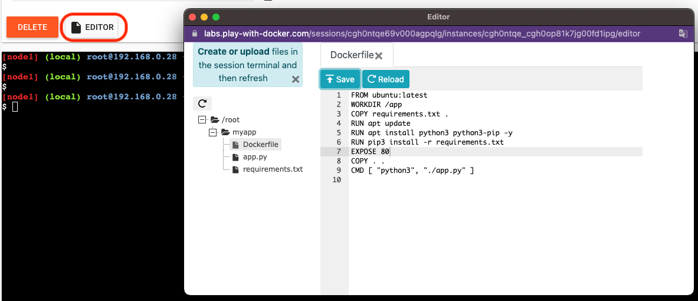
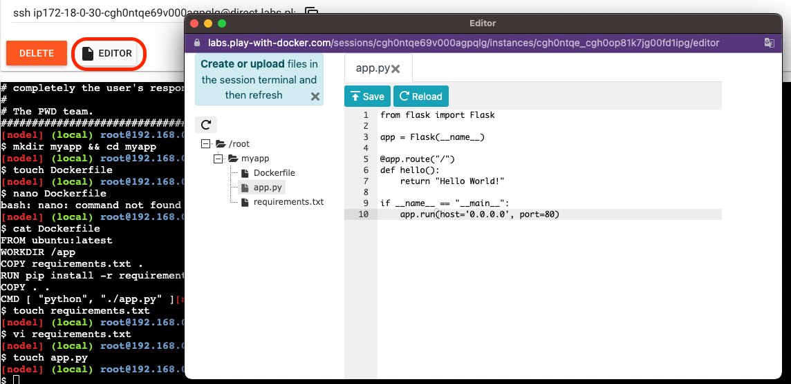
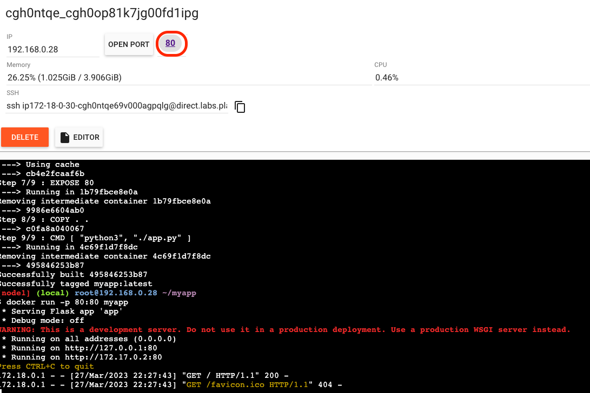
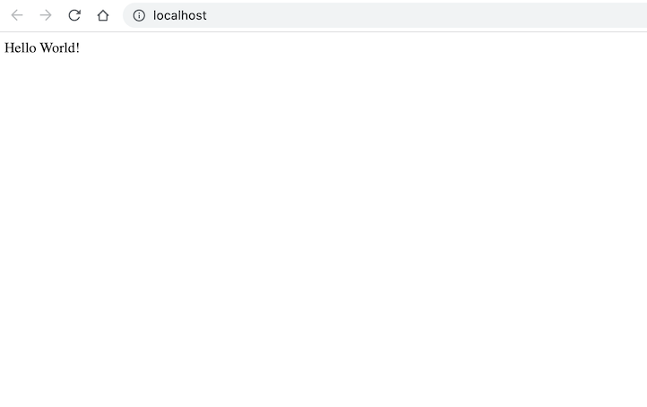
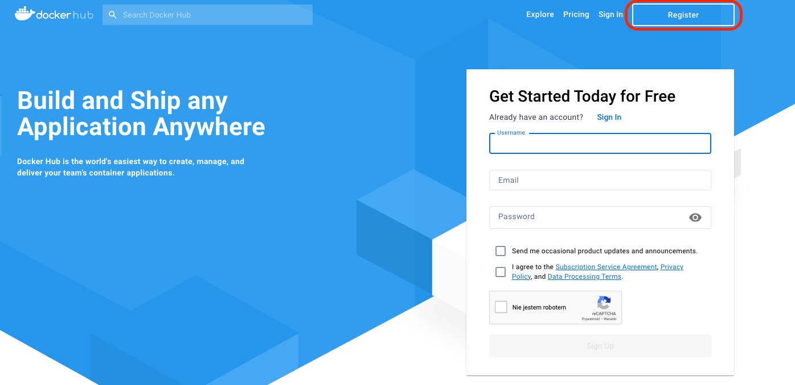
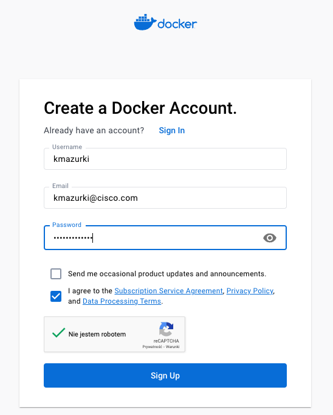
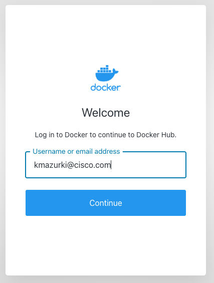
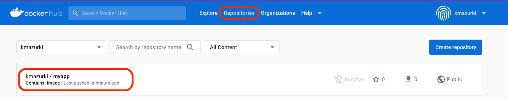
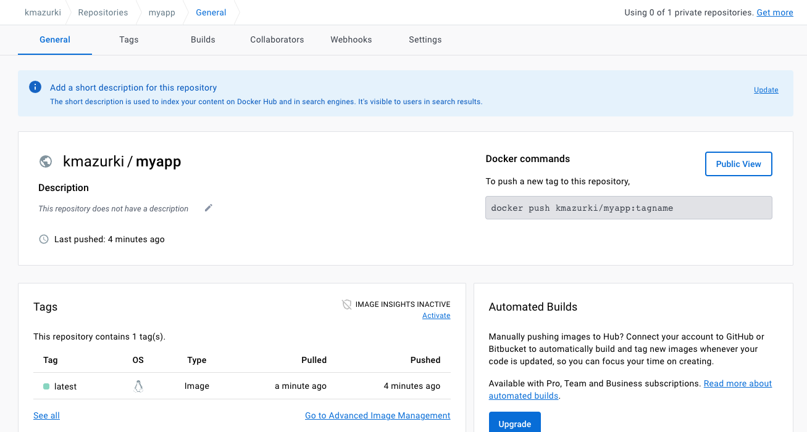

# LAB 2 - BGP EVPN on IOS-XE Cat9k using Terraform

## Lab Overview

This lab focuses on configuring BGP EVPN VXLAN on Cisco Catalyst 9000 Series Switches running Cisco IOS XE software using Terraform. 

### BGP EVPN VXLAN

BGP EVPN VXLAN is a campus network solution for Cisco Catalyst 9000 Series Switches running Cisco IOS XE software. It is designed to provide L2/L3 network services with greater flexibility, mobility, and scalability and also address the well-known classic networking protocols challenges.

You can find additional information and the fundamental terminology necessary to understand BGP EVPN VXLAN through the following links:
- [BGP EVPN VXLAN Overview](https://www.cisco.com/c/en/us/td/docs/switches/lan/catalyst9300/software/release/17-8/configuration_guide/vxlan/b_178_bgp_evpn_vxlan_9300_cg/bgp_evpn_vxlan_overview.html)
- [Why Transition to BGP EVPN VXLAN in Enterprise Campus](https://blogs.cisco.com/networking/why-transition-to-bgp-evpn-vxlan-in-enterprise-campus)

<br>

This lab will construct [Layer 3 VNI](https://www.cisco.com/c/en/us/td/docs/switches/lan/catalyst9300/software/release/17-8/configuration_guide/vxlan/b_178_bgp_evpn_vxlan_9300_cg/configuring_evpn_vxlan_layer_3_overlay_network.html) and [Layer 2 VNI](https://www.cisco.com/c/en/us/td/docs/switches/lan/catalyst9300/software/release/17-8/configuration_guide/vxlan/b_178_bgp_evpn_vxlan_9300_cg/configuring_evpn_vxlan_layer_2_overlay_network.html)


<br>

## Pre-requisites

- Use an IDE of your choice. This tutorial will assume Visual Studio Code

- Git installed

- Docker installed

- Access to Catalyst 9000 series switches (2x Leafs, 1xSpine)

- Basic understanding of Terraform

## Time Estimates

45 minutes

<br></br>


## Goal

The goal of this Docker lab is to provide you with a hands-on experience with Docker, a popular containerization platform. 
By completing this lab, you will learn the following skills:

1. Docker components: You will understand the different components of Docker, such as Docker daemon, Docker CLI, Docker registry, and Dockerfile.

2. Docker basic terminology: You will become familiar with Docker terminology such as container, image, volume, and network.

3. Launching first container: You will learn how to launch your first container using Docker run command.

4. Basic Docker container commands: You will learn basic Docker container commands such as start, stop, restart, and remove.

5. Basic Docker image commands: You will learn basic Docker image commands such as pull, push, tag, and delete.

6. Creating a Docker image with Dockerfile: You will learn how to create a Docker image using a Dockerfile, which is a text file that contains all the commands to build an image.

7. By the end of this lab, you should have a solid understanding of the Docker platform and be able to create and manage Docker containers and images.

## Pre-requisites

- Docker installed [Get Docker](https://docs.docker.com/get-docker/)

- Access to Internet

<br>

## Time Estimates

45 minutes

<br>

## Lab Overview

This lab is designed to introduce you to Docker, a popular containerization platform. You will learn how to use and manage containers and images. You will also become familiar with Docker components, basic terminology, and Dockerfile.


You can do lab on your local workstation if you have docker and git installed. If you don't have docker installed you can use Docker Playground:

https://labs.play-with-docker.com/


<br></br>
---

## 1. Docker Instalation

Install Docker on your system using the appropriate method for your operating system. Refer to the official Docker documentation for instructions: https://docs.docker.com/get-docker/


To check if Docker was installed successfully on your system, you can follow these steps:

1. Open a terminal or command prompt.

2. Type the following command and press Enter:

```
docker --version
```

3. If Docker was installed successfully, the version number of Docker Engine will be displayed in the terminal or command prompt. For example, the output may look something like this:

```
Docker version 17.05.0-ce, build 89658be
```

4. If you see output similar to the example above, it means that Docker was installed successfully on your system. If you encounter any issues during installation, you may want to refer to the Docker documentation or seek help from the Docker community.

<br></br>


## 2. Terraform init


```
 terraform init

Initializing the backend...
Initializing modules...

Initializing provider plugins...
- Finding netascode/utils versions matching ">= 0.2.4"...
- Finding ciscodevnet/iosxe versions matching ">= 0.3.0"...
- Installing netascode/utils v0.2.5...
- Installed netascode/utils v0.2.5 (self-signed, key ID 48630DA58CAFD6C0)
- Installing ciscodevnet/iosxe v0.3.3...
- Installed ciscodevnet/iosxe v0.3.3 (signed by a HashiCorp partner, key ID 974C06066198C482)

Partner and community providers are signed by their developers.
If you'd like to know more about provider signing, you can read about it here:
https://www.terraform.io/docs/cli/plugins/signing.html

Terraform has created a lock file .terraform.lock.hcl to record the provider
selections it made above. Include this file in your version control repository
so that Terraform can guarantee to make the same selections by default when
you run "terraform init" in the future.

Terraform has been successfully initialized!

You may now begin working with Terraform. Try running "terraform plan" to see
any changes that are required for your infrastructure. All Terraform commands
should now work.

If you ever set or change modules or backend configuration for Terraform,
rerun this command to reinitialize your working directory. If you forget, other
commands will detect it and remind you to do so if necessary.
```

One of the easiest ways to get started with Docker is to use a pre-existing public image that has already been created and shared on Docker Hub by someone else.

By default, the Docker CLI searches Docker Hub for available images, but it's also possible to configure the CLI to use other private Docker repositories.

To find a public Docker container image, you can use the `docker search <keyword>` command. For example, to find the "hello-world" test container, you would run the following command:

```
docker search hello-world
```

```
kmazurki@KMAZURKI-M-L9FT ~ % docker search hello-world
NAME                                       DESCRIPTION                                     STARS     OFFICIAL   AUTOMATED
hello-world                                Hello World! (an example of minimal Dockeriz…   2001      [OK]       
kitematic/hello-world-nginx                A light-weight nginx container that demonstr…   153                  
tutum/hello-world                          Image to test docker deployments. Has Apache…   90                   [OK]
dockercloud/hello-world                    Hello World!                                    20                   [OK]
crccheck/hello-world                       Hello World web server in under 2.5 MB          15                   [OK]
vad1mo/hello-world-rest                    A simple REST Service that echoes back all t…   5                    [OK]
rancher/hello-world                                                                        4                    
ansibleplaybookbundle/hello-world-db-apb   An APB which deploys a sample Hello World! a…   2                    [OK]
ppc64le/hello-world                        Hello World! (an example of minimal Dockeriz…   2                    
thomaspoignant/hello-world-rest-json       This project is a REST hello-world API to bu…   2                    
ansibleplaybookbundle/hello-world-apb      An APB which deploys a sample Hello World! a…   1                    [OK]
businessgeeks00/hello-world-nodejs                                                         0                    
okteto/hello-world                                                                         0                    
strimzi/hello-world-producer                                                               0                    
strimzi/hello-world-consumer                                                               0                    
golift/hello-world                         Hello World Go-App built by Go Lift Applicat…   0                    
koudaiii/hello-world                                                                       0                    
freddiedevops/hello-world-spring-boot                                                      0                    
strimzi/hello-world-streams                                                                0                    
garystafford/hello-world                   Simple hello-world Spring Boot service for t…   0                    [OK]
tacc/hello-world                                                                           0                    
tsepotesting123/hello-world                                                                0                    
kevindockercompany/hello-world                                                             0                    
dandando/hello-world-dotnet                                                                0                    
armswdev/c-hello-world                     Simple hello-world C program on Alpine Linux…   0                    
kmazurki@KMAZURKI-M-L9FT ~ % 
```

When you run this command, Docker searches the public Docker Hub repositories and returns multiple results for the "hello-world" image. For this lab, we'll be using the official "hello-world" image.


### Pull the "hello-world" Image

1. Open a terminal or command prompt.
2. Type the following command and press Enter to pull the "hello-world" image from Docker Hub:
```
docker pull hello-world
```

```
kmazurki@KMAZURKI-M-L9FT ~ % docker pull hello-world
Using default tag: latest
latest: Pulling from library/hello-world
7050e35b49f5: Pull complete 
Digest: sha256:ffb13da98453e0f04d33a6eee5bb8e46ee50d08ebe17735fc0779d0349e889e9
Status: Downloaded newer image for hello-world:latest
docker.io/library/hello-world:latest
```

### Run the "hello-world" Container

1. Type the following command and press Enter to run the "hello-world" container:

```
docker run hello-world
```

Docker will download the image if it's not already available on your system, and then launch a container based on that image.

After a few moments, you should see the following message displayed in your terminal or command prompt:

```
kmazurki@KMAZURKI-M-L9FT ~ % docker run hello-world

Hello from Docker!
This message shows that your installation appears to be working correctly.

To generate this message, Docker took the following steps:
 1. The Docker client contacted the Docker daemon.
 2. The Docker daemon pulled the "hello-world" image from the Docker Hub.
    (arm64v8)
 3. The Docker daemon created a new container from that image which runs the
    executable that produces the output you are currently reading.
 4. The Docker daemon streamed that output to the Docker client, which sent it
    to your terminal.

To try something more ambitious, you can run an Ubuntu container with:
 $ docker run -it ubuntu bash

Share images, automate workflows, and more with a free Docker ID:
 https://hub.docker.com/

For more examples and ideas, visit:
 https://docs.docker.com/get-started/
```

4. Congratulations, you have successfully launched your first Docker container!

### Stop and Remove the "hello-world" Container

1. Find container id of 'hello-world' container by running `docker ps -a` command:

```
kmazurki@KMAZURKI-M-L9FT ~ % docker ps -a  | grep hello-world
CONTAINER ID   IMAGE                         COMMAND                  CREATED          STATUS                        PORTS                                                        NAMES
abd10a4c8471   hello-world                   "/hello"                 4 minutes ago    Exited (0) 4 minutes ago                                                                   charming_johnson
```

hello-world container doesn't needs to be stopped because after container finishes executing its default command "/hello" it stops "Exited (0)". This is normal behaviour, because containers don’t run an entire operating system. They only run (contain) a specific process. When this process finishes, the container exits.

Note. You can also notice that hello-world container has a name `charming_johnson`. Docker run creates random names for containers in order to avoid naming conflicts between containers. When you run a Docker container, it is given a unique identifier called a container ID. However, container IDs can be difficult to remember and can easily clash with other containers running on the same host.

To address this issue, Docker generates a random name for the container when you run it. The name consists of two words separated by an underscore, with the first word being an adjective and the second word being a proper name. For example, a container might be named "happy_einstein" or "sleepy_hopper".

This naming convention is not only useful for avoiding naming conflicts, but it also makes it easier to identify containers when managing them using Docker commands. Additionally, the random names can be amusing and memorable, which adds a bit of fun to the process of working with containers.

If you prefer to name your containers yourself, you can specify a custom name using the "--name" option when running the "docker run" command.

`docker run --name hello-world hello-world `

```
kmazurki@KMAZURKI-M-L9FT ~ % docker run --name hello-world hello-world 

Hello from Docker!
This message shows that your installation appears to be working correctly.

To generate this message, Docker took the following steps:
 1. The Docker client contacted the Docker daemon.
 2. The Docker daemon pulled the "hello-world" image from the Docker Hub.
    (arm64v8)
 3. The Docker daemon created a new container from that image which runs the
    executable that produces the output you are currently reading.
 4. The Docker daemon streamed that output to the Docker client, which sent it
    to your terminal.

To try something more ambitious, you can run an Ubuntu container with:
 $ docker run -it ubuntu bash

Share images, automate workflows, and more with a free Docker ID:
 https://hub.docker.com/

For more examples and ideas, visit:
 https://docs.docker.com/get-started/
```
You can verify that the name of this docker container is now "hello-world" by running `docker ps -a | grep hello-world` command:

```
kmazurki@KMAZURKI-M-L9FT ~ % docker ps -a | grep hello
CONTAINER ID   IMAGE                COMMAND      CREATED          	STATUS                    PORTS     NAMES
d59bd56c5c09   hello-world          "/hello"     49 seconds ago     Exited (0) 48 seconds ago           hello-world
```

2. Remove the stopped "hello-world" container using following command:

`docker rm <container-id>`

Note: Replace \<container-id\> with the ID of the container you found running `docker ps -a` command (example: abd10a4c8471)

```
kmazurki@KMAZURKI-M-L9FT ~ % docker rm abd10a4c8471
```

You can also remove container using container_name. To remove container with name hello-world you can use following command:
`docker rm <container-name>`

```
kmazurki@KMAZURKI-M-L9FT ~ % docker rm hello-world
hello-world
```
<br></br>

## 3. Run Ubuntu container with an interactive shell

- Run the command `docker run -it ubuntu /bin/bash`

   This command tells Docker to start a new container based on the Ubuntu image, and to run an interactive shell inside the container. The `-it` option tells Docker to allocate a pseudo-TTY and keep STDIN open even if not attached, while /bin/bash specifies the command to run inside the container. When you run this command, Docker will download the Ubuntu image if it's not already present on your system.

- Once the container starts, you should see a new prompt with a different hostname, indicating that you're now inside the container. This prompt will look something like root@\<container-id>\:/#.

```
[node1] (local) root@192.168.0.18 ~
$ docker run -it ubuntu /bin/bash
Unable to find image 'ubuntu:latest' locally
latest: Pulling from library/ubuntu
2ab09b027e7f: Pull complete 
Digest: sha256:67211c14fa74f070d27cc59d69a7fa9aeff8e28ea118ef3babc295a0428a6d21
Status: Downloaded newer image for ubuntu:latest
root@06c266ab664b:/# 
```

- Run some commands inside the container to verify that it's working: You can use this shell to run any command or perform any operation that you would normally do in a terminal or command prompt. For example, you can run `ls` to list the files in the current directory, or `uname -a` to display information about the operating system running inside the container.

```
root@06c266ab664b:/# ls
bin  boot  dev  etc  home  lib  lib32  lib64  libx32  media  mnt  opt  proc  root  run  sbin  srv  sys  tmp  usr  var
root@06c266ab664b:/# 
root@06c266ab664b:/# 
root@06c266ab664b:/# uname -a
Linux 06c266ab664b 4.4.0-210-generic #242-Ubuntu SMP Fri Apr 16 09:57:56 UTC 2021 x86_64 x86_64 x86_64 GNU/Linux
root@06c266ab664b:/# 
```


- When you're finished, exit the container by running the command exit or pressing CTRL+D. This will bring you back to the host system's prompt.

```
root@06c266ab664b:/# exit
exit
[node1] (local) root@192.168.0.18 ~
```

- Check if container is still running by exetuting command `docker ps -a`

```
[node1] (local) root@192.168.0.18 ~
$ docker ps -a
CONTAINER ID   IMAGE     COMMAND       CREATED          STATUS                       PORTS     NAMES
1e277a057e6e   ubuntu    "/bin/bash"   14 seconds ago   Exited (127) 8 seconds ago             happy_cray
```

- You can see that container is not runnig - STATUS Exited (127). Start this exited ubuntu docker container using command: `docker start <container>`. Replace \<container-id\> with the ID of the container in the exited state and check that container starts `docker ps`

Note.

`docker ps` - list running containers

`docker ps -a` - list all containers (both running and stopped)


```
[node1] (local) root@192.168.0.18 ~
$ docker start 1e277a057e6e 
1e277a057e6e
[node1] (local) root@192.168.0.18 ~
$ docker ps -a
CONTAINER ID   IMAGE     COMMAND       CREATED          STATUS         PORTS     NAMES
1e277a057e6e   ubuntu    "/bin/bash"   14 minutes ago   Up 2 seconds             happy_cray
[node1] (local) root@192.168.0.18 ~
```

- Connect to interactive shell using docker exec command: `docker exec -it <container-id> /bin/bash`


```
[node1] (local) root@192.168.0.18 ~
$ docker exec -it 1e277a057e6e /bin/bash
root@1e277a057e6e:/# 
```

- This time exit docker container without stopping it by pressing `Ctrl+P` followed by `Ctrl+Q`. This operation detaches the container and allows you to return to your system's shell. After deataching from 

```
root@1e277a057e6e:/# read escape sequence
[node1] (local) root@192.168.0.18 ~
$ 
```

- After detaching you can check that container continues to run in the background

```
[node1] (local) root@192.168.0.18 ~
$ docker ps
CONTAINER ID   IMAGE     COMMAND       CREATED          STATUS         PORTS     NAMES
1e277a057e6e   ubuntu    "/bin/bash"   23 minutes ago   Up 9 minutes             happy_cray

```

- Now stop the container and remove it running `docker stop` and `docker rm` commands:

```
[node1] (local) root@192.168.0.18 ~
$ docker stop 1e277a057e6e
1e277a057e6e
[node1] (local) root@192.168.0.18 ~
$ docker rm 1e277a057e6e
1e277a057e6e
[node1] (local) root@192.168.0.18 ~
$ docker ps
CONTAINER ID   IMAGE     COMMAND   CREATED   STATUS    PORTS     NAMES
[node1] (local) root@192.168.0.18 ~
$ docker ps -a
CONTAINER ID   IMAGE     COMMAND   CREATED   STATUS    PORTS     NAMES
[node1] (local) root@192.168.0.18 ~
$ 
```
<br></br>

## 4. Docker images

Up until now, we've been working with Docker containers. Containers are lightweight, portable, and contain all the dependencies necessary to run an application. But where do these containers come from? They come from Docker images. A Docker image is a lightweight, standalone, and executable package that contains everything needed to run an application, including the code, runtime, libraries, and system tools.

### Display Docker Images

To see the list of Docker images on the system, you can issue the following command.

`docker images`

```
[node1] (local) root@192.168.0.18 ~
$ docker images
REPOSITORY    TAG       IMAGE ID       CREATED         SIZE
ubuntu        latest    08d22c0ceb15   2 weeks ago     77.8MB
hello-world   latest    feb5d9fea6a5   18 months ago   13.3kB
[node1] (local) root@192.168.0.18 ~
```

The output will provide the list of images on the system.
From the above output, you can see that we have 2 images: ubuntu and hello-world. Each image has the following attributes:

- <b>TAG</b> - this is used to logically tag images

- <b>Image ID</b> − This is used to uniquely identify the image

- <b>Created</b> − The number of days since the image was created

- <b>Virtual Size</b> − The size of the image


Images can be downloaded from Docker Hub using `docker run` command, or `docker pull image` command.

Pulling an image: To download an image from a registry, use the docker pull command followed by the name of the image and its tag (if applicable). For example:

- Download latest alpine image (A minimal Docker image based on Alpine Linux with a complete package index and only 5 MB in size!) with docker pull command: 
`docker pull alpine:latest`

```
[node1] (local) root@192.168.0.8 ~
$ docker pull alpine:latest
latest: Pulling from library/alpine
63b65145d645: Pull complete 
Digest: sha256:ff6bdca1701f3a8a67e328815ff2346b0e4067d32ec36b7992c1fdc001dc8517
Status: Downloaded newer image for alpine:latest
docker.io/library/alpine:latest
```

- Verify if image was downloaded successfully using `docker images` command:

```
[node1] (local) root@192.168.0.8 ~
$ docker images
REPOSITORY    TAG       IMAGE ID       CREATED         SIZE
ubuntu        latest    08d22c0ceb15   2 weeks ago     77.8MB
alpine        latest    b2aa39c304c2   6 weeks ago     7.05MB
hello-world   latest    feb5d9fea6a5   18 months ago   13.3kB
```

### Runing container from an image

To create and start a new container based on an image, use the `docker run` command followed by the name of the image followed by the command to run inside the container (Same as we did in step 4: <b>Run Ubuntu container with an interactive shell</b>).

Let's run echo 'hello world!' command which will prints out hello world! text:
`docker run alpine:latest echo 'hello world!'`

```
[node1] (local) root@192.168.0.8 ~
$ docker run alpine:latest echo 'hello world!'
hello world!
```

- Check container status:

```
[node1] (local) root@192.168.0.8 ~
$ docker ps -a
CONTAINER ID   IMAGE           COMMAND                 CREATED          STATUS                      PORTS     NAMES
124cbc094af0   alpine:latest   "echo 'hello world!'"   7 seconds ago    Exited (0) 6 seconds ago              suspicious_nobel
3d6b49daee34   ubuntu          "/bin/bash"             47 minutes ago   Exited (0) 47 minutes ago             gallant_lederberg
ee997548045d   hello-world     "/hello"                48 minutes ago   Exited (0) 48 minutes ago             intelligent_perlman
```

- Status of container is Exited (0), because echo process finishes and the container exits We observe the same with "hello world" container in task 3 (<b>Run your first Docker container</b>)

- We can run alpine container with an interactive shell running command: `docker run -it alpine:latest /bin/sh` (Note. Default shell for alpine image is sh not bash, that's why we are not using same command as we did for ubuntu container `docker run -it ubuntu /bin/bash`)

```
[node1] (local) root@192.168.0.8 ~
$ docker run -it alpine:latest /bin/sh
/ # ls
bin    etc    lib    mnt    proc   run    srv    tmp    var
dev    home   media  opt    root   sbin   sys    usr
/ # uname -a
Linux c8444543df3c 4.4.0-210-generic #242-Ubuntu SMP Fri Apr 16 09:57:56 UTC 2021 x86_64 Linux
```

### Tagging an image

A tag is an optional label that can be attached to an image to indicate a specific version or variant of the image. By default, if no tag is specified when pulling an image, Docker will pull the image with the `latest` tag.

To tag an image with a new name and version, use the `docker image tag` command followed by the source_image and source_tag and target_image and taget_tag. For example:

`docker image tag alpine:latest my-alpine:1.0`

```
[node1] (local) root@192.168.0.8 ~
$ docker image tag alpine:latest my-alpine:1.0
[node1] (local) root@192.168.0.8 ~
$ docker images
REPOSITORY    TAG       IMAGE ID       CREATED         SIZE
alpine        latest    b2aa39c304c2   6 weeks ago     7.05MB
my-alpine     1.0       b2aa39c304c2   6 weeks ago     7.05MB
```

This will create a new tag named my-alpine:1.0 for the alpine:latest image.

### Removing Docker Images

List your docker images using `docker images` command

```
[node1] (local) root@192.168.0.8 ~
$ docker images
REPOSITORY    TAG       IMAGE ID       CREATED         SIZE
alpine        latest    b2aa39c304c2   6 weeks ago     7.05MB
my-alpine     1.0       b2aa39c304c2   6 weeks ago     7.05MB
hello-world   latest    feb5d9fea6a5   18 months ago   13.3kB
```
Identify the image ID or repository and tag of the image you want to remove

Remove the image using one of the following methods:

- Method 1: Remove a Docker image using image_id: `docker rmi <image_id>`

Note: Be careful when using the docker rmi command as it will permanently remove the specified image from your local machine. If the image is still being used by a running container, you may receive an error message.

```
[node1] (local) root@192.168.0.8 ~
$ docker rmi feb5d9fea6a5
Error response from daemon: conflict: unable to delete feb5d9fea6a5 (must be forced) - image is being used by stopped container ee997548045d
```

We tried to remove "hello-world" docker image and because it's being used by stopped container ee997548045d we received error. Let's remove container and try again:

`docker ps -a` and `docker rm ee997548045d`

```
[node1] (local) root@192.168.0.8 ~
$ docker ps -a
CONTAINER ID   IMAGE           COMMAND                 CREATED       STATUS                   PORTS     NAMES
c8444543df3c   alpine:latest   "/bin/sh"               3 hours ago   Exited (0) 3 hours ago             focused_kepler
124cbc094af0   alpine:latest   "echo 'hello world!'"   3 hours ago   Exited (0) 3 hours ago             suspicious_nobel
3d6b49daee34   ubuntu          "/bin/bash"             4 hours ago   Exited (0) 4 hours ago             gallant_lederberg
ee997548045d   hello-world     "/hello"                4 hours ago   Exited (0) 4 hours ago             intelligent_perlman
[node1] (local) root@192.168.0.8 ~
$ docker rm ee997548045d
ee997548045d
```

`docker rmi feb5d9fea6a5`

```
[node1] (local) root@192.168.0.8 ~
$ docker rmi feb5d9fea6a5
Untagged: hello-world:latest
Untagged: hello-world@sha256:ffb13da98453e0f04d33a6eee5bb8e46ee50d08ebe17735fc0779d0349e889e9
Deleted: sha256:feb5d9fea6a5e9606aa995e879d862b825965ba48de054caab5ef356dc6b3412
Deleted: sha256:e07ee1baac5fae6a26f30cabfe54a36d3402f96afda318fe0a96cec4ca393359
[node1] (local) root@192.168.0.8 ~
```

- Method 2: Remove a Docker image using repository and tag: `docker rmi <repository>:<tag>`

`docker rmi my-alpine:1.0` and `docker rmi alpine:latest`

```
[node1] (local) root@192.168.0.8 ~
$ docker images
REPOSITORY    TAG       IMAGE ID       CREATED         SIZE
alpine        latest    b2aa39c304c2   6 weeks ago     7.05MB
my-alpine     1.0       b2aa39c304c2   6 weeks ago     7.05MB
hello-world   latest    feb5d9fea6a5   18 months ago   13.3kB
```

```
[node1] (local) root@192.168.0.8 ~
$ docker rmi my-alpine:1.0
Untagged: my-alpine:1.0
[node1] (local) root@192.168.0.8 ~
$ docker rmi alpine:latest
Untagged: alpine:latest
Untagged: alpine@sha256:ff6bdca1701f3a8a67e328815ff2346b0e4067d32ec36b7992c1fdc001dc8517
Deleted: sha256:b2aa39c304c27b96c1fef0c06bee651ac9241d49c4fe34381cab8453f9a89c7d
Deleted: sha256:7cd52847ad775a5ddc4b58326cf884beee34544296402c6292ed76474c686d39
[node1] (local) root@192.168.0.8 ~
```

<br></br>

## 5. Building a Python Docker image

In this task, we will learn how to create a Docker image using a Dockerfile. 

A Dockerfile is a text file that contains instructions for building a Docker image. It is essentially a recipe for creating a Docker image that can be used to run containers.

A Dockerfile typically starts with a base image, which is an existing image that will be used as the starting point for building the new image. The Dockerfile then includes a series of instructions that modify the base image in various ways to create the new image.

For example, a Dockerfile may include instructions to install software packages, copy files into the image, set environment variables, and configure the image for a specific use case.

Once the Dockerfile is complete, it can be used to build a Docker image using the docker build command. This command reads the Dockerfile and creates a new image based on the instructions in the file.

Dockerfiles are a key part of Docker's build process and are used extensively in Docker-based workflows. They provide a way to automate the process of building Docker images and ensure that images are built consistently across different environments and platforms.

- Create a new directory for your project and navigate into it:

`mkdir myapp && cd myapp`
 
 ```
 [node1] (local) root@192.168.0.28 ~
$ mkdir myapp && cd myapp
[node1] (local) root@192.168.0.28 ~/myapp
```

- Create a new file named Dockerfile in your project directory:

`touch Dockerfile`

```
$ touch Dockerfile
[node1] (local) root@192.168.0.28 ~/myapp
```

- Open the Dockerfile in a text editor and add the following lines:

```
FROM ubuntu:latest
WORKDIR /app
COPY requirements.txt .
RUN apt update
RUN apt install python3 python3-pip -y
RUN pip install -r requirements.txt
COPY . .
CMD [ "python3", "./app.py" ]
```
   This Dockerfile uses the official ubuntu image as a base, sets the working directory to /app, installs the Python dependencies specified in requirements.txt, copies the rest of the application files, and specifies the command to run the application.



- Create a new file named requirements.txt in your project directory:

`touch requirements.txt`

- Open the requirements.txt file in a text editor and add the following line:

```
Flask==2.2.2
```
   This is a simple example Flask application, and this line specifies the Flask library as a dependency.

- Create a new file named app.py in your project directory:

`touch app.py`

- Open the app.py file in a text editor and add the following lines:

```
from flask import Flask

app = Flask(__name__)

@app.route("/")
def hello():
    return "Hello World!"

if __name__ == "__main__":
    app.run(host='0.0.0.0', port=80)
```



   This is a simple Flask application that listens on port 80 and returns "Hello World!" when accessed.

- Save and close all the files.

- Open a terminal window and navigate to your project directory.

- Build the Docker image using the docker build command:

`docker build -t myapp .`

   This will build the Docker image using the Dockerfile in the current directory and tag it with the name myapp.

```
[node1] (local) root@192.168.0.28 ~/myapp
$ docker build -t myapp .
Sending build context to Docker daemon  3.584kB
Step 1/8 : FROM ubuntu:latest
 ---> 08d22c0ceb15
Step 2/8 : WORKDIR /app
 ---> Using cache
 ---> 01bdc61a7c1f
Step 3/8 : COPY requirements.txt .
 ---> 4373e0959e01
Step 4/8 : RUN apt update
 ---> Running in 11b447689510
...
...
...
Removing intermediate container 9702c3aebb95
 ---> cb4e2fcaaf6b
Step 7/8 : COPY . .
 ---> 95e74bdd1d23
Step 8/8 : CMD [ "python3", "./app.py" ]
 ---> Running in ea063a089099
Removing intermediate container ea063a089099
 ---> ac192d7216ab
Successfully built ac192d7216ab
Successfully tagged myapp:latest
[node1] (local) root@192.168.0.28 ~/myapp
```

- Inspect the Docker image using the `docker image ls` command. This will display a list of all the images with the name myapp, including their size and creation date.

```
[node1] (local) root@192.168.0.28 ~/myapp
$ docker image ls myapp
REPOSITORY   TAG       IMAGE ID       CREATED         SIZE
myapp        latest    ac192d7216ab   2 minutes ago   472MB
```

- Start a container from the image using the `docker run` command. This will start a container from the myapp image and map port 80 from the container to port 80 on the host.

`docker run -p 80:80 myapp`

```
[node1] (local) root@192.168.0.28 ~/myapp
$ docker run -p 80:80 myapp
 * Serving Flask app 'app'
 * Debug mode: off
WARNING: This is a development server. Do not use it in a production deployment. Use a production WSGI server instead.
 * Running on all addresses (0.0.0.0)
 * Running on http://127.0.0.1:80
 * Running on http://172.17.0.2:80
Press CTRL+C to quit
```

- Verify that the container is running by accessing it in a web browser at http://localhost.

Note. If you are using Docker Playground to verify container click on `80` next to OPEN PORT button:



You should see website which looks like this:



Congratulations, you have created a Docker image using a Dockerfile, inspected Docker images using docker image ls, and started a container from the image using docker run.

<br></br>

## 6. Publishing an image to a public image registry

### Create a Docker Hub account

      Note. Docker Hub account is free for personal use. You can find more information about pricing here: https://www.docker.com/pricing/


- Go to the Docker Hub website (https://hub.docker.com/) and click "Register" in the top right corner



- Fill in the required information, such as your email address, username, and password
Click "Sign Up" to create your Docker Hub account



Log in to Docker Hub
Go to the Docker Hub website and click "Sign In" in the top right corner
Enter your Docker Hub username or email address password then click Continue to Log In.




### Publishing an image to a public image registry

Once your images are ready, you want to make them available to your colleagues, or perhaps to the public community. If so, you need to publish them in an image registry.

You can publish an image to a private registry, a managed registry, or a public registry.

- A private registry set up in your infrastructure can limit access only to your organization.

- A managed private registry service, maintained by a hosting company, can limit access to a certain set of users.

- A public registry enables all users to access your images and use them for their own projects.

Image registries usually store multiple versions of your published images, in case you need to roll back to a previous one or perform some regression testing.

Docker Hub is Docker's official cloud-based registry for Docker images and since Docker Hub is Docker's official registry, it is the default registry when you install Docker.

To push Docker image into Docker Hub use the following steps:

- Tag the Docker image with a unique name. Use the docker tag command to tag the Docker image with a unique name that includes your Docker Hub username and the name of your image. For example:

```docker tag my-docker-image my-docker-username/my-docker-image```

Let's take image created in previous task.

```docker tag myapp kmazurki/myapp```

Note. Replace kmazurki with your docker username

- Log in to your Docker Hub account. Use the `docker login` command to log in to your Docker Hub account:

`docker login -u my-docker-username`

```
[node1] (local) root@192.168.0.28 ~/myapp
$ docker login -u kmazurki
Password: 
WARNING! Your password will be stored unencrypted in /root/.docker/config.json.
Configure a credential helper to remove this warning. See
https://docs.docker.com/engine/reference/commandline/login/#credentials-store

Login Succeeded
[node1] (local) root@192.168.0.28 ~/myapp
```

- Push the Docker image to Docker Hub. Use the `docker push` command to push the Docker image to Docker Hub.

```docker push kmazurki/myapp```

Note. Replace kmazurki with your docker username

- Verify that the Docker image is on Docker Hub
   - Go to the Docker Hub website and log in to your account
   - Go to your Docker Hub repositories and verify that your Docker image is there






You can share this image with your coleagues:

`https://hub.docker.com/r/kmazurki/myapp`

and they could simply pull this image using `docker pull` command:

```docker pull kmazurki/myapp```

and then run this image using command:

```docker run -p 80:80 kmazurki/myapp```

Note. You can skip docker pull command and use only docker run command, because if image does not exist on your machine it will be automatically downloaded from Docker Hub

<br></br>

---

### Congratulations on completing the Docker Introduction lab! You have taken an important step in learning how to use Docker to build, ship, and run applications in a containerized environment.