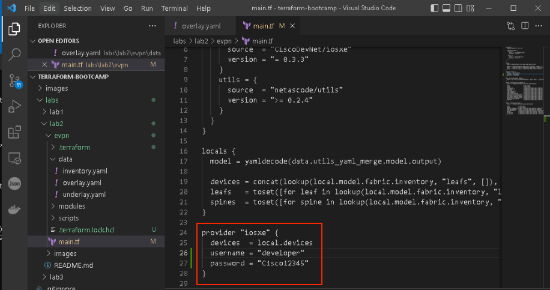
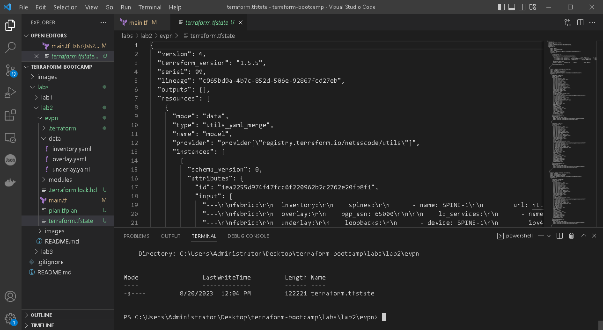

# LAB 2 - BGP EVPN on IOS-XE Cat9k using Terraform

## Lab Overview

This lab demonstrates how to configure BGP EVPN VXLAN on Cisco Catalyst 9000 Series Switches running Cisco IOS XE software using Terraform. 

`Note` This lab focus on interacting with Cisco IOS-XE devices using Terraform and not on an in-depth technical exploration of BGP EVPN VXLAN. As a result, a deep understanding of EVPN is not required.

### BGP EVPN VXLAN

BGP EVPN VXLAN is a campus network solution for Cisco Catalyst 9000 Series Switches running Cisco IOS XE software. It is designed to provide L2/L3 network services with greater flexibility, mobility, and scalability and also address the well-known classic networking protocols challenges.

You can find additional information and the fundamental terminology necessary to understand BGP EVPN VXLAN through the following links:

- [BGP EVPN VXLAN Overview](https://www.cisco.com/c/en/us/td/docs/switches/lan/catalyst9300/software/release/17-8/configuration_guide/vxlan/b_178_bgp_evpn_vxlan_9300_cg/bgp_evpn_vxlan_overview.html)

- [Why Transition to BGP EVPN VXLAN in Enterprise Campus](https://blogs.cisco.com/networking/why-transition-to-bgp-evpn-vxlan-in-enterprise-campus)

- [Configuring EVPN VXLAN Layer 3 Overlay Network](https://www.cisco.com/c/en/us/td/docs/switches/lan/catalyst9300/software/release/17-8/configuration_guide/vxlan/b_178_bgp_evpn_vxlan_9300_cg/configuring_evpn_vxlan_layer_3_overlay_network.html)
- [Configuring EVPN VXLAN Layer 2 Overlay Network](https://www.cisco.com/c/en/us/td/docs/switches/lan/catalyst9300/software/release/17-8/configuration_guide/vxlan/b_178_bgp_evpn_vxlan_9300_cg/configuring_evpn_vxlan_layer_2_overlay_network.html)


<br>

In this lab we will be using code [terraform-iosxe-evpn-example](https://github.com/netascode/terraform-iosxe-evpn-example) with [IOS-XE Provider](https://registry.terraform.io/providers/netascode/iosxe/latest/docs) and following Terraform modules:

- [evpn-ospf-underlay](https://registry.terraform.io/modules/netascode/evpn-ospf-underlay/iosxe/latest)
- [evpn-overlay](https://registry.terraform.io/modules/netascode/evpn-overlay/iosxe/latest)


<br>

## Pre-requisites

- Use an IDE of your choice. This tutorial will assume Visual Studio Code

- Git installed

- Docker installed

- `terraform` version 1.5.X installed on your local machine [Terraform](https://developer.hashicorp.com/terraform/downloads)

- Access to Catalyst 9000 series switches (2x Leafs, 1xSpine)

- Access to the internet

- Basic understanding of Terraform

## Time Estimates

45 minutes

<br></br>

## 1. Clone terraform-bootcamp repository to workstation

Click on `Windows CMD prompt` icon on Workstation Desktop


Clone terraform-bootcamp-evpn repository to Desktop by running following command:

`git clone https://github.com/kuba-mazurkiewicz/terraform-bootcamp.git`


You will be asked to Sign in to GitHub. Use `access token` provided during labs


After cloning the repository, open the repository folder on your desktop. Right-click on the `terraform-bootcamp` folder and select `Open with Code`


Open Terminal in Visual Studio Code Editor by selecting `Terminal -> New Terminal`


Navigate to labs/lab2/evpn folder in terminal by executing command: `cd labs/lab2/evpn`


and expand same evpn folder on right hand side of Visual Studio Code to open inspect files in Editor:


<br>

## 2. Inspect yaml files in `data` directory

The configuration is derived from a set of yaml files in the data directory. This allows to configure BGP EVPN VXLAN in minutes using an easy to use data model. It takes away the complexity of having to deal with references, dependencies or loops. By completely separating data (defining variables) from logic (infrastructure declaration), it allows the user to focus on describing the intended configuration while using a set of terraform modules.

Same approach is being used in `Cisco Nexus-as-Code` project. More information can be found here: https://cisco.com/go/nexusascode

<br>

File `inventory.yaml` contains hostnames and urls for spine and leafs used in lab topology:


```yaml
---
fabric:
  inventory:
    spines:
      - name: SPINE-1
        url: https://198.18.1.21     
    leafs:
      - name: LEAF-1
        url: https://198.18.1.31
      - name: LEAF-2
        url: https://198.18.1.32
```

<br>

File `underlay.yaml` contains data used to configure ospf underlay between spine and leafs:


```yaml
---
fabric:
  underlay:
    loopbacks:
      - device: SPINE-1
        ipv4_address: 100.65.0.1
      - device: LEAF-1
        ipv4_address: 100.65.0.2
      - device: LEAF-2
        ipv4_address: 100.65.0.3

    vtep_loopbacks:
      - device: LEAF-1
        ipv4_address: 10.1.200.1
      - device: LEAF-2
        ipv4_address: 10.1.200.2

    loopback_id: 0
    pim_loopback_id: 100

    fabric_interface_type: GigabitEthernet
    leaf_fabric_interface_prefix: 1/0/
    leaf_fabric_interface_offset: 1
    spine_fabric_interface_prefix: 1/0/
    spine_fabric_interface_offset: 1

    anycast_rp_ipv4_address: 100.1.101.1
```

<br>

File `overlay.yaml` contains data used to construct overlay L2 VNI and L3 VNI on leafs:


```yaml
---
fabric:
  overlay:
    bgp_asn: 65000

    l3_services:
      - name: GREEN
        id: 1000
      - name: BLUE
        id: 1010

    l2_services:
      - name: L2_101
        id: 101
        ipv4_multicast_group: 225.0.0.101
        ip_learning: true
      - name: L2_102
        id: 102
      - name: GREEN_1000
        id: 10
        ipv4_multicast_group: 225.0.1.1
        l3_service: GREEN
        ipv4_address: 10.10.10.1
        ipv4_mask: 255.255.255.0
        ip_learning: true
        re_originate_route_type5: true
      - name: BLUE_1011
        id: 1011
        l3_service: BLUE
        ipv4_address: 172.17.1.1
        ipv4_mask: 255.255.255.0
```

<br>


## 3. Initialize a working directory (terraform init)

Run `terraform init` command to prepare working directory:


Terraform init command performs following steps:

1. Backend Initialization
```sh
Initializing the backend...
```

2. Module Installation

```
Initializing modules...
- iosxe_evpn_ospf_underlay in modules\terraform-iosxe-evpn-ospf-underlay
- iosxe_evpn_overlay in modules\terraform-iosxe-evpn-overlay
```

3. Provider Plugin Installation

```sh
Initializing provider plugins...
- Finding ciscodevnet/iosxe versions matching ">= 0.3.0"...
- Finding netascode/utils versions matching ">= 0.2.4"...
- Installing netascode/utils v0.2.5...
- Installed netascode/utils v0.2.5 (self-signed, key ID 48630DA58CAFD6C0)
- Installing ciscodevnet/iosxe v0.3.3...
- Installed ciscodevnet/iosxe v0.3.3 (signed by a HashiCorp partner, key ID 974C06066198C482)
```

## 4. Provide credentials

Before provisioning infrastructure, you need to provide Terraform with credentials to access spines and leaves. This can be done either via  environment variables or by updating the provider configuration in main.tf.

Let's update main.tf provider configuration with following data:

```sh
provider "iosxe" {
  username = "developer"
  password = "C1sco12345"
  devices  = local.devices
}
```

Open main.tf file in Visual Studio Code and paste following 2 lines after line 25 in provider "iosxe" section:

```sh
  username = "developer"
  password = "C1sco12345"
```



<br>

## 5. Create execution plan (terraform plan)

Run `terraform plan` command to preview changes that Terraform plans to make to your infrastructure.

We will run terrafrom plan command with `-out=plan.tfplan` flag, which will save execution plan to file. In the next section we will use this file as input when executing `terraform apply` command.

```sh
PS C:\Users\Administrator\Desktop\terraform-bootcamp\labs\lab2\evpn> terraform plan -out=plan.tfplan
data.utils_yaml_merge.model: Reading...
data.utils_yaml_merge.model: Read complete after 0s [id=1ea2255d974f47fcc6f220962b2c2762e20fb8f1]

Terraform used the selected providers to generate the following execution plan. Resource actions are
indicated with the following symbols:
  + create

Terraform will perform the following actions:

 # module.iosxe_evpn_overlay.iosxe_evpn_instance.l2_evpn_instance["LEAF-1/102"] will be created
  + resource "iosxe_evpn_instance" "l2_evpn_instance" {
      + device                              = "LEAF-1"
      + evpn_instance_num                   = 102
      + id                                  = (known after apply)
      + vlan_based_encapsulation            = "vxlan"
      + vlan_based_rd                       = "65000:102"
      + vlan_based_replication_type_ingress = true
      + vlan_based_route_target_export      = "65000:102"
      + vlan_based_route_target_import      = "65000:102"
    }

  # module.iosxe_evpn_overlay.iosxe_evpn_instance.l2_evpn_instance["LEAF-2/10"] will be created
  + resource "iosxe_evpn_instance" "l2_evpn_instance" {
      + device                              = "LEAF-2"
      + evpn_instance_num                   = 10
      + id                                  = (known after apply)
      + vlan_based_encapsulation            = "vxlan"
      + vlan_based_ip_local_learning_enable = true
      + vlan_based_rd                       = "65000:10"
      + vlan_based_route_target_export      = "65000:10"
      + vlan_based_route_target_import      = "65000:10"
    }

  # module.iosxe_evpn_overlay.iosxe_evpn_instance.l2_evpn_instance["LEAF-2/101"] will be created
  + resource "iosxe_evpn_instance" "l2_evpn_instance" {
      + device                              = "LEAF-2"
      + evpn_instance_num                   = 101
      + id                                  = (known after apply)
      + vlan_based_encapsulation            = "vxlan"
      + vlan_based_ip_local_learning_enable = true
      + vlan_based_rd                       = "65000:101"
      + vlan_based_route_target_export      = "65000:101"
      + vlan_based_route_target_import      = "65000:101"
    }

<snip>

  # module.iosxe_evpn_overlay.iosxe_vrf.vrf["LEAF-2/1010"] will be created
  + resource "iosxe_vrf" "vrf" {
      + address_family_ipv4                = true
      + address_family_ipv6                = true
      + device                             = "LEAF-2"
      + id                                 = (known after apply)
      + ipv4_route_target_export           = [
          + {
              + value = "65000:1010"
            },
        ]
      + ipv4_route_target_export_stitching = [
          + {
              + stitching = true
              + value     = "65000:1010"
            },
        ]
      + ipv4_route_target_import           = [
          + {
              + value = "65000:1010"
            },
        ]
      + ipv4_route_target_import_stitching = [
          + {
              + stitching = true
              + value     = "65000:1010"
            },
        ]
      + ipv6_route_target_export           = [
          + {
              + value = "65000:1010"
            },
        ]
      + ipv6_route_target_export_stitching = [
          + {
              + stitching = true
              + value     = "65000:1010"
            },
        ]
      + ipv6_route_target_import           = [
          + {
              + value = "65000:1010"
            },
        ]
      + ipv6_route_target_import_stitching = [
          + {
              + stitching = true
              + value     = "65000:1010"
            },
        ]
      + name                               = "BLUE"
      + rd                                 = "65000:1010"
    }

Plan: 98 to add, 0 to change, 0 to destroy.

──────────────────────────────────────────────────────────────────────────────────────────────────────────────────────────── 

Saved the plan to: plan.tfplan

To perform exactly these actions, run the following command to apply:
    terraform apply "plan.tfplan"
```

Your output might be different forom sample output above, but at the end of the output you will see a summary of number of objects that will be added,changed or deleted.


At this stage no configuration changes will be made to spine and leaf devices, but the devices will be queried to refresh state entries in Terraform statefile (if any).

<br>

## 6. Apply execution plan (terraform apply)

The terraform `apply` command is used to apply changes in the configuration. We will use terraform apply with `plan.tfplan` file saved in previous step by running following command:

`terraform apply plan.tfplan`

```sh
PS C:\Users\Administrator\Desktop\terraform-bootcamp\labs\lab2\evpn> terraform apply plan.tfplan
module.iosxe_evpn_overlay.iosxe_vlan_configuration.l3_vlan_configuration["LEAF-1/1000"]: Creating...
module.iosxe_evpn_ospf_underlay.iosxe_system.system["SPINE-1"]: Creating...
module.iosxe_evpn_overlay.iosxe_vlan_configuration.l3_vlan_configuration["LEAF-2/1010"]: Creating...
module.iosxe_evpn_ospf_underlay.iosxe_system.system["LEAF-2"]: Creating...
module.iosxe_evpn_overlay.iosxe_vlan_configuration.l3_vlan_configuration["LEAF-1/1010"]: Creating...
module.iosxe_evpn_ospf_underlay.iosxe_system.system["LEAF-1"]: Creating...
module.iosxe_evpn_overlay.iosxe_vlan_configuration.l3_vlan_configuration["LEAF-2/1000"]: Creating...
module.iosxe_evpn_overlay.iosxe_vlan_configuration.l3_vlan_configuration["LEAF-2/1000"]: Creation complete after 1s [id=Cisco-IOS-XE-native:native/vlan/Cisco-IOS-XE-vlan:configuration=1000]
module.iosxe_evpn_overlay.iosxe_vlan_configuration.l3_vlan_configuration["LEAF-1/1000"]: Creation complete after 1s [id=Cisco-IOS-XE-native:native/vlan/Cisco-IOS-XE-vlan:configuration=1000]
module.iosxe_evpn_ospf_underlay.iosxe_system.system["SPINE-1"]: Creation complete after 1s [id=Cisco-IOS-XE-native:native]
module.iosxe_evpn_overlay.iosxe_vlan_configuration.l3_vlan_configuration["LEAF-2/1010"]: Creation complete after 1s [id=Cisco-IOS-XE-native:native/vlan/Cisco-IOS-XE-vlan:configuration=1010]
module.iosxe_evpn_ospf_underlay.iosxe_system.system["LEAF-1"]: Creation complete after 1s [id=Cisco-IOS-XE-native:native]
module.iosxe_evpn_overlay.iosxe_vlan_configuration.l3_vlan_configuration["LEAF-1/1010"]: Creation complete after 1s [id=Cisco-IOS-XE-native:native/vlan/Cisco-IOS-XE-vlan:configuration=1010]
module.iosxe_evpn_ospf_underlay.iosxe_system.system["LEAF-2"]: Creation complete after 1s [id=Cisco-IOS-XE-native:native]
module.iosxe_evpn_ospf_underlay.iosxe_interface_loopback.vtep_loopback["LEAF-2"]: Creating...
module.iosxe_evpn_ospf_underlay.iosxe_pim.pim["LEAF-1"]: Creating...
module.iosxe_evpn_ospf_underlay.iosxe_interface_loopback.loopback["LEAF-1"]: Creating...
module.iosxe_evpn_ospf_underlay.iosxe_interface_loopback.loopback["LEAF-2"]: Creating...
module.iosxe_evpn_ospf_underlay.iosxe_interface_loopback.vtep_loopback["LEAF-1"]: Creating...
module.iosxe_evpn_ospf_underlay.iosxe_interface_loopback.loopback["SPINE-1"]: Creating...
module.iosxe_evpn_ospf_underlay.iosxe_pim.pim["SPINE-1"]: Creating...
module.iosxe_evpn_ospf_underlay.iosxe_interface_loopback.vtep_loopback["LEAF-2"]: Creation complete after 1s [id=Cisco-IOS-XE-native:native/interface/Loopback=1]
module.iosxe_evpn_ospf_underlay.iosxe_pim.pim["LEAF-2"]: Creating...
module.iosxe_evpn_ospf_underlay.iosxe_ospf.ospf["LEAF-1"]: Creating...
module.iosxe_evpn_ospf_underlay.iosxe_interface_loopback.loopback["LEAF-1"]: Creation complete after 1s [id=Cisco-IOS-XE-native:native/interface/Loopback=0]
module.iosxe_evpn_ospf_underlay.iosxe_ospf.ospf["LEAF-2"]: Creating...
module.iosxe_evpn_ospf_underlay.iosxe_interface_loopback.pim_loopback["SPINE-1"]: Creating...
module.iosxe_evpn_ospf_underlay.iosxe_ospf.ospf["SPINE-1"]: Creating...
module.iosxe_evpn_ospf_underlay.iosxe_pim.pim["LEAF-1"]: Creation complete after 1s [id=Cisco-IOS-XE-native:native/ip/pim]
module.iosxe_evpn_ospf_underlay.iosxe_interface_loopback.loopback["SPINE-1"]: Creation complete after 1s [id=Cisco-IOS-XE-native:native/interface/Loopback=0]
module.iosxe_evpn_ospf_underlay.iosxe_interface_loopback.loopback["LEAF-2"]: Creation complete after 1s [id=Cisco-IOS-XE-native:native/interface/Loopback=0]
module.iosxe_evpn_ospf_underlay.iosxe_interface_pim.loopback_interface_pim["SPINE-1"]: Creating...
module.iosxe_evpn_ospf_underlay.iosxe_interface_ethernet.leaf_fabric_interface["LEAF-2/0"]: Creating...
module.iosxe_evpn_ospf_underlay.iosxe_interface_ethernet.leaf_fabric_interface["LEAF-1/0"]: Creating...
module.iosxe_evpn_ospf_underlay.iosxe_pim.pim["LEAF-2"]: Creation complete after 0s [id=Cisco-IOS-XE-native:native/ip/pim]
module.iosxe_evpn_ospf_underlay.iosxe_pim.pim["SPINE-1"]: Creation complete after 1s [id=Cisco-IOS-XE-native:native/ip/pim]
module.iosxe_evpn_ospf_underlay.iosxe_interface_ethernet.spine_fabric_interface["SPINE-1/0"]: Creating...
module.iosxe_evpn_ospf_underlay.iosxe_interface_ethernet.spine_fabric_interface["SPINE-1/1"]: Creating...
module.iosxe_evpn_ospf_underlay.iosxe_interface_loopback.vtep_loopback["LEAF-1"]: Creation complete after 1s [id=Cisco-IOS-XE-native:native/interface/Loopback=1]
module.iosxe_evpn_ospf_underlay.iosxe_interface_pim.loopback_interface_pim["LEAF-1"]: Creating...
module.iosxe_evpn_ospf_underlay.iosxe_interface_pim.loopback_interface_pim["SPINE-1"]: Creation complete after 0s [id=Cisco-IOS-XE-native:native/interface/Loopback=0/ip/pim]
module.iosxe_evpn_ospf_underlay.iosxe_msdp.msdp["SPINE-1"]: Creating...
module.iosxe_evpn_ospf_underlay.iosxe_interface_ethernet.leaf_fabric_interface["LEAF-2/0"]: Creation complete after 0s [id=Cisco-IOS-XE-native:native/interface/GigabitEthernet=1%2F0%2F1]
module.iosxe_evpn_ospf_underlay.iosxe_interface_pim.loopback_interface_pim["LEAF-2"]: Creating...
module.iosxe_evpn_ospf_underlay.iosxe_interface_ethernet.leaf_fabric_interface["LEAF-1/0"]: Creation complete after 0s [id=Cisco-IOS-XE-native:native/interface/GigabitEthernet=1%2F0%2F1]
module.iosxe_evpn_ospf_underlay.iosxe_interface_pim.vtep_loopback_interface_pim["LEAF-1"]: Creating...
module.iosxe_evpn_ospf_underlay.iosxe_interface_loopback.pim_loopback["SPINE-1"]: Creation complete after 0s [id=Cisco-IOS-XE-native:native/interface/Loopback=100]
module.iosxe_evpn_ospf_underlay.iosxe_ospf.ospf["LEAF-2"]: Creation complete after 0s [id=Cisco-IOS-XE-native:native/router/Cisco-IOS-XE-ospf:router-ospf/ospf/process-id=1]
module.iosxe_evpn_ospf_underlay.iosxe_ospf.ospf["LEAF-1"]: Creation complete after 1s [id=Cisco-IOS-XE-native:native/router/Cisco-IOS-XE-ospf:router-ospf/ospf/process-id=1]
module.iosxe_evpn_ospf_underlay.iosxe_interface_pim.loopback_interface_pim["LEAF-2"]: Creation complete after 1s [id=Cisco-IOS-XE-native:native/interface/Loopback=0/ip/pim]
module.iosxe_evpn_ospf_underlay.iosxe_ospf.ospf["SPINE-1"]: Creation complete after 1s [id=Cisco-IOS-XE-native:native/router/Cisco-IOS-XE-ospf:router-ospf/ospf/process-id=1]
module.iosxe_evpn_ospf_underlay.iosxe_interface_pim.vtep_loopback_interface_pim["LEAF-1"]: Creation complete after 1s [id=Cisco-IOS-XE-native:native/interface/Loopback=1/ip/pim]
module.iosxe_evpn_ospf_underlay.iosxe_interface_pim.vtep_loopback_interface_pim["LEAF-2"]: Creating...
module.iosxe_evpn_ospf_underlay.iosxe_interface_pim.loopback_interface_pim["LEAF-1"]: Creation complete after 1s [id=Cisco-IOS-XE-native:native/interface/Loopback=0/ip/pim]
module.iosxe_evpn_ospf_underlay.iosxe_interface_pim.leaf_interface_pim["LEAF-2/0"]: Creating...
module.iosxe_evpn_ospf_underlay.iosxe_interface_pim.pim_loopback_interface_pim["SPINE-1"]: Creating...
module.iosxe_evpn_ospf_underlay.iosxe_interface_ospf.leaf_interface_ospf["LEAF-2/0"]: Creating...
module.iosxe_evpn_ospf_underlay.iosxe_interface_pim.leaf_interface_pim["LEAF-1/0"]: Creating...
module.iosxe_evpn_ospf_underlay.iosxe_interface_ospf.leaf_interface_ospf["LEAF-1/0"]: Creating...
module.iosxe_evpn_ospf_underlay.iosxe_interface_ospf_process.loopback_interface_ospf_process["SPINE-1"]: Creating...
module.iosxe_evpn_ospf_underlay.iosxe_interface_pim.vtep_loopback_interface_pim["LEAF-2"]: Creation complete after 0s [id=Cisco-IOS-XE-native:native/interface/Loopback=1/ip/pim]
module.iosxe_evpn_ospf_underlay.iosxe_interface_ospf_process.vtep_loopback_interface_ospf_process["LEAF-1"]: Creating...
module.iosxe_evpn_ospf_underlay.iosxe_interface_pim.pim_loopback_interface_pim["SPINE-1"]: Creation complete after 0s [id=Cisco-IOS-XE-native:native/interface/Loopback=100/ip/pim]
module.iosxe_evpn_ospf_underlay.iosxe_interface_ospf.leaf_interface_ospf["LEAF-2/0"]: Creation complete after 0s [id=Cisco-IOS-XE-native:native/interface/GigabitEthernet=1%2F0%2F1/ip/Cisco-IOS-XE-ospf:router-ospf/ospf]
module.iosxe_evpn_ospf_underlay.iosxe_interface_pim.leaf_interface_pim["LEAF-1/0"]: Creation complete after 0s [id=Cisco-IOS-XE-native:native/interface/GigabitEthernet=1%2F0%2F1/ip/pim]
module.iosxe_evpn_ospf_underlay.iosxe_interface_ethernet.spine_fabric_interface["SPINE-1/0"]: Creation complete after 2s [id=Cisco-IOS-XE-native:native/interface/GigabitEthernet=1%2F0%2F1]
module.iosxe_evpn_ospf_underlay.iosxe_interface_ospf_process.vtep_loopback_interface_ospf_process["LEAF-2"]: Creating...
module.iosxe_evpn_ospf_underlay.iosxe_interface_ospf.leaf_interface_ospf["LEAF-1/0"]: Creation complete after 1s [id=Cisco-IOS-XE-native:native/interface/GigabitEthernet=1%2F0%2F1/ip/Cisco-IOS-XE-ospf:router-ospf/ospf]
module.iosxe_evpn_ospf_underlay.iosxe_interface_pim.leaf_interface_pim["LEAF-2/0"]: Creation complete after 1s [id=Cisco-IOS-XE-native:native/interface/GigabitEthernet=1%2F0%2F1/ip/pim]
module.iosxe_evpn_ospf_underlay.iosxe_interface_ospf_process.loopback_interface_ospf_process["LEAF-1"]: Creating...
module.iosxe_evpn_ospf_underlay.iosxe_interface_ospf_process.vtep_loopback_interface_ospf_process["LEAF-1"]: Creation complete after 1s [id=Cisco-IOS-XE-native:native/interface/Loopback=1/ip/Cisco-IOS-XE-ospf:router-ospf/ospf/process-id=1]
module.iosxe_evpn_overlay.iosxe_bgp.bgp["SPINE-1"]: Creating...
module.iosxe_evpn_overlay.iosxe_bgp.bgp["LEAF-1"]: Creating...
module.iosxe_evpn_ospf_underlay.iosxe_interface_ospf_process.pim_loopback_interface_ospf_process["SPINE-1"]: Creating...
module.iosxe_evpn_ospf_underlay.iosxe_interface_ospf_process.vtep_loopback_interface_ospf_process["LEAF-2"]: Creation complete after 0s [id=Cisco-IOS-XE-native:native/interface/Loopback=1/ip/Cisco-IOS-XE-ospf:router-ospf/ospf/process-id=1]
module.iosxe_evpn_ospf_underlay.iosxe_msdp.msdp["SPINE-1"]: Creation complete after 2s [id=Cisco-IOS-XE-native:native/ip/Cisco-IOS-XE-multicast:msdp]
module.iosxe_evpn_overlay.iosxe_bgp.bgp["LEAF-2"]: Creating...
module.iosxe_evpn_ospf_underlay.iosxe_interface_ospf_process.loopback_interface_ospf_process["LEAF-2"]: Creating...
module.iosxe_evpn_ospf_underlay.iosxe_interface_ethernet.spine_fabric_interface["SPINE-1/1"]: Creation complete after 2s [id=Cisco-IOS-XE-native:native/interface/GigabitEthernet=1%2F0%2F2]
module.iosxe_evpn_ospf_underlay.iosxe_interface_ospf_process.loopback_interface_ospf_process["LEAF-1"]: Creation complete after 0s [id=Cisco-IOS-XE-native:native/interface/Loopback=0/ip/Cisco-IOS-XE-ospf:router-ospf/ospf/process-id=1]
module.iosxe_evpn_ospf_underlay.iosxe_interface_ospf_process.loopback_interface_ospf_process["SPINE-1"]: Creation complete after 1s [id=Cisco-IOS-XE-native:native/interface/Loopback=0/ip/Cisco-IOS-XE-ospf:router-ospf/ospf/process-id=1]
module.iosxe_evpn_overlay.iosxe_evpn.evpn["LEAF-2"]: Creating...
module.iosxe_evpn_overlay.iosxe_evpn.evpn["LEAF-1"]: Creating...
module.iosxe_evpn_ospf_underlay.iosxe_interface_ospf_process.leaf_interface_ospf_process["LEAF-2/0"]: Creating...
module.iosxe_evpn_ospf_underlay.iosxe_interface_pim.spine_interface_pim["SPINE-1/1"]: Creating...
module.iosxe_evpn_ospf_underlay.iosxe_interface_ospf_process.leaf_interface_ospf_process["LEAF-1/0"]: Creating...
module.iosxe_evpn_overlay.iosxe_bgp.bgp["LEAF-1"]: Creation complete after 0s [id=Cisco-IOS-XE-native:native/router/Cisco-IOS-XE-bgp:bgp=65000]
module.iosxe_evpn_overlay.iosxe_bgp.bgp["LEAF-2"]: Creation complete after 0s [id=Cisco-IOS-XE-native:native/router/Cisco-IOS-XE-bgp:bgp=65000]
module.iosxe_evpn_overlay.iosxe_bgp.bgp["SPINE-1"]: Creation complete after 0s [id=Cisco-IOS-XE-native:native/router/Cisco-IOS-XE-bgp:bgp=65000]
module.iosxe_evpn_ospf_underlay.iosxe_interface_ospf.spine_interface_ospf["SPINE-1/0"]: Creating...
module.iosxe_evpn_ospf_underlay.iosxe_interface_ospf.spine_interface_ospf["SPINE-1/1"]: Creating...
module.iosxe_evpn_ospf_underlay.iosxe_interface_pim.spine_interface_pim["SPINE-1/0"]: Creating...
module.iosxe_evpn_ospf_underlay.iosxe_interface_pim.spine_interface_pim["SPINE-1/1"]: Creation complete after 3s [id=Cisco-IOS-XE-native:native/interface/GigabitEthernet=1%2F0%2F2/ip/pim]
module.iosxe_evpn_overlay.iosxe_bgp_neighbor.bgp_neighbor_spine["LEAF-1/SPINE-1"]: Creating...
module.iosxe_evpn_ospf_underlay.iosxe_interface_ospf_process.pim_loopback_interface_ospf_process["SPINE-1"]: Creation complete after 3s [id=Cisco-IOS-XE-native:native/interface/Loopback=100/ip/Cisco-IOS-XE-ospf:router-ospf/ospf/process-id=1]
module.iosxe_evpn_overlay.iosxe_bgp_address_family_l2vpn.bgp_l2vpn["LEAF-2"]: Creating...
module.iosxe_evpn_ospf_underlay.iosxe_interface_ospf.spine_interface_ospf["SPINE-1/0"]: Creation complete after 3s [id=Cisco-IOS-XE-native:native/interface/GigabitEthernet=1%2F0%2F1/ip/Cisco-IOS-XE-ospf:router-ospf/ospf]
module.iosxe_evpn_overlay.iosxe_vrf.vrf["LEAF-2/1000"]: Creating...
module.iosxe_evpn_overlay.iosxe_bgp_neighbor.bgp_neighbor_spine["LEAF-1/SPINE-1"]: Creation complete after 1s [id=Cisco-IOS-XE-native:native/router/Cisco-IOS-XE-bgp:bgp=65000/neighbor=100.65.0.2]
module.iosxe_evpn_overlay.iosxe_vrf.vrf["LEAF-2/1010"]: Creating...
module.iosxe_evpn_overlay.iosxe_evpn.evpn["LEAF-1"]: Creation complete after 4s [id=Cisco-IOS-XE-native:native/l2vpn/Cisco-IOS-XE-l2vpn:evpn_cont/evpn]
module.iosxe_evpn_overlay.iosxe_bgp_address_family_l2vpn.bgp_l2vpn["LEAF-1"]: Creating...
module.iosxe_evpn_ospf_underlay.iosxe_interface_ospf_process.loopback_interface_ospf_process["LEAF-2"]: Creation complete after 4s [id=Cisco-IOS-XE-native:native/interface/Loopback=0/ip/Cisco-IOS-XE-ospf:router-ospf/ospf/process-id=1]
module.iosxe_evpn_ospf_underlay.iosxe_interface_ospf_process.leaf_interface_ospf_process["LEAF-1/0"]: Creation complete after 4s [id=Cisco-IOS-XE-native:native/interface/GigabitEthernet=1%2F0%2F1/ip/Cisco-IOS-XE-ospf:router-ospf/ospf/process-id=1]   
module.iosxe_evpn_overlay.iosxe_bgp_neighbor.bgp_neighbor_leaf["LEAF-1/SPINE-1"]: Creating...
module.iosxe_evpn_overlay.iosxe_vrf.vrf["LEAF-2/1010"]: Creation complete after 0s [id=Cisco-IOS-XE-native:native/vrf/definition=BLUE]
module.iosxe_evpn_overlay.iosxe_vrf.vrf["LEAF-1/1000"]: Creating...
module.iosxe_evpn_overlay.iosxe_bgp_neighbor.bgp_neighbor_spine["LEAF-2/SPINE-1"]: Creating...
module.iosxe_evpn_overlay.iosxe_bgp_address_family_l2vpn.bgp_l2vpn["LEAF-1"]: Creation complete after 1s [id=Cisco-IOS-XE-native:native/router/Cisco-IOS-XE-bgp:bgp=65000/address-family/no-vrf/l2vpn=evpn]
module.iosxe_evpn_ospf_underlay.iosxe_interface_ospf_process.leaf_interface_ospf_process["LEAF-2/0"]: Creation complete after 5s [id=Cisco-IOS-XE-native:native/interface/GigabitEthernet=1%2F0%2F1/ip/Cisco-IOS-XE-ospf:router-ospf/ospf/process-id=1]   
module.iosxe_evpn_overlay.iosxe_evpn.evpn["LEAF-2"]: Creation complete after 5s [id=Cisco-IOS-XE-native:native/l2vpn/Cisco-IOS-XE-l2vpn:evpn_cont/evpn]
module.iosxe_evpn_overlay.iosxe_bgp_neighbor.bgp_neighbor_leaf["LEAF-2/SPINE-1"]: Creating...
module.iosxe_evpn_overlay.iosxe_bgp_address_family_l2vpn.bgp_l2vpn["SPINE-1"]: Creating...
module.iosxe_evpn_overlay.iosxe_vrf.vrf["LEAF-1/1010"]: Creating...
module.iosxe_evpn_overlay.iosxe_bgp_address_family_l2vpn.bgp_l2vpn["LEAF-2"]: Creation complete after 2s [id=Cisco-IOS-XE-native:native/router/Cisco-IOS-XE-bgp:bgp=65000/address-family/no-vrf/l2vpn=evpn]
module.iosxe_evpn_overlay.iosxe_evpn_instance.l2_evpn_instance["LEAF-2/1011"]: Creating...
module.iosxe_evpn_ospf_underlay.iosxe_interface_ospf.spine_interface_ospf["SPINE-1/1"]: Creation complete after 6s [id=Cisco-IOS-XE-native:native/interface/GigabitEthernet=1%2F0%2F2/ip/Cisco-IOS-XE-ospf:router-ospf/ospf]
module.iosxe_evpn_overlay.iosxe_evpn_instance.l2_evpn_instance["LEAF-1/10"]: Creating...
module.iosxe_evpn_ospf_underlay.iosxe_interface_pim.spine_interface_pim["SPINE-1/0"]: Creation complete after 7s [id=Cisco-IOS-XE-native:native/interface/GigabitEthernet=1%2F0%2F1/ip/pim]
module.iosxe_evpn_overlay.iosxe_evpn_instance.l2_evpn_instance["LEAF-1/101"]: Creating...
module.iosxe_evpn_overlay.iosxe_bgp_neighbor.bgp_neighbor_spine["LEAF-2/SPINE-1"]: Creation complete after 3s [id=Cisco-IOS-XE-native:native/router/Cisco-IOS-XE-bgp:bgp=65000/neighbor=100.65.0.3]
module.iosxe_evpn_overlay.iosxe_evpn_instance.l2_evpn_instance["LEAF-2/102"]: Creating...
module.iosxe_evpn_overlay.iosxe_bgp_neighbor.bgp_neighbor_leaf["LEAF-1/SPINE-1"]: Creation complete after 5s [id=Cisco-IOS-XE-native:native/router/Cisco-IOS-XE-bgp:bgp=65000/neighbor=100.65.0.1]
module.iosxe_evpn_overlay.iosxe_evpn_instance.l2_evpn_instance["LEAF-2/101"]: Creating...
module.iosxe_evpn_overlay.iosxe_vrf.vrf["LEAF-2/1000"]: Creation complete after 6s [id=Cisco-IOS-XE-native:native/vrf/definition=GREEN]
module.iosxe_evpn_overlay.iosxe_evpn_instance.l2_evpn_instance["LEAF-1/102"]: Creating...
module.iosxe_evpn_overlay.iosxe_bgp_neighbor.bgp_neighbor_leaf["LEAF-2/SPINE-1"]: Creation complete after 4s [id=Cisco-IOS-XE-native:native/router/Cisco-IOS-XE-bgp:bgp=65000/neighbor=100.65.0.1]
module.iosxe_evpn_overlay.iosxe_evpn_instance.l2_evpn_instance["LEAF-2/10"]: Creating...
module.iosxe_evpn_overlay.iosxe_bgp_address_family_l2vpn.bgp_l2vpn["SPINE-1"]: Creation complete after 6s [id=Cisco-IOS-XE-native:native/router/Cisco-IOS-XE-bgp:bgp=65000/address-family/no-vrf/l2vpn=evpn]
module.iosxe_evpn_overlay.iosxe_evpn_instance.l2_evpn_instance["LEAF-1/1011"]: Creating...
module.iosxe_evpn_overlay.iosxe_evpn_instance.l2_evpn_instance["LEAF-1/101"]: Creation complete after 6s [id=Cisco-IOS-XE-native:native/l2vpn/Cisco-IOS-XE-l2vpn:evpn_cont/evpn-instance/evpn/instance/instance=101]
module.iosxe_evpn_ospf_underlay.iosxe_interface_ospf_process.spine_interface_ospf_process["SPINE-1/0"]: Creating...
module.iosxe_evpn_overlay.iosxe_vrf.vrf["LEAF-1/1000"]: Creation complete after 9s [id=Cisco-IOS-XE-native:native/vrf/definition=GREEN]
module.iosxe_evpn_ospf_underlay.iosxe_interface_ospf_process.spine_interface_ospf_process["SPINE-1/1"]: Creating...
module.iosxe_evpn_overlay.iosxe_vrf.vrf["LEAF-1/1010"]: Creation complete after 8s [id=Cisco-IOS-XE-native:native/vrf/definition=BLUE]
module.iosxe_evpn_overlay.iosxe_bgp_l2vpn_evpn_neighbor.bgp_l2vpn_evpn_neighbor_leaf["LEAF-1/SPINE-1"]: Creating...
module.iosxe_evpn_overlay.iosxe_evpn_instance.l2_evpn_instance["LEAF-1/10"]: Creation complete after 7s [id=Cisco-IOS-XE-native:native/l2vpn/Cisco-IOS-XE-l2vpn:evpn_cont/evpn-instance/evpn/instance/instance=10]
module.iosxe_evpn_overlay.iosxe_evpn_instance.l2_evpn_instance["LEAF-2/101"]: Creation complete after 4s [id=Cisco-IOS-XE-native:native/l2vpn/Cisco-IOS-XE-l2vpn:evpn_cont/evpn-instance/evpn/instance/instance=101]
module.iosxe_evpn_overlay.iosxe_bgp_l2vpn_evpn_neighbor.bgp_l2vpn_evpn_neighbor_spine["LEAF-1/SPINE-1"]: Creating...
module.iosxe_evpn_overlay.iosxe_bgp_l2vpn_evpn_neighbor.bgp_l2vpn_evpn_neighbor_leaf["LEAF-2/SPINE-1"]: Creating...
module.iosxe_evpn_overlay.iosxe_evpn_instance.l2_evpn_instance["LEAF-1/102"]: Creation complete after 4s [id=Cisco-IOS-XE-native:native/l2vpn/Cisco-IOS-XE-l2vpn:evpn_cont/evpn-instance/evpn/instance/instance=102]
module.iosxe_evpn_overlay.iosxe_bgp_l2vpn_evpn_neighbor.bgp_l2vpn_evpn_neighbor_spine["LEAF-2/SPINE-1"]: Creating...
module.iosxe_evpn_overlay.iosxe_evpn_instance.l2_evpn_instance["LEAF-2/1011"]: Creation complete after 8s [id=Cisco-IOS-XE-native:native/l2vpn/Cisco-IOS-XE-l2vpn:evpn_cont/evpn-instance/evpn/instance/instance=1011]
module.iosxe_evpn_overlay.iosxe_bgp_l2vpn_evpn_neighbor.bgp_l2vpn_evpn_neighbor_leaf["LEAF-1/SPINE-1"]: Creation complete after 0s [id=Cisco-IOS-XE-native:native/router/Cisco-IOS-XE-bgp:bgp=65000/address-family/no-vrf/l2vpn=evpn/l2vpn-evpn/neighbor=100.65.0.1]
module.iosxe_evpn_overlay.iosxe_interface_vlan.l3_core_svi["LEAF-1/1010"]: Creating...
module.iosxe_evpn_overlay.iosxe_evpn_instance.l2_evpn_instance["LEAF-2/102"]: Creation complete after 7s [id=Cisco-IOS-XE-native:native/l2vpn/Cisco-IOS-XE-l2vpn:evpn_cont/evpn-instance/evpn/instance/instance=102]
module.iosxe_evpn_overlay.iosxe_interface_vlan.l2_svi["LEAF-2/10"]: Creating...
module.iosxe_evpn_overlay.iosxe_bgp_address_family_ipv4_vrf.bgp_af_ipv4_vrf["LEAF-1"]: Creating...
module.iosxe_evpn_overlay.iosxe_evpn_instance.l2_evpn_instance["LEAF-2/10"]: Creation complete after 5s [id=Cisco-IOS-XE-native:native/l2vpn/Cisco-IOS-XE-l2vpn:evpn_cont/evpn-instance/evpn/instance/instance=10]
module.iosxe_evpn_overlay.iosxe_interface_nve.nve["LEAF-2"]: Creating...
module.iosxe_evpn_overlay.iosxe_bgp_l2vpn_evpn_neighbor.bgp_l2vpn_evpn_neighbor_leaf["LEAF-2/SPINE-1"]: Creation complete after 1s [id=Cisco-IOS-XE-native:native/router/Cisco-IOS-XE-bgp:bgp=65000/address-family/no-vrf/l2vpn=evpn/l2vpn-evpn/neighbor=100.65.0.1]
module.iosxe_evpn_ospf_underlay.iosxe_interface_ospf_process.spine_interface_ospf_process["SPINE-1/0"]: Creation complete after 1s [id=Cisco-IOS-XE-native:native/interface/GigabitEthernet=1%2F0%2F1/ip/Cisco-IOS-XE-ospf:router-ospf/ospf/process-id=1] 
module.iosxe_evpn_overlay.iosxe_bgp_address_family_ipv6_vrf.bgp_af_ipv6_vrf["LEAF-2"]: Creating...
module.iosxe_evpn_ospf_underlay.iosxe_interface_ospf_process.spine_interface_ospf_process["SPINE-1/1"]: Creation complete after 1s [id=Cisco-IOS-XE-native:native/interface/GigabitEthernet=1%2F0%2F2/ip/Cisco-IOS-XE-ospf:router-ospf/ospf/process-id=1] 
module.iosxe_evpn_overlay.iosxe_interface_vlan.l3_core_svi["LEAF-2/1000"]: Creating...
module.iosxe_evpn_overlay.iosxe_interface_vlan.l3_core_svi["LEAF-2/1010"]: Creating...
module.iosxe_evpn_overlay.iosxe_bgp_l2vpn_evpn_neighbor.bgp_l2vpn_evpn_neighbor_spine["LEAF-2/SPINE-1"]: Creation complete after 1s [id=Cisco-IOS-XE-native:native/router/Cisco-IOS-XE-bgp:bgp=65000/address-family/no-vrf/l2vpn=evpn/l2vpn-evpn/neighbor=100.65.0.3]
module.iosxe_evpn_overlay.iosxe_interface_vlan.l2_svi["LEAF-1/1011"]: Creating...
module.iosxe_evpn_overlay.iosxe_evpn_instance.l2_evpn_instance["LEAF-1/1011"]: Creation complete after 6s [id=Cisco-IOS-XE-native:native/l2vpn/Cisco-IOS-XE-l2vpn:evpn_cont/evpn-instance/evpn/instance/instance=1011]
module.iosxe_evpn_overlay.iosxe_bgp_address_family_ipv6_vrf.bgp_af_ipv6_vrf["LEAF-1"]: Creating...
module.iosxe_evpn_overlay.iosxe_interface_vlan.l3_core_svi["LEAF-1/1010"]: Creation complete after 4s [id=Cisco-IOS-XE-native:native/interface/Vlan=1010]
module.iosxe_evpn_overlay.iosxe_bgp_address_family_ipv4_vrf.bgp_af_ipv4_vrf["LEAF-2"]: Creating...
module.iosxe_evpn_overlay.iosxe_interface_vlan.l2_svi["LEAF-2/10"]: Creation complete after 4s [id=Cisco-IOS-XE-native:native/interface/Vlan=10]
module.iosxe_evpn_overlay.iosxe_bgp_l2vpn_evpn_neighbor.bgp_l2vpn_evpn_neighbor_spine["LEAF-1/SPINE-1"]: Creation complete after 5s [id=Cisco-IOS-XE-native:native/router/Cisco-IOS-XE-bgp:bgp=65000/address-family/no-vrf/l2vpn=evpn/l2vpn-evpn/neighbor=100.65.0.2]
module.iosxe_evpn_overlay.iosxe_interface_nve.nve["LEAF-1"]: Creating...
module.iosxe_evpn_overlay.iosxe_interface_vlan.l3_core_svi["LEAF-1/1000"]: Creating...
module.iosxe_evpn_overlay.iosxe_bgp_address_family_ipv4_vrf.bgp_af_ipv4_vrf["LEAF-1"]: Creation complete after 5s [id=Cisco-IOS-XE-native:native/router/Cisco-IOS-XE-bgp:bgp=65000/address-family/with-vrf/ipv4=unicast]
module.iosxe_evpn_overlay.iosxe_interface_vlan.l2_svi["LEAF-2/1011"]: Creating...
module.iosxe_evpn_overlay.iosxe_bgp_address_family_ipv4_vrf.bgp_af_ipv4_vrf["LEAF-2"]: Creation complete after 2s [id=Cisco-IOS-XE-native:native/router/Cisco-IOS-XE-bgp:bgp=65000/address-family/with-vrf/ipv4=unicast]
module.iosxe_evpn_overlay.iosxe_interface_vlan.l2_svi["LEAF-1/10"]: Creating...
module.iosxe_evpn_overlay.iosxe_interface_vlan.l2_svi["LEAF-1/1011"]: Creation complete after 9s [id=Cisco-IOS-XE-native:native/interface/Vlan=1011]
module.iosxe_evpn_overlay.iosxe_vlan_configuration.l2_vlan_configuration["LEAF-2/10"]: Creating...
module.iosxe_evpn_overlay.iosxe_bgp_address_family_ipv6_vrf.bgp_af_ipv6_vrf["LEAF-2"]: Creation complete after 10s [id=Cisco-IOS-XE-native:native/router/Cisco-IOS-XE-bgp:bgp=65000/address-family/with-vrf/ipv6=unicast]
module.iosxe_evpn_overlay.iosxe_vlan_configuration.l2_vlan_configuration["LEAF-1/102"]: Creating...
module.iosxe_evpn_overlay.iosxe_interface_nve.nve["LEAF-2"]: Still creating... [10s elapsed]
module.iosxe_evpn_overlay.iosxe_interface_vlan.l3_core_svi["LEAF-2/1000"]: Still creating... [10s elapsed]
module.iosxe_evpn_overlay.iosxe_interface_vlan.l3_core_svi["LEAF-2/1010"]: Still creating... [10s elapsed]
module.iosxe_evpn_overlay.iosxe_interface_vlan.l2_svi["LEAF-1/10"]: Creation complete after 5s [id=Cisco-IOS-XE-native:native/interface/Vlan=10]
module.iosxe_evpn_overlay.iosxe_vlan_configuration.l2_vlan_configuration["LEAF-1/101"]: Creating...
module.iosxe_evpn_overlay.iosxe_bgp_address_family_ipv6_vrf.bgp_af_ipv6_vrf["LEAF-1"]: Creation complete after 9s [id=Cisco-IOS-XE-native:native/router/Cisco-IOS-XE-bgp:bgp=65000/address-family/with-vrf/ipv6=unicast]
module.iosxe_evpn_overlay.iosxe_vlan_configuration.l2_vlan_configuration["LEAF-1/1011"]: Creating...
module.iosxe_evpn_overlay.iosxe_interface_vlan.l3_core_svi["LEAF-2/1000"]: Creation complete after 14s [id=Cisco-IOS-XE-native:native/interface/Vlan=1000]
module.iosxe_evpn_overlay.iosxe_vlan_configuration.l2_vlan_configuration["LEAF-1/10"]: Creating...
module.iosxe_evpn_overlay.iosxe_interface_nve.nve["LEAF-2"]: Creation complete after 14s [id=Cisco-IOS-XE-native:native/interface/nve=1]
module.iosxe_evpn_overlay.iosxe_vlan_configuration.l2_vlan_configuration["LEAF-2/102"]: Creating...
module.iosxe_evpn_overlay.iosxe_interface_nve.nve["LEAF-1"]: Still creating... [10s elapsed]
module.iosxe_evpn_overlay.iosxe_interface_vlan.l3_core_svi["LEAF-1/1000"]: Still creating... [10s elapsed]
module.iosxe_evpn_overlay.iosxe_interface_vlan.l3_core_svi["LEAF-2/1010"]: Creation complete after 15s [id=Cisco-IOS-XE-native:native/interface/Vlan=1010]
module.iosxe_evpn_overlay.iosxe_vlan_configuration.l2_vlan_configuration["LEAF-2/101"]: Creating...
module.iosxe_evpn_overlay.iosxe_interface_vlan.l2_svi["LEAF-2/1011"]: Still creating... [10s elapsed]
module.iosxe_evpn_overlay.iosxe_interface_vlan.l2_svi["LEAF-2/1011"]: Creation complete after 11s [id=Cisco-IOS-XE-native:native/interface/Vlan=1011]
module.iosxe_evpn_overlay.iosxe_vlan_configuration.l2_vlan_configuration["LEAF-2/1011"]: Creating...
module.iosxe_evpn_overlay.iosxe_interface_nve.nve["LEAF-1"]: Creation complete after 12s [id=Cisco-IOS-XE-native:native/interface/nve=1]
module.iosxe_evpn_overlay.iosxe_interface_vlan.l3_core_svi["LEAF-1/1000"]: Creation complete after 13s [id=Cisco-IOS-XE-native:native/interface/Vlan=1000]
module.iosxe_evpn_overlay.iosxe_vlan_configuration.l2_vlan_configuration["LEAF-2/101"]: Creation complete after 2s [id=Cisco-IOS-XE-native:native/vlan/Cisco-IOS-XE-vlan:configuration=101]
module.iosxe_evpn_overlay.iosxe_vlan_configuration.l2_vlan_configuration["LEAF-2/10"]: Creation complete after 9s [id=Cisco-IOS-XE-native:native/vlan/Cisco-IOS-XE-vlan:configuration=10]
module.iosxe_evpn_overlay.iosxe_vlan_configuration.l2_vlan_configuration["LEAF-2/102"]: Creation complete after 4s [id=Cisco-IOS-XE-native:native/vlan/Cisco-IOS-XE-vlan:configuration=102]
module.iosxe_evpn_overlay.iosxe_vlan_configuration.l2_vlan_configuration["LEAF-2/1011"]: Creation complete after 2s [id=Cisco-IOS-XE-native:native/vlan/Cisco-IOS-XE-vlan:configuration=1011]
module.iosxe_evpn_overlay.iosxe_vlan_configuration.l2_vlan_configuration["LEAF-1/102"]: Creation complete after 8s [id=Cisco-IOS-XE-native:native/vlan/Cisco-IOS-XE-vlan:configuration=102]
module.iosxe_evpn_overlay.iosxe_vlan_configuration.l2_vlan_configuration["LEAF-1/101"]: Creation complete after 7s [id=Cisco-IOS-XE-native:native/vlan/Cisco-IOS-XE-vlan:configuration=101]
module.iosxe_evpn_overlay.iosxe_vlan_configuration.l2_vlan_configuration["LEAF-1/10"]: Creation complete after 4s [id=Cisco-IOS-XE-native:native/vlan/Cisco-IOS-XE-vlan:configuration=10]
module.iosxe_evpn_overlay.iosxe_vlan_configuration.l2_vlan_configuration["LEAF-1/1011"]: Creation complete after 6s [id=Cisco-IOS-XE-native:native/vlan/Cisco-IOS-XE-vlan:configuration=1011]

Apply complete! Resources: 98 added, 0 changed, 0 destroyed.
PS C:\Users\Administrator\Desktop\terraform-bootcamp\labs\lab2\evpn> 
```

<br>

We are using the local filesystem for the Terraform state file (`terraform.tfstate`) in this lab. Once terraform plan has been executed, Terraform updates project’s state file to reflect the changes made to the resources. This file is then unlocked so that new changes can be applied.

```ps
PS C:\Users\Administrator\Desktop\terraform-bootcamp\labs\lab2\evpn> ls terraform.tfstate


    Directory: C:\Users\Administrator\Desktop\terraform-bootcamp\labs\lab2\evpn


Mode                 LastWriteTime         Length Name
----                 -------------         ------ ----
-a----         8/20/2023  12:04 PM         122221 terraform.tfstate

```

You can view content of `terraform.tfstate` file in Visual Studio Code:



<br>

## 7. Verify BGP EVPN VXLAN Configuration


Once the configuration changes have been applied to spine and leafs devices we can verify the EVPN operational status by using Putty to login to devices.

Use the following details to log in to the devices:

| Device Name | Device IP | username / password | 
| --- | --- | --- |
| C9k-spine | 198.18.1.21 | developer/C1sco12345 | 
| C9k-leaf1 | 198.18.1.31 | developer/C1sco12345 | 
| C9k-leaf2 | 198.18.1.32 | developer/C1sco12345 | 


Click on Putty icon on taskbar and open all 3


<br></br>

---

### Congratulations on completing the Docker Introduction lab! You have taken an important step in learning how to use Docker to build, ship, and run applications in a containerized environment.