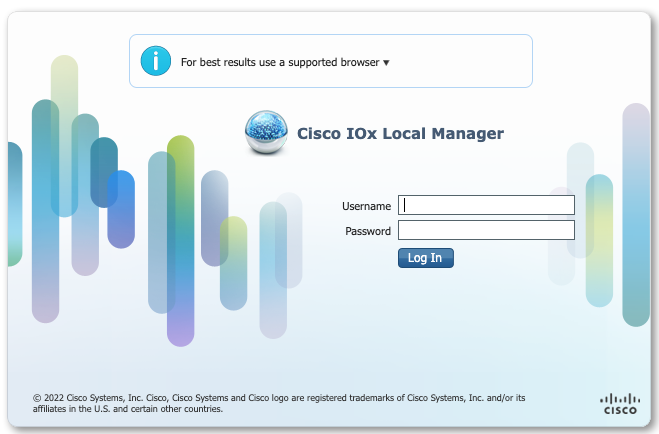
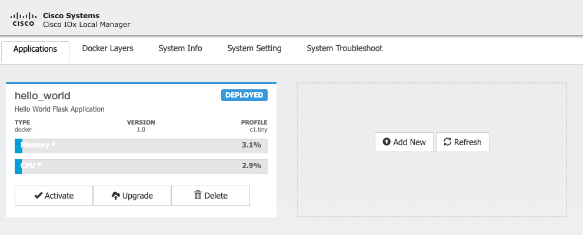
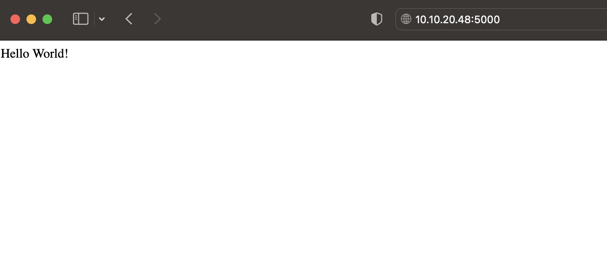
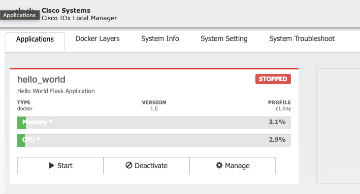
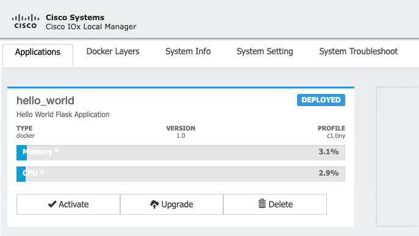
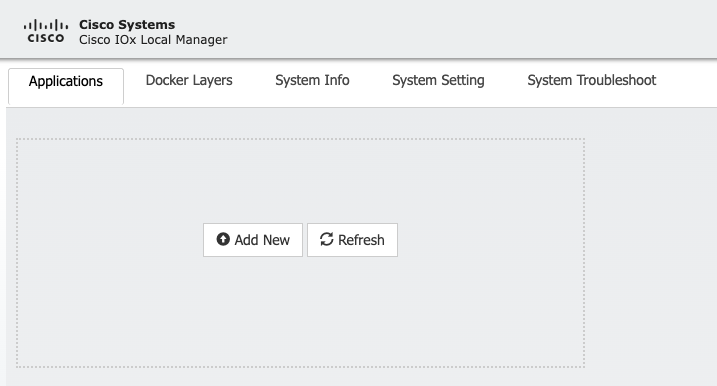

# LAB 3 - Building an IOx Application with Docker

## Goal

By the end of this lab, you should be able to build and deploy an IOx application using Docker. By completing this lab you will learn the following skills:

- understand how to create a Docker image of their application
- configure it to run on the IOx platform
- deploy it to an IOx-enabled device
- monitor and review the IOx Application

## Pre-requisites

- Access to a Cisco device that supports the IOx feature, such as the Cisco Catalyst 9000 series switch or Catalyst 8000 series router

- A computer with SSH client software installed

- [ioxclient](https://developer.cisco.com/docs/iox/#!iox-resource-downloads) for your operating system.


## Time Estimates

60 minutes

## Lab Overview

The "Building an IOx Application with Docker" will teach you how to build, package, install, start, stop, and uninstall an IOx application using Docker.

The lab consists of several steps that you need to follow in order to successfully build and deploy an IOx application. First, you will use Docker to build a container for your application. You will then use the ioxclient tool to package the application into a tar file.

Once the container is packaged, you will install it on the router. This involves uploading the package.tar file to the router and using the ioxclient tool to install it. After the container is installed, you will start it to make the application available for use.

To stop the container, you will use the ioxclient tool to issue a stop command. Finally, you will learn how to uninstall the container using the ioxclient tool.

Throughout the lab, you will gain hands-on experience with the various tools and commands used to build and deploy an IOx application. By the end of the session, you should have a good understanding of the process involved in building and deploying a containerized IOx application.


To complete this lab you can use any device which supports IOX or use sandbox from developer.cisco.com [IOS XE on CSR Latest Code with ZTP functionality](https://devnetsandbox.cisco.com/RM/Diagram/Index/f2e2c0ad-844f-4a73-8085-00b5b28347a1?diagramType=Topology)


This lab instruction is using IOS XE on CSR Latest Code with ZTP functionality sandbox:

| Hostname  | IP Address | Username | Password | Connection Type|
| ---------- | -------- | -------- | -------- | -------- |
| csr1000v-1 | 10.10.20.48 | developer | C1sco12345 | SSH |

<br>

`IMPORTANT`

Before you continue with this lab, make sure that lab device has iox feature enabled and network settings are configured as per LAB 1 - Guest Shell, Python scripting on Box -> 1. Enabling Guestshell:

  - Network settings for the IOS XE host
  - NAT configuration

If you didn't go through LAB_1 simply copy paste following config lines into CSR1000v host:

```
conf t
iox
interface VirtualPortGroup0
ip nat inside
ip address 192.168.10.1 255.255.255.0
exit
interface GigabitEthernet1
ip nat outside
exit
ip access-list extended NAT
permit ip 192.168.10.0 0.0.0.255 any
exit
ip nat inside source list NAT interface GigabitEthernet1 overload
end
```

Output from device:
```
csr1000v-1#conf t
Enter configuration commands, one per line.  End with CNTL/Z.
csr1000v-1(config)#iox
csr1000v-1(config)#interface VirtualPortGroup0
csr1000v-1(config-if)#ip nat inside
csr1000v-1(config-if)#ip address 192.168.10.1 255.255.255.0
csr1000v-1(config-if)#exit
csr1000v-1(config)#interface GigabitEthernet1
csr1000v-1(config-if)#ip nat outside
csr1000v-1(config-if)#exit
csr1000v-1(config)#ip access-list extended NAT
csr1000v-1(config-ext-nacl)#permit ip 192.168.10.0 0.0.0.255 any
csr1000v-1(config-ext-nacl)#exit
csr1000v-1(config)#$de source list NAT interface GigabitEthernet1 overload       
csr1000v-1(config)#end
```

Wait couple minutes for IOX service (IOXman) to start. You can check it using `show iox` command:

```
csr1000v-1#show iox

IOx Infrastructure Summary:
---------------------------
IOx service (CAF) 1.11.0.2     : Running
IOx service (HA)               : Not Supported 
IOx service (IOxman)           : Running 
IOx service (Sec storage)      : Not Supported 
Libvirtd 1.3.4                 : Running
```

<br>

## 1. Install ioxclient tool

1. Download ioxclient:

- On your Windows host machine in the dCloud Pod, use the following link to download the installation zip file to any system folder of your choosing: https://pubhub.devnetcloud.com/media/iox/docs/artifacts/ioxclient/ioxclient-v1.7.2.1/ioxclient_1.7.2.1_windows_amd64.zip

- On your Linux host machine in the dCloud Pod, use the following link to download the installation zip file to any system folder of your choosing: https://pubhub.devnetcloud.com/media/iox/docs/artifacts/ioxclient/ioxclient-v1.7.2.1/ioxclient_1.7.2.1_linux_amd64.tar.gz

2. Unpack the ioxclient folder with the command `tar -xzf ioxclient_1.7.2.1_linux_amd64.tar.gz`

3. If you are using Windows, skip to the next step. If you are using Linux, navigate to the unpacked ioxclient folder and set permissions by running `chmod +x ioxclient`

4. Copy the ioxclient binary.

- Windows: ioxclient.exe in C:\Windows\system32
- Linux: ioxclient in /usr/local/bin

You are now ready to use ioxclient from the command line in either Linux or Windows.

<br>

## 2. Access IOX Local Manager
Cisco IOx Local Manager is a platform-specific application that is installed on a host system as part of
the installation of the Cisco IOx framework on that device. It provides a web-based user interface that
you can use to manage, administer, monitor, and troubleshoot apps on the host system, and to perform a
variety of related activities.

On some Cisco platforms IOX Local Manager is enabled by default, in our lab you need to enable `ip http / https server` by running following command:

```
csr1000v-1#conf t
Enter configuration commands, one per line.  End with CNTL/Z.
csr1000v-1(config)#ip http server 
csr1000v-1(config)#ip http secure-server 
csr1000v-1(config)#ip http authentication local
```

`COPY-PASTE`

```
ip http server 
ip http secure-server 
ip http authentication local
```

To access IOX Local Manager simply open web-browser and enter the following address:

`https://ip_address/iox/login` or `http://ip_address/iox/login`

where ip_address is the IP address of the host system on which Cisco IOx Local Manager is installed.


IOX Local Manager on CSR1000v device in lab can be accessed as follows:

- CSR1000V:
  - https://10.10.20.48/iox/login
  - credentials [developer/C1sco12345]




Local Manager will be used later in this lab to verify status of deployed containers.

There are 2 different processes of deploying container to Cisco device.
- uploading a Docker image to an IOx device (via IOx Local Manager or CLI)
- packaging a Docker image using the IOxclient tool

In next tasks we will focus on 2nd process of deploying container using IOxclient tool.

Packaging a Docker image using the IOxclient tool involves creating a Cisco IOx application package that contains the Docker image along with metadata and configuration files required for the application to run on an IOx device. This process is typically done using the IOxclient tool, which automates the creation of the application package. Packaging a Docker image using the IOxclient tool is useful when you need to create a custom IOx application that includes a specific Docker image along with additional IOx-specific configuration files.

Whether you can upload a Docker image directly to an IOx device or need to use the IOxclient tool to package your application can depend on the platform's support for native Docker. If the platform does not support native Docker, then you would need to use the IOxclient tool to package and deploy your application [Platform Support Matrix](https://developer.cisco.com/docs/iox/#!platform-support-matrix/enterprise-platforms)

<br></br>

## 3. Configure ioxclient tool

The first time ioxclient is used, a wizard will be shown asking a few questions based on which ioxclient will configure itself. It will also create a "default" profile that captures connection information with an IOx device. Creating and using additional profiles will be described in further sections.

To run ioxclient simply type `ioxclient` in your terminal:

```
kmazurki@KMAZURKI-M-L9FT ~ % ioxclient
Config file not found :  /home/developer/.ioxclientcfg.yaml
Creating one time configuration..
Your / your organization's name : 
```

You will be prompt for information about device you want to connect to.

Note: The below configuration values are platform specific. Please consult the target platform's ioxclient setup section for more details provided in section [Platforms](https://developer.cisco.com/docs/iox/#!platform-support-matrix).


```
kmazurki@KMAZURKI-M-L9FT ~ % ioxclient
Config file not found :  /Users/kmazurki/.ioxclientcfg.yaml
Creating one time configuration..
Your / your organization's name : cisco
Your / your organization's URL : www.cisco.com
Your IOx platform's IP address[127.0.0.1] : 10.10.20.48
Your IOx platform's port number[8443] : 443
Authorized user name[root] : developer
Password for developer : 
Local repository path on IOx platform[/software/downloads]: 
Connection Timeout Millisecond [1000]: 
URL Scheme (http/https) [https]: 
API Prefix[/iox/api/v2/hosting/]: 
Your IOx platform's SSH Port[2222]: 22
Your RSA key, for signing packages, in PEM format[]: 
Your x.509 certificate in PEM format[]: 
Secure client authentication no|yes [no]: 
Client authentication x.509 certificate in PEM format[]: 
Client authentication private key in PEM format[]: 
Activating Profile  default
Saving current configuration
```

- You can choose any organization's name and URL you want
- IOx platform's IP address is ip address of IOX capable device where you want to deploy containers
- IOx platform's port number by default is 8443, but it can depend on platform (basically its port on which Local Manager is running) -> change to 443
- Authorized user name and Password are credentials used to access devices
- IOx platform's SSH Port default 2222 -> change to 22


After command run for the first time you should see that default profile was activated:

```
Activating Profile  default
```
The tool creates a default profile. Each profile has information about how to connect to a specific Cisco IOx platform.

The profile data is stored in $HOME/.ioxclientcfg.yaml file. Do not attempt to manually edit this file.
To list profiles you can use following command:
`ioxclient profiles list`

```
kmazurki@KMAZURKI-M-L9FT ~ % ioxclient profiles list
Active Profile :  default
Profile Name :  default
	Host IP:  10.10.20.48
	Host Port:  443
	Auth Keys:  ZGV2ZWxvcGVyOkMxc2NvMTIzNDU=
	Auth Token:  53b201b7-eb14-4391-92a1-be7a9b751956
	Api Prefix:  /iox/api/v2/hosting/
	URL Scheme:  https
	RSA Key:  
	Certificate: 
	Connection Timeout Millisecond:  1000
```

If you want to create new profile to interact with ne IOx device you can use command:
`ioxclient profiles create`

```
kmazurki@KMAZURKI-M-L9FT ~ % ioxclient profiles create
Active Profile :  default
Enter a name for this profile : sandbox
Your IOx platform's IP address[127.0.0.1] : 10.10.20.48
Your IOx platform's port number[8443] : 443
Authorized user name[root] : developer
Password for developer : 
Local repository path on IOx platform[/software/downloads]: 
Connection Timeout Millisecond [1000]: 
URL Scheme (http/https) [https]: 
API Prefix[/iox/api/v2/hosting/]: 
Your IOx platform's SSH Port[2222]: 22
Your RSA key, for signing packages, in PEM format[]: 
Your x.509 certificate in PEM format[]: 
Secure client authentication no|yes [no]: 
Client authentication x.509 certificate in PEM format[]: 
Client authentication private key in PEM format[]: 
Activating Profile  sandbox
Saving current configuration
```

I used same settings as in default profile, because lab only contains 1x CSR1000v device, but if you have multiple IOX devices you can add them using this command. The only difference from default profile is name of the profile. Newly added progile has name: sandbox.

Let's list profiles `ioxclient profiles list`:

```
kmazurki@KMAZURKI-M-L9FT ~ % ioxclient profiles list
Active Profile :  sandbox
Profile Name :  default
	Host IP:  10.10.20.48
	Host Port:  443
	Auth Keys:  ZGV2ZWxvcGVyOkMxc2NvMTIzNDU=
	Auth Token:  53b201b7-eb14-4391-92a1-be7a9b751956
	Api Prefix:  /iox/api/v2/hosting/
	URL Scheme:  https
	RSA Key:  
	Certificate: 
	Connection Timeout Millisecond:  1000
Profile Name :  sandbox
	Host IP:  10.10.20.48
	Host Port:  443
	Auth Keys:  ZGV2ZWxvcGVyOkMxc2NvMTIzNDU=
	Auth Token:  
	Api Prefix:  /iox/api/v2/hosting/
	URL Scheme:  https
	RSA Key:  
	Certificate: 
	Connection Timeout Millisecond:  1000
```

We can see that we have two profiles.
- default
- <b>sandbox</b> -> Active Profile

Note: When a new profile is created, it automatically gets activated

To activate profile use following command:

`ioxclient profiles activate <name_of_profile>`

Let's activate default profile:

```
kmazurki@KMAZURKI-M-L9FT ~ % ioxclient profiles activate default
Active Profile :  sandbox
Activating Profile  default
Saving current configuration
```

To delete profile use command:

`ioxclient profiles delete <name_of_profile>`

Since we activated default profile, lets delete sandbox profile:

```
kmazurki@KMAZURKI-M-L9FT ~ % ioxclient profiles delete sandbox
Active Profile :  default
Deleting profile  sandbox
Saving current configuration
```

Note: Editing an existing profile is not supported. If you would like to reuse an existing profile name, simply delete it and recreate it with desired values.

If you want to remove the existing configuration information stored by he tool you can use `ioxclient profiles reset` command which will prompt for fresh config information:

```
kmazurki@KMAZURKI-M-L9FT ~ % ioxclient profiles reset
Active Profile :  default
Your current config details will be lost. Continue (y/N) ? : y
Current config backed up at  /var/folders/54/bchpg7k13p71_m0pwn00qxwr0000gn/T/ioxclient3594428379
Config data deleted.
```

We removed ioxclient configuration and now we need to add this back again using `ioxclient` command, which will create again default profile:

```
kmazurki@KMAZURKI-M-L9FT ~ % ioxclient
Config file not found :  /Users/kmazurki/.ioxclientcfg.yaml
Creating one time configuration..
Your / your organization's name : cisco
Your / your organization's URL : www.cisco.com
Your IOx platform's IP address[127.0.0.1] : 10.10.20.48
Your IOx platform's port number[8443] : 443
Authorized user name[root] : developer
Password for developer : 
Local repository path on IOx platform[/software/downloads]: 
Connection Timeout Millisecond [1000]: 
URL Scheme (http/https) [https]: 
API Prefix[/iox/api/v2/hosting/]: 
Your IOx platform's SSH Port[2222]: 22
Your RSA key, for signing packages, in PEM format[]: 
Your x.509 certificate in PEM format[]: 
Secure client authentication no|yes [no]: 
Client authentication x.509 certificate in PEM format[]: 
Client authentication private key in PEM format[]: 
Activating Profile  default
Saving current configuration
```

### Get platform information via the ioxclient tool

Now you should be able to run the following command and retrieve platform information directly from the IOx device:

`ioxclient platform info`

```
kmazurki@KMAZURKI-M-L9FT ~ % ioxclient platform info
Currently active profile :  default
Secure client authentication:  no
Command Name:  plt-info
Oops, access token expired
Saving current configuration
Retyring the command
-------------System Info----------------
{
 "arp_cache": [],
 "corrupted_appids": [],
 "cpu": {
  "cpu_arch": "x86_64",
  "family": 6,
  "frequency": 2194.917,
  "model": 79,
  "model_name": "Intel(R) Xeon(R) CPU E5-4669 v4 @ 2.20GHz",
  "number_cores": 1,
  "stepping": 0
 },
 "dns_resolver": {
  "domain": "",
  "nameservers": [],
  "search": ""
 },
 "docker_version": "Not Supported",
 "hostname": "csr1000v-1",
 "interfaces": [
  {
   "ipv4_address": "",
   "ipv4_netmask": "",
   "mtu": 1500,
   "name": "dpbr_200",
   "type": "Ethernet"
  },
  {
   "ipv4_address": "",
   "ipv4_netmask": "",
   "mtu": 1500,
   "name": "dpbr_400",
   "type": "Ethernet"
  },
  {
   "ipv4_address": "",
   "ipv4_netmask": "",
   "mtu": 1500,
   "name": "ieobc_br",
   "type": "Ethernet"
  },
  {
   "ipv4_address": "127.0.0.1",
   "ipv4_netmask": "255.255.255.0",
   "mtu": 65536,
   "name": "lo",
   "type": "Local"
  },
  {
   "ipv4_address": "10.0.3.0",
   "ipv4_netmask": "255.255.255.0",
   "mtu": 65536,
   "name": "lo:e0_cc_0",
   "type": "Local"
  },
  {
   "ipv4_address": "10.0.2.0",
   "ipv4_netmask": "255.255.255.0",
   "mtu": 65536,
   "name": "lo:e0_fp_0",
   "type": "Local"
  },
  {
   "ipv4_address": "10.0.1.0",
   "ipv4_netmask": "255.255.255.0",
   "mtu": 65536,
   "name": "lo:e0_rp_0",
   "type": "Local"
  },
  {
   "ipv4_address": "10.1.3.0",
   "ipv4_netmask": "255.255.255.0",
   "mtu": 65536,
   "name": "lo:e1_cc_0",
   "type": "Local"
  },
  {
   "ipv4_address": "10.1.2.0",
   "ipv4_netmask": "255.255.255.0",
   "mtu": 65536,
   "name": "lo:e1_fp_0",
   "type": "Local"
  },
  {
   "ipv4_address": "10.1.1.0",
   "ipv4_netmask": "255.255.255.0",
   "mtu": 65536,
   "name": "lo:e1_rp_0",
   "type": "Local"
  },
  {
   "ipv4_address": "10.2.0.3",
   "ipv4_netmask": "255.255.0.0",
   "mtu": 65536,
   "name": "lo:p_fp_a",
   "type": "Local"
  },
  {
   "ipv4_address": "10.2.0.1",
   "ipv4_netmask": "255.255.0.0",
   "mtu": 65536,
   "name": "lo:p_rp_a",
   "type": "Local"
  },
  {
   "ipv4_address": "10.3.0.3",
   "ipv4_netmask": "255.255.0.0",
   "mtu": 65536,
   "name": "lo:s_fp_a",
   "type": "Local"
  },
  {
   "ipv4_address": "10.3.0.1",
   "ipv4_netmask": "255.255.0.0",
   "mtu": 65536,
   "name": "lo:s_rp_a",
   "type": "Local"
  },
  {
   "ipv4_address": "",
   "ipv4_netmask": "",
   "mtu": 1500,
   "name": "veth0_400",
   "type": "Ethernet"
  },
  {
   "ipv4_address": "",
   "ipv4_netmask": "",
   "mtu": 1500,
   "name": "veth1_200",
   "type": "Ethernet"
  },
  {
   "ipv4_address": "",
   "ipv4_netmask": "",
   "mtu": 1500,
   "name": "veth1_400",
   "type": "Ethernet"
  }
 ],
 "ipv4_routing": [],
 "libvirt_version": "1003004",
 "memory": {
  "size": 4073902080,
  "swap": 0
 },
 "ntp_server": "",
 "product_id": "CSR1000V",
 "server_info": {
  "address": "127.0.0.1",
  "port": "8098",
  "protocol": "HTTP"
 },
 "storage": [],
 "system_id": "SSI130300YK",
 "udi": "CSR1000V:SSI130300YK",
 "uuid": "bd51c76a-11c6-42b3-8901-571da0fd0d95",
 "version": {
  "caf_version_info": {
   "branch": "r/1.11.0.0",
   "build_number": 2,
   "revision": "40262bfef2fec99ef0d9bad684fd5c7afc3fa5fa"
  },
  "caf_version_name": "AMBER",
  "caf_version_number": "1.11.0.2",
  "platform_version_info": {},
  "platform_version_number": "0",
  "repo": {
   "repo_version": "1.0",
   "supported_versions": [
    "1.0"
   ]
  }
 }
}%    
```

You should receive JSON output with platform specific information from IOx device specified in default profile


<br></br>

## 4. Building an IOx Application with Docker

Before packaging the Docker image for IOx, you must build the image. Building the image requires the Docker tools and running the docker build command. 

Let's use application we prepared in [LAB 2 - Introduction to Docker](../lab2/README.md) (Building a Python Docker image), but with small modifications:

- we will use alpine image
- application will run on port 5000

One of the best practice while building IOX applications is to use small rootfs. In lab2 we used Ubuntu as rootfs and if we check image size for myapp we can see that the size is almost 500MB, and this is simple "hello world" flask application. Imagine building more complex application with more more data and dependencies. First this containe would take more time to deploy and activate compare to small app and also storage space on Cisco devices is limited, so if you have multiple applications with big size you might run out of storage space.


```
kmazurki@KMAZURKI-M-L9FT lab3 % docker images | grep myapp
myapp                                                     latest                                                                       37997bca7efa   14 hours ago    446MB
kmazurki/myapp                                            latest                                                                       495846253b87   2 days ago      472MB
```

That's why we are going to modify our rootfs from Ubuntu to Alpine.
Note. Alpine is a minimal Docker image based on Alpine Linux with a complete package index and only 5 MB in size.

Navigate to `lab3/app` folder. Dockerfile, app.py and requirements.txt files are already there:

```
kmazurki@KMAZURKI-M-L9FT lab3 % cd app
kmazurki@KMAZURKI-M-L9FT app % ls
Dockerfile  app.py  requirements.txt
```

Now build your image using `docker build -t ioxapp .` command:

```
kmazurki@KMAZURKI-M-L9FT app % docker build -t ioxapp .
[+] Building 18.8s (12/12) FINISHED                                                                                                                      
 => [internal] load build definition from Dockerfile                                                                                                0.0s
 => => transferring dockerfile: 268B                                                                                                                0.0s
 => [internal] load .dockerignore                                                                                                                   0.0s
 => => transferring context: 2B                                                                                                                     0.0s
 => [internal] load metadata for docker.io/library/alpine:latest                                                                                    0.7s
 => CACHED [1/7] FROM docker.io/library/alpine:latest@sha256:124c7d2707904eea7431fffe91522a01e5a861a624ee31d03372cc1d138a3126                       0.0s
 => [internal] load build context                                                                                                                   0.0s
 => => transferring context: 423B                                                                                                                   0.0s
 => [2/7] WORKDIR /app                                                                                                                              0.0s
 => [3/7] COPY requirements.txt .                                                                                                                   0.0s
 => [4/7] RUN apk upgrade                                                                                                                           1.7s
 => [5/7] RUN apk --update add --no-cache python3 py3-pip                                                                                           5.6s
 => [6/7] RUN pip3 install -r requirements.txt                                                                                                      9.7s 
 => [7/7] COPY . .                                                                                                                                  0.5s 
 => exporting to image                                                                                                                              0.3s 
 => => exporting layers                                                                                                                             0.3s 
 => => writing image sha256:508837fb8b28840af3935288e2ee9bd168f22e62a5949e43de4f18560e2f81ab                                                        0.0s 
 => => naming to docker.io/library/ioxapp                                                                                                           0.0s 
kmazurki@KMAZURKI-M-L9FT app % 
```

Let's check the size of that image `docker images | grep ioxapp`

```
kmazurki@KMAZURKI-M-L9FT app % docker images | grep ioxapp
ioxapp                                                    latest                                                                       87ccaa332260   2 minutes ago    85.5MB
```

You can see that size of a image is 85MB, and the same container from LAB_2 using Ubuntu rootfs was around 500 MB.


Navigate back to lab3 folder:

```
kmazurki@KMAZURKI-M-L9FT app % cd ..
kmazurki@KMAZURKI-M-L9FT lab3 % 
```


### Create the IOx Application Files

To package the Docker image for IOx you need to have 2 additional files:

- `package.yaml` - package descriptor file. The contents of this file captures application/service metadata, requirements etc., in a YAML format. It should be named as package.yaml. The specifications of this file is covered [here](https://developer.cisco.com/docs/iox/#!package-descriptor/yaml-template)

- `activation.json` - we will use this file to assign the specific network interface to iox application. It is currently not possible to assign the specific network interface in the package.yaml. Activation.json file can contains more information and they can override some parts of our package.yaml configuration. In activation.json file you can also assign static ip address to interface. By deafult containers will try to use DHCP address.

Example of `package.yaml` file:

```
descriptor-schema-version: 2.8
info:
  name: <App Name>
  version: <App Version>

app:
  type: docker
  cpuarch: <x86_64 or aarch64>

  resources:
    profile: <cpu, memory resource profile. Eg., default or c1.tiny or custom >

  startup:
    rootfs: rootfs.tar
    target: <command to execute in the container>
```


Let's create `package.yaml` file and insert following content:

```
descriptor-schema-version: "2.10"

info:
 name: Hello_World
 description: "Hello World Flask Application"
 version: "1.0"

app:
 cpuarch: "x86_64"
 type: docker
 resources:
   profile: c1.tiny
   network:     
     - 
       interface-name: eth0
       ports:
         tcp:
           - 5000

 startup:
   rootfs: rootfs.tar
   target: ["python3 app.py"]
```

Let's create `activation.json` file with following content:

```
{
    "resources": {
        "network": [{
          "interface-name": "eth0", 
          "network-name": "VPG0",
          "mode": "static",
            "ipv4": {
                "ip": "192.168.10.10",
                "prefix": "24",
                "gateway": "192.168.10.1",
                "dns": "8.8.8.8",
                "default": true
            }
        }]
    }
}
```

Note. We are associating "eth0" interface on the app to "VPG0" network available on the device.


`activation.json` and `package.yaml` files needs to be created under lab3 folder:

```
kmazurki@KMAZURKI-M-L9FT lab3 % ls
README.md	activation.json	app		images		package.yaml
kmazurki@KMAZURKI-M-L9FT lab3 % 
```


### Package the IOx Application with the ioxclient tool

To package IOx application using docker image we created and package.yaml file we need use following command:

`ioxclient docker package ioxapp .`

```
kmazurki@KMAZURKI-M-L9FT lab3 % ioxclient docker package ioxapp .
Currently active profile :  default
Secure client authentication:  no
Command Name:  docker-package
Timestamp at DockerPackage start: 1680180873946
Using the package descriptor file in the project dir
Validating descriptor file package.yaml with package schema definitions
Parsing descriptor file..
Found schema version  2.10
Loading schema file for version  2.10
Validating package descriptor file..
File package.yaml is valid under schema version 2.10
Generating IOx package of type docker with layers as rootfs
Replacing symbolically linked layers in docker rootfs, if any
No symbolically linked layers found in rootfs. No changes made in rootfs
Removing emulation layers in docker rootfs, if any
The docker image is better left in it's pristine state
Updated package metadata file :  /Users/kmazurki/Documents/iox/application_hosting_on_cisco_devices/labs/lab3/.package.metadata
No rsa key and/or certificate files provided to sign the package
-------------------------------------------------------------------------
Generating the envelope package
-------------------------------------------------------------------------
Checking if package descriptor file is present..
Skipping descriptor schema validation..
Created Staging directory at :  /var/folders/54/bchpg7k13p71_m0pwn00qxwr0000gn/T/3477663814
Copying contents to staging directory
Timestamp before CopyTree: 1680180878307
Timestamp after CopyTree: 1680180878383
Creating artifacts manifest file
Creating an inner envelope for application artifacts
Including  rootfs.tar
Generated  /var/folders/54/bchpg7k13p71_m0pwn00qxwr0000gn/T/3477663814/artifacts.tar.gz
Parsing Package Metadata file :  /private/var/folders/54/bchpg7k13p71_m0pwn00qxwr0000gn/T/3477663814/.package.metadata
Updated package metadata file :  /private/var/folders/54/bchpg7k13p71_m0pwn00qxwr0000gn/T/3477663814/.package.metadata
Calculating SHA256 checksum for package contents..
Timestamp before SHA256: 1680180881128
Timestamp after SHA256: 1680180881128
Path:  .package.metadata
SHA256 : 959b0db1f28d9f79df7d5befc32631bf47c81881c25506502c2c3db72ecb02a3
Timestamp before SHA256: 1680180881128
Timestamp after SHA256: 1680180881128
Path:  artifacts.mf
SHA256 : cdd13192f84b53a228f602563d3f4959f64284f0b3afa093d3067a1ec14bc852
Timestamp before SHA256: 1680180881128
Timestamp after SHA256: 1680180881144
Path:  artifacts.tar.gz
SHA256 : 1003c96a354ebf1fda838def9c04a3544dbf7176e2440b4a00611ef777cc62a9
Timestamp before SHA256: 1680180881144
Timestamp after SHA256: 1680180881144
Path:  envelope_package.tar.gz
SHA256 : 930ce17941785eda650a6625f87bacf4b370b07402b2aaa1cda9c07b911fe084
Timestamp before SHA256: 1680180881144
Timestamp after SHA256: 1680180881144
Path:  package.yaml
SHA256 : fea778876b66b1de61df3d60360f5dab2804632fd13c03a654267b41e19fb9cf
Generated package manifest at  package.mf
Generating IOx Package..
Package docker image ioxapp at /Users/kmazurki/Documents/iox/application_hosting_on_cisco_devices/labs/lab3/package.tar
```

Last two message lines indicates that the tool packaged the application successfully. Now you can deploy the package onto the IOx device instance. In the working directory you now have a `package.tar` file that is the Docker image packaged as an IOx application.

```
kmazurki@KMAZURKI-M-L9FT lab3 % ls
README.md	app		package.tar
activation.json	images		package.yaml
kmazurki@KMAZURKI-M-L9FT lab3 % 
```

### Deploy the IOx Application

To deploy using the ioxclient, you run the following command:

`ioxclient application install {APPLICATION_ID} package.tar`

Note. APPLICATION_ID has to be unieque and can contains only letters, numbers and underscore.

Let's use hello_world as our APPLICATION_ID:

`ioxclient application install hello_world package.tar`

```
kmazurki@KMAZURKI-M-L9FT lab3 % ioxclient application install hello_world package.tar
Currently active profile :  default
Secure client authentication:  no
Command Name:  application-install
Using the package descriptor file in the project dir
Validating descriptor file package.yaml with package schema definitions
Parsing descriptor file..
Found schema version  2.10
Loading schema file for version  2.10
Validating package descriptor file..
File package.yaml is valid under schema version 2.10
Saving current configuration
Installation Successful.
```

Installation Succesfull

### Verify the Application state

To verify that application was deployed succesfully run following command:

`ioxclient application list`

```
kmazurki@KMAZURKI-M-L9FT lab3 % ioxclient application list
Currently active profile :  default
Secure client authentication:  no
Command Name:  application-list
List of installed App : 
 1. hello_world --->   DEPLOYED
kmazurki@KMAZURKI-M-L9FT lab3 % 
```

You can also verify this accessing IOX Local Manager by opening webbrowser and navigating to: https://10.10.20.48/iox/login/



### Activate and Start the Application

To Activate your application, run the following command:

`ioxclient application activate --payload activation.json hello_world`

```
kmazurki@KMAZURKI-M-L9FT lab3 % ioxclient application activate --payload activation.json hello_world 
Currently active profile :  default
Secure client authentication:  no
Command Name:  application-activate
Payload file : activation.json. Will pass it as application/json in request body..
Oops, access token expired
Saving current configuration
Retyring the command
Payload file : activation.json. Will pass it as application/json in request body..
App hello_world is Activated
```

Let's verify that using `ioxclient application list`:

```
kmazurki@KMAZURKI-M-L9FT lab3 % ioxclient application list
Currently active profile :  default
Secure client authentication:  no
Command Name:  application-list
List of installed App : 
 1. hello_world --->  ACTIVATED
 ```

To Start Application use following command:

`ioxclient application start hello_world`

```
kmazurki@KMAZURKI-M-L9FT lab3 % ioxclient application start hello_world
Currently active profile :  default
Secure client authentication:  no
Command Name:  application-start
App hello_world is Started

kmazurki@KMAZURKI-M-L9FT lab3 % 
```

If the command is successful, a message indicates that the application is Started.

You can verify that running 'ioxclient application list' command:

```
kmazurki@KMAZURKI-M-L9FT lab3 % ioxclient application list
Currently active profile :  default
Secure client authentication:  no
Command Name:  application-list
List of installed App : 
 1. hello_world --->    RUNNING
```

To make our application accessible from outside, you need to configure port forwarding:

`ip nat inside source static tcp 192.168.10.10 5000 interface GigabitEthernet1 5000`

```
csr1000v-1#conf t
Enter configuration commands, one per line.  End with CNTL/Z.
csr1000v-1(config)#ip nat inside source static tcp 192.168.10.10 5000 interface GigabitEthernet1 5000
csr1000v-1(config)#exit
```

Now you can connect to the following URL to see website with Hello World! text:

`http://10.10.20.48:5000`



<br>

### Stop, Deactivate and Uninstall the Application

If you want to remove your application from device, you need to first stop it using command:
`ioxclient application stop {APPLICATION_ID}`

```
kmazurki@KMAZURKI-M-L9FT lab3 % ioxclient application list
Currently active profile :  default
Secure client authentication:  no
Command Name:  application-stop
App hello_world is Stopped
```


Next deactivate application using command:
`ioxclient application deactivate {APPLICATION_ID}`

```
kmazurki@KMAZURKI-M-L9FT lab3 % ioxclient application list
Currently active profile :  default
Secure client authentication:  no
Command Name:  application-deactivate
App hello_world is Deactivated
```


And finally uninstall application using command:
`ioxclient application uninstall {APPLICATION_ID}`

```
kmazurki@KMAZURKI-M-L9FT lab3 % ioxclient application list
Currently active profile :  default
Secure client authentication:  no
Command Name:  application-uninstall
Successfully uninstalled app  hello_world
```



<br></br>

---

### Congratulations on completing the Building an IOx Application with Docker lab! You have taken an important step in learning how to bulid IOx Applications and package them using ioxclient.