# LAB 4 - Build CICD pipeline with Terraform

## Lab Overview

Multiple solutions are available to implement CI/CD automation for the Terraform IaC workflows. In this lab, we will explore and implement a CI/CD pipeline for Terraform using GitLab. GitLab is like a toolbox that provides remote spots for holding our code (known as repositories), and it also takes care of automatic testing and deployments (CI/CD).

<br>

## Pre-requisites

- Use an IDE of your choice. This tutorial will assume Visual Studio Code

- Git installed

- Docker installed

- Access to ACI Simulator

## Time Estimates

45 minutes

<br></br>

## 1. Install GITLAB with Docker

Open terminal and pull gitlab-ce image from DockerHub:

`docker pull gitlab/gitlab-ee:latest`

```
C:\Users\Administrator\Desktop>docker pull gitlab/gitlab-ce:latest
```

Image will take 2-3 mins to download. Once downloaded, check if image was downloaded successfuly using `docker images` command:

```
C:\Users\Administrator\Desktop>docker images
REPOSITORY               TAG       IMAGE ID       CREATED         SIZE
gitlab/gitlab-ce         latest    c5dc32379073   4 days ago      3.01GB
yangsuite-dcloud         latest    f8cbf8617700   7 months ago    3.46GB
yangsuite                latest    79745a8cf9fd   11 months ago   2.58GB
tig_mdt                  latest    4922aa6e492d   12 months ago   4.32GB
portainer/portainer-ce   2.9.3     ad0ecf974589   21 months ago   252MB
```

<br>

## 2. Configure and Run Gitlab

To run Gitlab container you need to provide a few options at runtime:

```
docker run -d --hostname 198.18.133.252 -p 443:443 -p 80:80 -p 22:22 --name gitlab-linode --restart always  gitlab/gitlab-ce:latest
```

`-d` runs docker container in background

`--hostname` defines the container's internal hostname (use ip address of your workstation)

`-p` publish container's port(s) to the host

`--name` assign a name to the container

`--restart` restart policy to apply when a container exits


To check ip address of workstation use `ipconfig` command:

```
C:\Users\Administrator\Desktop>ipconfig

Windows IP Configuration


Ethernet adapter Ethernet0:

   Connection-specific DNS Suffix  . : demo.dcloud.cisco.com
   IPv4 Address. . . . . . . . . . . : 198.18.133.252
   Subnet Mask . . . . . . . . . . . : 255.255.192.0
   Default Gateway . . . . . . . . . : 198.18.128.1
```

Then run docker container use following command (replacing ip address with IP address of workstation):

```
C:\Users\Administrator\Desktop>docker run -d --hostname 198.18.133.252 -p 443:443 -p 80:80 -p 22:22 --name gitlab-linode --restart always  gitlab/gitlab-ce:latest
e692f708e88e7c0fb3d8e528dea5d2aabd95f6932e075abfc83cf6e1bd815675
```
Container may take couple minutes to start.
To find out more information about startup process inspect logs:

`docker logs -f gitlab-linode`

To exit from log monitoring process enter CTRL+C.

Open webbrowser and navigate to IP address you specified in --hostname option during container startup:

`http://198.18.133.252`

If you see HTTP error 502 try waiting few more minutes and refresh page.

First time you access Gitlab site you will be propmed to setup root password. Enter complex password and save it.

If you are not asked to set up a root password, follow this workaround:

1. Enter Gitlab-CE container shell: `docker exec -it gitlab-linode /bin/bash`
2. Run following command to setup new root password (minimum 8 characters): `gitlab-rake "gitlab:password:reset[root]"`

```root@198:/# gitlab-rake "gitlab:password:reset[root]"
Enter password:
Confirm password:
Password successfully updated for user with username root.
```
3. Exit from shell container by typing `exit`

```
root@198:/# exit
exit

C:\Users\Administrator\Desktop>
```
4. Now you can login to Gitlab with your new password and root login.


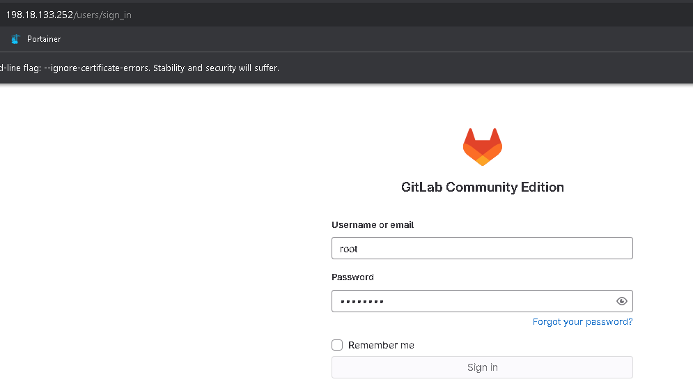

<br>

## 3. Install and register Gitlab runner 

GitLab Runner is an open-source application that is used in conjunction with GitLab CI/CD (Continuous Integration/Continuous Deployment) pipelines. It's designed to run jobs and tasks as part of your CI/CD pipeline.

To start gitlab runner container use following command:

```docker run -d --name gitlab-runner --restart always gitlab/gitlab-runner:latest```

```
C:\Users\Administrator\Desktop>docker run -d --name gitlab-runner --restart always gitlab/gitlab-runner:latest
Unable to find image 'gitlab/gitlab-runner:latest' locally
latest: Pulling from gitlab/gitlab-runner
edaedc954fb5: Pull complete
8c3aebe7713f: Pull complete
5b1147e4eba7: Pull complete
Digest: sha256:9cabe88ca172e44ea41603aaf43cd7985fac76d46c6dac2d9c4e5899ba7a2be1
Status: Downloaded newer image for gitlab/gitlab-runner:latest
e0303ca291b233016529828448f9fc282dd03c7d7e0bd21d973a1b6ba6fcec16
```

Check if Gitlab runner is running:

```
C:\Users\Administrator\Desktop>docker ps
CONTAINER ID   IMAGE                          COMMAND                  CREATED              STATUS                       PORTS                                                                    NAMES
e0303ca291b2   gitlab/gitlab-runner:latest    "/usr/bin/dumb-init …"   About a minute ago   Up About a minute                                                                                     gitlab-runner
e692f708e88e   gitlab/gitlab-ce:latest        "/assets/wrapper"        About an hour ago    Up About an hour (healthy)   0.0.0.0:22->22/tcp, 0.0.0.0:80->80/tcp, 0.0.0.0:443->443/tcp             gitlab-linode
f0d13245a4d0   yangsuite-dcloud:latest        "/start"                 7 months ago         Up Less than a second        0.0.0.0:8480->8480/tcp, 0.0.0.0:58500-58501->58500-58501/tcp             yangsuite
0615e3d8832a   tig_mdt:latest                 "/start.sh"              12 months ago        Up Less than a second        0.0.0.0:3000->3000/tcp, 0.0.0.0:57500-57501->57500-57501/tcp, 5201/tcp   tig_mdt
d7cc1df5338f   portainer/portainer-ce:2.9.3   "/portainer"             12 months ago        Up Less than a second        0.0.0.0:8000->8000/tcp, 0.0.0.0:9443->9443/tcp, 9000/tcp                 portainer
```

After you start your gitlab runner you need to register this runner to run jobs using following steps:

1. Navigate to Gitlab website: `http://198.18.133.252`

2. Click <b>Configure GitLab</b>

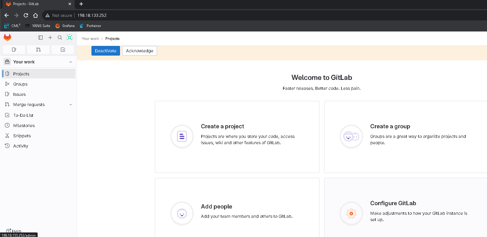

3. Go to <b>CI/CD -> Runners</b>

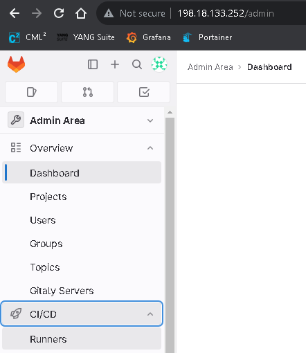

4. Click <b>New instance runner</b>

5. Create new runner with following options:

- Platform: Linux
- Enable option: <b>Run untagged jobs</b>

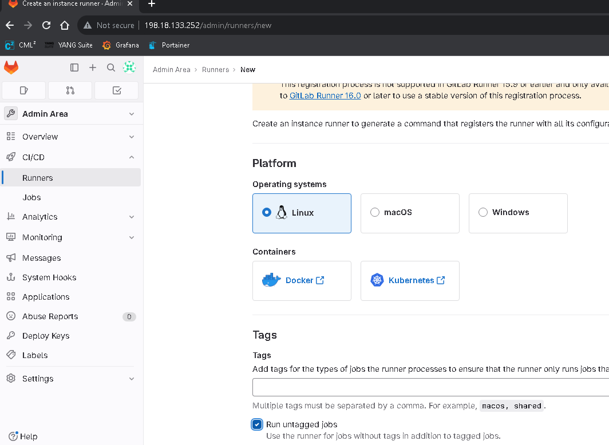

6. Click <b>Create runner</b> button

7. To register gitlab runner copy command from Step 1 from gitlab website:

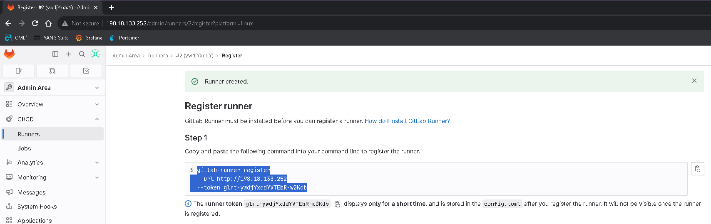

8. Enter gitlab-runner container shell: `docker exec -it gitlab-runner /bin/bash`

9. Paste and run command copied in step 7:

`gitlab-runner register  --url http://198.18.133.252  --token glrt-ywdjYxddYVTEbR-wGKdb`

- keep GitLab URL and name for the runner as defaults [] by hittng ENTER
- choose the shell executor

```
root@e0303ca291b2:/# gitlab-runner register  --url http://198.18.133.252  --token glrt-ywdjYxddYVTEbR-wGKdb
Runtime platform                                    arch=amd64 os=linux pid=42 revision=674e0e29 version=16.2.1
Running in system-mode.

Enter the GitLab instance URL (for example, https://gitlab.com/):
[http://198.18.133.252]:
Verifying runner... is valid                        runner=ywdjYxddY
Enter a name for the runner. This is stored only in the local config.toml file:
[e0303ca291b2]:
Enter an executor: kubernetes, docker, shell, parallels, ssh, virtualbox, docker-autoscaler, docker+machine, instance, custom, docker-windows:
shell
Runner registered successfully. Feel free to start it, but if it's running already the config should be automatically reloaded!

Configuration (with the authentication token) was saved in "/etc/gitlab-runner/config.toml"
root@e0303ca291b2:/#
```

11. To view runner, go to <b>Admin Area > Runners</b>

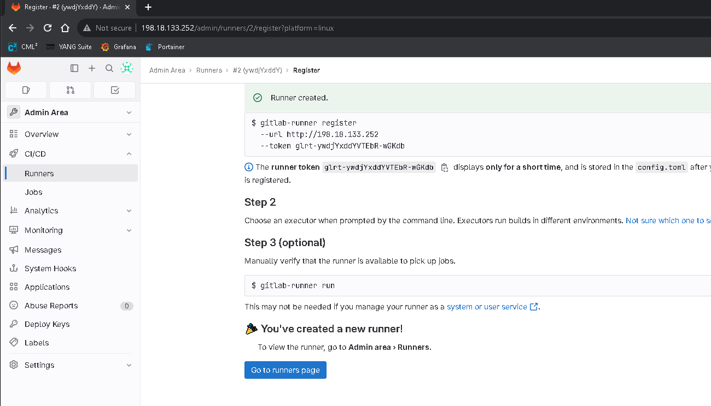

12. Verify that status of runner is Online:

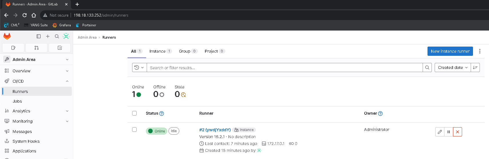

If you see green circle next to your runner, it means that you have a runner available to proces your jobs and you can create your first project!

<br>

## 4. Create your first project

To create a new project click <b>Create a project</b>

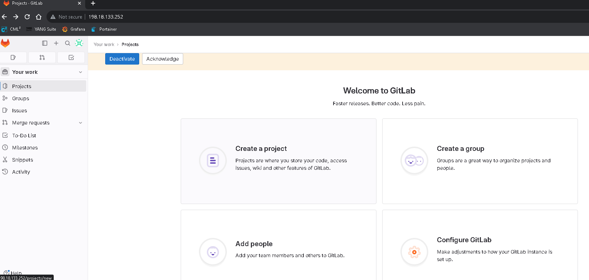

<b>Create blank project</b>

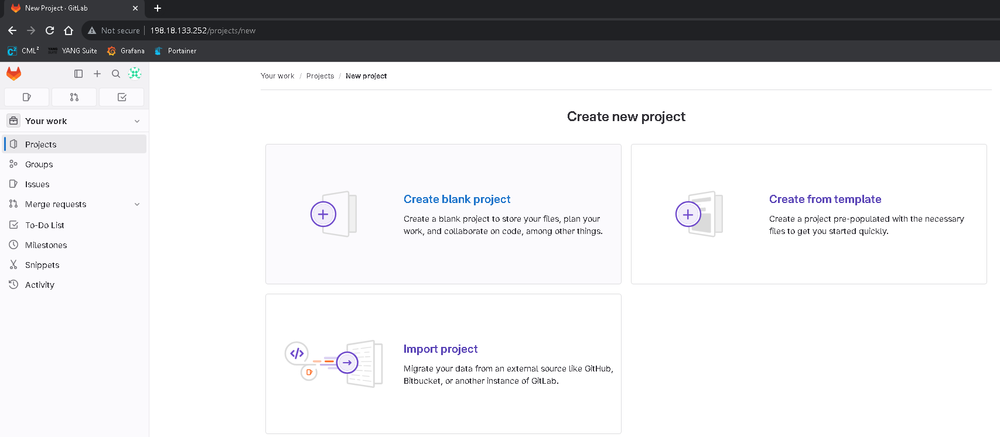

Assign project name: `terraform-iac` and pick a group or namespace (Users -> root) then click <b>Create project button</b>

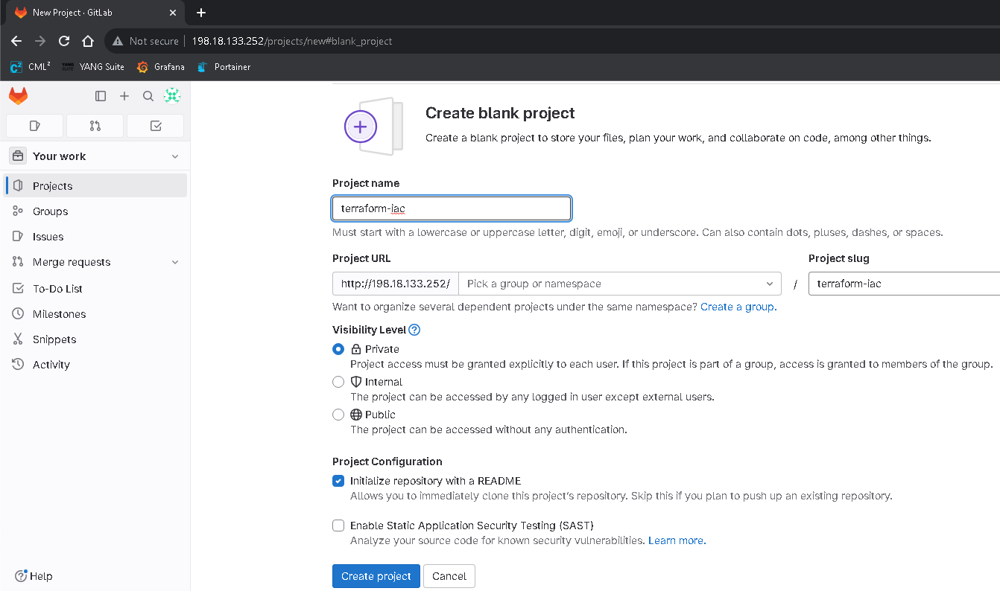

You should see terrraform-iac project created successfully:

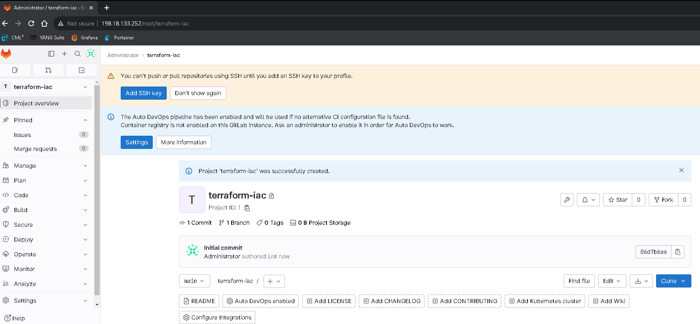

<br>

## 5. Clone and modify repository

Navigate to your terraform-iac project, click and expand Clone button and copy <b>Clone with HTTP</b> URL:

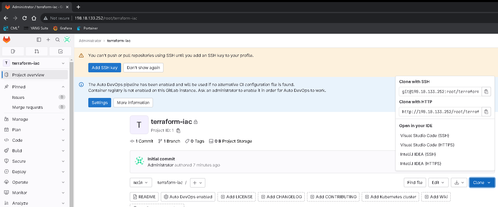

```http://198.18.133.252/root/terraform-iac.git```

Open Windows Command prompt and clone terraform-iac empty repo using git clone command:

`git clone http://198.18.133.252/root/terraform-iac.git`

You wil be asked to enter credentials for your Gitlab instance. Use root as username and password you set up in section (2. Configure and Run Gitlab)


```
C:\Users\Administrator>git clone http://198.18.133.252/root/terraform-iac.git
Cloning into 'terraform-iac'...
remote: Enumerating objects: 3, done.
remote: Counting objects: 100% (3/3), done.
remote: Compressing objects: 100% (2/2), done.
remote: Total 3 (delta 0), reused 0 (delta 0), pack-reused 0
Receiving objects: 100% (3/3), done.

```

Open Visual Studio Code Editor and navigate to File -> Open Folder and choose location of your cloned repository:

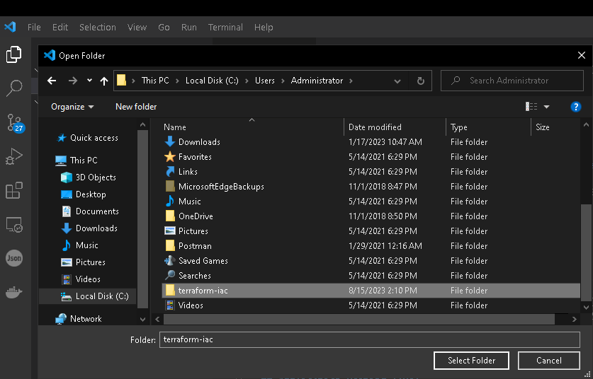

Click Select Folder and Yes, I trust the authors option on next screen:

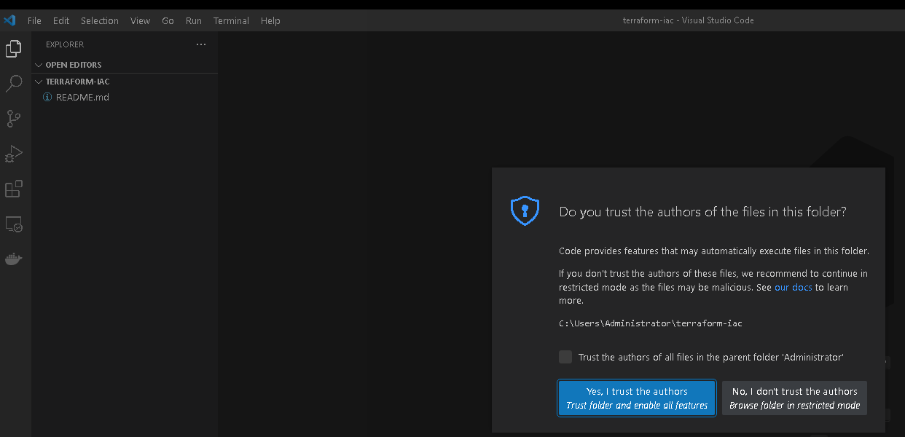

In repository you only have README.md file, now you need to copy files from terraform-bootcamp repository from labs/lab4/scripts folder into your 
<br>

## 5. Create Gitlab CICD pipeline

                                                                                                                                              
 
<br></br>

---

### Congratulations on completing the Troubleshoot IOx Applications lab! You have taken an important step in learning how to solve application and platform related issues. You resolved a code-based failure on an application deployed on CSR1000v router using the application console and application log files. You identify resource contention that prevents applications from activating on an CSR1000v.